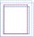
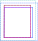
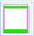
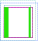

=======================================
GDP 2 — Specializations Near Boundaries
=======================================

:Author: Rhea George <rheag@vulcan.com> - Vulcan Climate Modeling
:Status: Draft
:Type: Feature
:Created: 21-04-2020
:Discussion PR: `https://github.com/GridTools/gt4py/pull/24 <discussion_pr>`_
:Implementation: `https://github.com/GridTools/gt4py/pull/36 <impl_pr>`_


Abstract
--------

GT4Py treats the vertical domain specially so that top and bottom boundary conditions can easily be applied.
It also has a limited ability to compute on sub-regions of the horizontal iteration space using the ``domain`` and ``origin`` keyword arguments to stencil calls, which offset and limit the stencil's computational domain relative to fields' origins.
However, this feature requires that separate stencils are written for boundaries, limiting the possibilities for backend optimization.

Here we propose a mechanism to push such regional computation around boundaries into the stencil and in the process add an feature capable of expressing stencil computation on global boundaries of domain-decomposed iterations spaces.
This additionally has the benefit of locating stencil-specific boundary calculation adjacent to the main stencil code, resulting in a friendlier interface and fewer opportunities for errors.

Motivation and Scope
--------------------

Numerical models, especially finite difference methods, commonly have specialized computation near boundaries to facilitate boundary conditions or grid-specific requirements.
We are developing a weather model on the cubed-sphere multi-block structured grid, and have many stencils that require such specific treatment on and near the structured block boundaries.

We are currently working around the lack of a first-class feature by using the ``domain`` and ``origin`` keyword arguments to stencil calls, but doing so leads to inefficient code that is difficult for model developers to read.
To illustrate the need for such a feature, consider a snippet of the model that computes a variable ``ub`` different based on location in the grid:

.. code-block:: python

    Field = gtscript.Field[np.float]​

    @gtscript.stencil()​
    def main_ub(uc: Field, vc: Field, cosa: Field, rsina: Field, ub: Field, dt5: float):​
        with computation(PARALLEL), interval(...):​
            ub = dt5 * (uc[0, -1, 0] + uc - ​(vc[-1, 0, 0] + vc) * cosa) * rsina​

    @gtscript.stencil()​
    def x_edge_ub(ut: Field, ub: Field, dt5: float):
        with computation(PARALLEL), interval(...):​
            ub = dt5 * (ut[0, -1, 0] + ut)​

    @gtscript.stencil()​
    def y_edge_ub(ut: Field, ub: Field, *, dt4: float):
        with computation(PARALLEL), interval(...):
            ub = dt4 * (-ut[0, -2, 0] + 3.0 * (ut[0, -1, 0] + ut) - ut[0, 1, 0])

    # Requires new python function to call stencils on each region
    def ubke(uc, vc, ut, ub, dt5, dt4, grid):​
        domain_y_edge = (grid.ni, 1, grid.nz)
        domain_x_edge = (1, grid.nj, grid.nz)
        main_ub(uc, vc, grid.cosa, grid.rsina, ub, dt5=dt5, ​
                origin=(grid.local_istart, grid.local_jstart, 0),
                domain=(grid.ni, grid.nj, grid.nz))​
        if grid.west_edge:​
            x_edge_ub(ut, ub, dt5=dt5, ​origin=(grid.local_istart, grid.local_jstart, 0), ​domain=domain_x_edge)​
        if grid.south_edge:
            y_edge(ut, ub, dt4=dt4, origin=(grid.local_istart, grid.local_jstart, 0), domain=domain_y_edge)
        if grid.north_edge:
            y_edge_ub(ut, ub, dt4=dt4, origin=(grid.local_istart, grid.local_jend, 0), domain=domain_y_edge)
        if grid.east_edge:
            x_edge_ub(ut, ub, dt5=dt5, origin=(grid.local_iend, grid.local_jstart, 0), domain=domain_x_edge)

This example motivates requirements for the feature. It must be able to:

1. Specify regions in the context of an application-defined grid inside a single stencil. This naturally incorporates the concept of domain decomposition.
2. Specify regions at and near the edges of the field data arrays, regardless of whether the computational domain exists there. If the stencil call's extended computational domain has a non-zero intersection with the region, it iterates over that portion.

The specific feature that we are proposing is the addition of a ``region()`` keyword that specifies the horizontal iteration space.
Arguments passed to the ``region()`` call are region objects that describe the restricted iteration space.
In order to make this friendlier for applications, they can provide methods or classes that provide these objects specifying the local index region.

Using this concept, the example is transformed into:

.. code-block:: python

    @gtscript.stencil()
    def stencil(uc: Field, vc: Field, cosa: Field, rsina: Field, ut: Field, ub: Field, dt5: float, dt4: float):
        with computation(PARALLEL), interval(...):
            ub = dt5 * (uc[0, -1, 0] + uc - (vc[-1, 0, 0] + vc) * cosa) * rsina
            with region(WestEdge(0, 1), EastEdge(0, 1)):
                ub = dt5 * (ut[0, -1, 0] + ut)
            with region(SouthEdge(0, 1), NorthEdge(0, 1)):
                ub = dt4 * (-ut[0, -2, 0] + 3.0 * (ut[0, -1, 0] + ut) - ut[0, 1, 0])

This reduces the complexity of the code and consolidates operations on `ub` - it is now immediately clear what the stencil is filling into ``ub`` everywhere.


Usage and Impact
----------------

This is an optional feature, but will be the only way so far to specialize computation at points in the horizontal iteration space.


Backward Compatibility
----------------------

This GDP aims to be fully backward-compatible.


Detailed Description
--------------------

As introduced above, we propose adding a new gtscript ``region()`` call that specializes the stencil on a region of the iteration space when a non-zero intersection between the written-to field's extended compute domain and the application domain occurs.
Since stencils are designed without the use of absolute indexes, regions can only be specified as a set of offsets from an `edge`.


An example
++++++++++

Let us begin with an illustrated example of what is required of regional computation.



    Two edge-based fields (blue and cyan), with halos (dotted lines) and a compute domain (red dashes).



    Same setup as above, but with an application domain (purple dashes).



    Same setup, and demonstrating top and bottom edge regions of some width. Note the top side is restricted by the application domain (purple).



    Stencil called again with a different compute domain. This time the right region is restricted.

Computation is only done in regions of the horizontal iteration space where the compute domain intersects with the region, so a distributed computation is naturally supported by specifying non-zero offsets on certain processors.


Region specification
++++++++++++++++++++

The region specification is a nested tuple interface that defines offsets from the edges of on each axis of the application domain.
Applications may define their own named versions of these to reduce code bulk.
There are two parallel axes each with two endpoints, so the specification is a pair of pairs, where a pair is a 2-tuple.
Each endpoint is itself a pair of a `gt4py.definitions.Interval` and an integer offset.
For example, to fill a strip the `west` strip of a I-J plane of size 3, the region specification would be:

.. code-block:: python

    (((Interval.START, 0), (Interval.START, 2)), ((Interval.START, 0), (Interval.STOP, 0)))

This specifies an iteration region over the first 3 points in ``i``` (``0,1,2``) from the application domain edge, and all ``j`` in the grid.
Again, the computation will only happen on portions of the region that have an intersection with the written-to field's extended compute domain.


Additional run-time information
+++++++++++++++++++++++++++++++

GT4Py currently stores information about the offsets between fields and the compute domain by specifying origins for each field that are referred to by ``(0,0)`` in the compute domain.
Therefore the additional information that is needed for regional computation is to specify (1) the total size of the application domain and (2) how the fields relate to the application domain.

The total size of the application domain can be represented as a numeric tuple of two `ints`.

Currently, GT4Py ties the compute domain origin to each field's origin when a single origin is passed at stencil run time.
**Specifying an origin to a stencil call overwrites the origin for each field.**
When the storage rewrite is complete, fields will also have halo metadata, so this can be used to align the non-halo portion of a field relative to the application domain.
The easiest method is to specify the origin offset between the bottom left non-halo point in the field (the natural/default origin) to the application domain.
Much of the time this will be ``(0, 0)`` (in which case it does not need to be specified), but could be non-zero for staggered fields.
This information should be collected in a dictionary of field name to numeric tuple, and passed to stencils at execution time.

The call could then look like:

.. code-block:: python

    stencil(uc, vc, cosa, rsina, ut, ub, dt5, dt4,
        app_domain=(grid.ni, grid.nj), app_origins={ub: (1,0)})


Temporary fields
^^^^^^^^^^^^^^^^

The information above is sufficient for field arguments to the stencil, but what about temporaries? Assigning to temporaries in a region should be allowed, so GT4Py needs to generate an offset automatically from the application domain for these fields. The natural way to determine this is to have the `origin` of the temporary field be the origin of the compute domain.

Take for example the double Laplacian example, with a special case before applying the second Laplacian:

.. code-block:: python

    @gtscript.stencil()
    def double_lap(in_f: gtscript.Field[float],
                out_f: gtscript.Field[float]):
        with computation(PARALLEL), interval(...):
            tmp_f = lap(in_f)
            with region(LeftEdge(-1, 0)):
                tmp_f = 1.0
            out_f = lap(tmp_f)

    # Both halo lines will be consumed
    in_f = storage(shape=(8,8), halos=((2,2),(2,2)))
    out_f = storage(shape=(8,8), halos=((2,2),(2,2)))
    double_lap(in_f, out_f)

Observations:

* Both halo lines of ``in_f`` are consumed by the stencil.
* The extended left edge of ``tmp_f`` is filled with ones. This is one point outside the computational domain.
* The application domain shape, since it was not passed to the stencil, is automatically set to the compute domain shape, which itself is automatically determined to be ``(4,4)``.
* The natural origins are used to align the fields, in this case both are the same size.


Related Work
------------

The dawn compiler accepts regions of the horizontal iteration space in its stencil intermediate representation.


Implementation
--------------

The implementation on the GT4Py involves adding:

1. the `region()` specifier parsing to the AST visitor in IRMaker_
2. the reduced iteration space to the `internal IR`_
3. region parsing tests
4. backend support for the IR features and ensure correct code generation
5. code generation tests
6. application domain arguments to stencil calls
7. a few end to end tests

.. _IRMaker: https://github.com/GridTools/gt4py/blob/master/src/gt4py/frontend/gtscript_frontend.py#L454
.. _internal IR: https://github.com/GridTools/gt4py/blob/master/src/gt4py/ir/nodes.py

The application must define functions that create the tuples or subclass tuple.


FV3 Example
-----------

.. code-block:: Fortran

    subroutine divergence_corner(u, v, ua, va, divg_d, ...)

    ! arguments
    real :: ua(isd:ied, jsd:jed)          ! cell-center
    real :: va(isd:ied, jsd:jed)          ! cell-center
    real :: u(isd:ied, jsd:jed+1)         ! staggered in y-direction
    real :: v(isd:ied+1, jsd:jed)         ! staggered in x-direction
    real :: divg_d(isd:ied+1, jsd:jed+1)  ! corner (staggered both in x- and y-direction)

    ! locals
    real :: uf(is-2:ie+2, js-1:je+2)      ! staggered in y-direction
    real :: vf(is-1:ie+2, js-2:je+2)      ! staggered in y-direction

    ! indices
    integer :: is,  ie,  js,  je   ! compute domain
    integer :: isd, ied, jsd, jed  ! data domain = compute domain + halo zone

    is2 = max(2, is)         ! restrict computation to exclude west-edge
    ie1 = min(npx-1, ie+1)   ! restrict computation to exclude east-edge

    do j = js, je+1
      if (j == 1 .or. j == npy) then
        do i = is-1, ie+1
          uf(i,j) =
            u(i,j)*dyc(i,j)*0.5*(sin_sg(i,j-1,4) + sin_sg(i,j,2))
        end do
      else
        do i = is-1, ie+1
          uf(i,j) = &
              (u(i,j) - 0.25*(va(i,j-1) + va(i,j))*(cos_sg(i,j-1,4) + cos_sg(i,j,2)))  &
                                      *dyc(i,j)*0.5*(sin_sg(i,j-1,4) + sin_sg(i,j,2))
        end do
      end if
    end do

    do j = js-1, je+1
      do i = is2, ie1     ! inner domain (full compute domain for ranks without edges)
        vf(i, j) = &
          (v(i,j) - 0.25*(ua(i-1,j) + ua(i, j))*(cos_sg(i-1,j,3) + cos_sg(i,j,1)))  &
                                *dxc(i,j)*0.5*(sin_sg(i-1,j,3) + sin_sg(i,j,1))
      end do
      if (is == 1) &      ! west-edge
        vf(1, j) = &
          v(1, j)*dxc(1, j)*0.5*(sin_sg(0, j, 3) + sin_sg(1, j, 1))
      if (ie+1 == npx) &  ! east-edge
        vf(npx, j) = &
          v(npx, j)*dxc(npx,j)*0.5*(sin_sg(npx-1, j, 3) + sin_sg(npx, j, 1))
    end do

    do j=js,je+1
      do i=is,ie+1
        divg_d(i,j) = vf(i,j-1) - vf(i,j) + uf(i-1,j) - uf(i,j)
      end do
    end do

    if (gridstruct%sw_corner) &
      divg_d(1,    1) = divg_d(1,    1) - vf(1,    0)
    if (gridstruct%se_corner) &
      divg_d(npx,  1) = divg_d(npx,  1) - vf(npx,  0)
    if (gridstruct%ne_corner) &
      divg_d(npx,npy) = divg_d(npx,npy) + vf(npx,npy)
    if (gridstruct%nw_corner) &
      divg_d(1,  npy) = divg_d(1,  npy) + vf(1,  npy)

    do j=js,je+1
      do i=is,ie+1
        divg_d(i,j) = rarea_c(i,j) * divg_d(i,j)
      end do
    end do

.. code-block:: python

    @gtscript.stencil
    def divergence_corner(...):
    with computation(PARALLEL), interval(...):
        uf = (u - 0.25*(va[0, -1, 0] + va)*(cos_sg4[0, -1, 0] + cos_sg2))  \
                                  *dyc*0.5*(sin_sg4[0, -1, 0] + sin_sg2)
        with region(SouthEdge(0, 1), NorthEdge(-1, 0)):
            uf = u*dyc*0.5*(sin_sg4[0, -1, 0] + sin_sg2)

        vf = (v - 0.25*(ua[-1, 0, 0] + ua)*(cos_sg3[-1, 0, 0] + cos_sg1))  \
                                  *dxc*0.5*(sin_sg3[-1, 0, 0] + sin_sg1)
        with region(WestEdge(0, 1), EastEdge(-1, 0)):
            vf = v*dxc*0.5*(sin_sg3[-1, 0, 0] + sin_sg1)

        divg_d = rarea_c * (vf[0, -1, 0] - vf + uf[-1, 0, 0] - uf)
        with region(SouthWestCorner((0, 1), (0, 1)), SoutEastCorner((0, 1), (-1, 0))):
            divg_d = rarea_c * (-vf + uf[-1, 0, 0] - uf)
        with region(NorthEastCorner((-1, 0), (-1, 0)), NorthWestCorners((-1, 0), (0, 1)):
            divg_d = rarea_c * (vf[0, -1, 0] + uf[-1, 0, 0] - uf)


Alternatives
------------

There are a number of modifications possible to how this is expressed.

1. Multidimensional Intervals

This alternative expands the `interval()` specifier to include both vertical and horizontal ranges with the region objects.
This may be not quite consistent because the `with computation()` still refers to the ordering of the vertical direction, while `with interval()` would specify the whole 3D iteration space.
To correct this we could rename 'with computation' to 'with vertical_computation', or something similar, at the expense of backward compatibility.
With this idea, the interval could specify an arbitrary number of region bounds.

.. code-block:: python

  @gtscript.stencil()​
  def ubke(uc: Field, vc: Field, cosa: Field, rsina: Field, ub: Field, ut: Field, dt4: float, dt5: float):​
    with computation(gtscript.PARALLEL):​
      with interval(...): # indicates compute domain specified with 'origin' and 'domain'
        ub = dt5 * (uc[0, -1, 0] + uc - (vc[-1, 0, 0] + vc) * cosa) * rsina​
      with interval(Vertical(0, None), (WestEdge(0, 1), EastEdge(0, 1)):​
        ub = dt5 * (ut[0, -1, 0] + ut)​
      with interval((SouthEdge(0, 1), NorthEdge(0, 1))):​
        ub = dt4 * (-ut[0, -2, 0] + 3.0 * (ut[0, -1, 0] + ut) - ut[0, 1, 0])​

In this case we would have special `Vertical` objects for slicing the vertical direction.
This might lend itself more naturally to expanding to an arbitrary Nd array.

2. Explicit Indices

This proposal is similar to the first, but more explicit.
This will be more familiar to Fortran model developers, but it is more tedious than some of the other solutions, so a python developer may be tempted to add another translation layer to allow abstraction of duplicated patterns.
Instead of offsets from a compute domain, absolute global indices are within the `interval()` as scalar variables. e.g. `i_s` and `i_e`, that the application defines and magically get passed into the stencil.

A major problem with this approach is that it requires the backend to know about the global iteration space. We may be able to implement handling for Dawn, but this would not work for most backends, and would be hard to generalize.

.. code-block:: python

    @gtscript.stencil()
    def ubke(uc: Field, vc: Field, cosa: Field, rsina: Field, ub: Field, *, dt4: float, dt5: float):
        with computation(gtscript.PARALLEL),
            with interval(i_s:i_e, j_s:j_e, k_s:k_e):
                ub = dt5 * (uc[0, -1, 0] + uc - (vc[-1, 0, 0] + vc) * cosa) * rsina
            # West edge
            with interval(i_e-1:i_e, :, :):
                ub = dt5 * (ut[0, -1, 0] + ut)
            # East edge
            with interval(i_e:i_e+1, :, :):
                ub = dt5 * (ut[0, -1, 0] + ut)
            # South edge
            with interval(:,j_s:j_s+1, :):
                ub = dt4 * (-ut[0, -2, 0] + 3.0 * (ut[0, -1, 0] + ut) - ut[0, 1, 0])
            # North edge
            with interval(:, j_e:j_e+1, :):
                ub = dt4 * (-ut[0, -2, 0] + 3.0 * (ut[0, -1, 0] + ut) - ut[0, 1, 0])

3. Partitioner outside stencil
Have a partitioner object that has awareness of the model decomposition make the calls.
Use methods it has to specify subdomains.

.. code-block:: python

    def ub(uc, vc, ub, dt4, dt5, partitioner):  # new SubtilePartitioner object
        with partitioner.center(uc) as domain:
            main_ub(uc,vc,grid.cosa,grid.rsina,ub,dt5=dt5,origin=domain.origin, domain=domain.extent,)
        with partitioner.tile_west(ut, start=0, end=1) as domain:
            x_edge(ut, ub, dt5=dt5, origin=domain.origin, domain=domain.extent)
        with partitioner.tile_south(ut, start=0, end=1) as domain:
            y_edge(ut, ub, dt4=dt4, origin=domain.origin, domain=domain.extent)
        with partitioner.tile_north(ut, start=-1, end=0) as domain:
            y_edge(ut, ub, dt4=dt4, origin=domain.origin, domain=domain.extent)
        with partitioner.tile_east(ut, start=-1, end=0) as domain:
            x_edge(ut, ub, dt5=dt5, origin=domain.origin, domain=domain.extent)

This is similar to the idea of a region object, but is more directly utilizing a user defined object rather than a special boundary keyword.
It is unclear how this would translate to the backend.


Copyright
---------

This document has been placed in the public domain.
