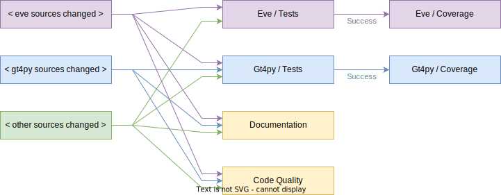

# CI infrastructure

## Workflows

The following workflows are currently active:

The `Eve / Test` and `Gt4py / Test` workflows run the automated tests for the two packages. These workflows also save the code coverage output as workflow artifacts.

The `Eve / Coverage` and `Gt4py / Coverage` workflows are triggered by a successful run of the tests. They download the coverage artifacts and publish them to codecov.io.

The `Documentation` workflow executes the Jupyter nodebook of the quick start guide to make sure it's in sync with the code.

The `Code Quality` workflow runs pre-commit to check code quality requirements through tools like mypy or flake8.

### When are workflows triggered

The general idea is to run workflows only when needed. In this monorepo structure, this practically means that a set of tests are only run when the associated sources or the sources of a dependency change. For example, eve tests will not be run when only GT4Py sources are changed.

## Integration with external tools

Workflows that integrate with external code quality services (i.e. codecov.io, SonarCloud) need special treatment for security reasons. Such workflows use a secret token to interact with the external services. Anyone having access to the secret token can read or write data to the external services and can thus "hack" it by publishing spoofed code coverage results, for example. To prevent the exposure of the secret tokens, GitHub allows repository owners to record secret tokens associated with the repository. These repository secrets can then be safely accessed from CI workflows.

The repository secrets, however, are only available within the main repository, not its forks. Otherwise, someone could make a fork, create a pull request with a malicious workflow, and steal the secrets. As a side-effect, it's impossible to publish code coverage results from a workflow triggered by a pull request from a fork.

To resolve this issue, the coverage workflows are triggered in the context of the main repository via the `workflow_run` trigger after the tests in the context of the fork have finished. The test workflows upload the coverage results as artifacts which are then downloaded in the subsequent workflow that publishes them to codecov.io. The test workflows also save the context such as run ID or PR number in an artifact, which is then forwarded by the subsequent workflow to the external tool.

## Tested operating systems

The testing workflows already use a matrix strategy to run the automated tests on multiple operating systems. There is, however, a baseline 2000 hour monthly limit for the total time CI runs take. Since MacOS builds consume node hours 10 times as fast, this leaves an effective 200 hours for MacOS CI runs. This was already exhausted during testing of the workflows, thus MacOS was temporarily disabled in the configuration matrices, leaving only Ubuntu. It would be nice to further test the limits or pay for some more hours to restore MacOS builds.

## Future improvements

- Split code quality: it might be better to run code quality tools separate for each project in the monorepo.
- Split documentation: once there is proper HTML documentation generated for the projects, it might make sense to have that run as one job per project.
- Template for tests: although there is a reusable workflow for the code coverage uploading, it probably make sense to reuse some of the workflow description for the tests as well.