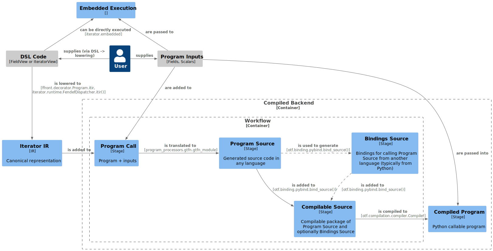

# On The Fly Compilation

- **Status**: valid
- **Authors**: Rico Häuselmann (@DropD)
- **Created**: 2022-09-12
- **Updated**: 2023-04-03

This supersedes [0009 - Compiled Backend Integration](0009-Compiled_Backend_Integration.md) and concentrates on the API design for on-the-fly compilation of GT4Py programs and all the steps in between IR and compiled Python extension.

## Context

The on-the-fly compilation (OTFC) in gt4py encompasses everything necessary to go from an IR representation of a GT4Py program to an executable Python function. Depending on the chosen route, this may include:

- generating source code (in any language), including source code required to call other generated code from Python (if applicable)
- writing generated source code to the file system and subsequently
  - compiling and / or
  - importing it back into Python
- decorating resulting Python constructs (wrapping)
- short-circuiting any or all of the above if the resulting Python constructs are already available

```
DSL -> IR -> Generate source -> [Bindings -> Write to FS -> Python Module] -> CompiledProgram -> Decorate -> Execute program
        |-------------| |-----------| |-------------------------------------------|
          Translation      Binding         Compilation
        |--------------------------------------------------------------------------------------------|
                    GT4Py On-The-Fly Compilation
```

<!--
@startuml 0011-on-the-fly-overview
!include <C4/C4_Component>

hide stereotype

AddRelTag('optional', $lineStyle=DashedLine())

Person(user, 'User')

Component(iteratorir, 'Iterator IR', 'IR', 'Canonical representation')

Component_Ext(dslcode, "DSL Code", "FieldView or IteratorView")

Rel_L(user, dslcode, 'supplies (via DSL -> lowering)')
Rel_D(dslcode, iteratorir, 'is lowered to', 'ffront.decorator.Program.itir, iterator.runtime.FendefDispatcher.itir()')

Component(embedded, "Embedded Execution")
Rel_L(dslcode, embedded, 'can be directly executed', 'iterator.embedded')

Component_Ext(inputs, 'Program Inputs', 'Fields, Scalars')
Rel_R(user, inputs, 'supplies')
Rel(inputs, embedded, 'are passed to')

Container_Boundary(backend, 'Compiled Backend', 'program_processors.runners.gtfn_cpu') {

Container_Boundary(workflow, 'Workflow', 'otf.workflow.Workflow') {
  Component(program_call, 'Program Call', 'Stage', 'Program + inputs')
  Rel_R(iteratorir, program_call, 'is added to')
  Rel(inputs, program_call, 'are added to')

  Component(program_source, 'Program Source', 'Stage', 'Generated source code in any language')
  Rel_R(program_call, program_source, 'is translated to', 'program_processors.gtfn.gtfn_module')

  Component(bindings_source, 'Bindings Source', 'Stage', 'Bindings for calling Program Source from another language (typically from Python)')
  Rel_R(program_source, bindings_source, 'is used to generate', 'otf.binding.pybind.bind_source()' , $tags='optional')

  Component(compilable_source, 'Compilable Source', 'Stage', 'Compilable package of Program Source and optionally Bindings Source')
  Rel(program_source, compilable_source, 'is added to', 'otf.binding.pybind.bind_source()')
  Rel(bindings_source, compilable_source, 'is added to', 'otf.binding.pybind.bind_source()', $tags='optional')

}

  Component(compiled_program, 'Compiled Program', 'Stage', 'Python callable program')
  Rel_R(compilable_source, compiled_program, 'is compiled to', 'otf.compilation.compiler.Compiler')
  Rel(inputs, compiled_program, 'are passed into')

}

@enduml
-->



The main use case is to execute GT4Py programs in a performance portable way from Python. Other use cases may include generating performance portable code to be integrated in external applications, generating code for debugging purposes, pre-compiling libraries of GT4Py programs for use from separate Python applications, etc.

Much of the goals and the resulting architecture comes from lessons learned in GT4Py Cartesian, where originally all the steps of on-the-fly compilation together with code generation were approached as one monolithic implementation per "backend" (method of generating external source files). This had to be refactored to account for some use cases and lead to tight coupling with small changes rippling though more code than necessary.

## Naming

To avoid confusion the commonly occurring stages of OTF workflows have names (some of which map to protocols).

**`otf.stages.ProgramCall`:**
IR representation of a GT4Py program wrapped together with the arguments that will be passed to it.

**`otf.stages.ProgramSource`:**
Backend source code wrapped together with information on how it wants to be called.

**`otf.stages.CompilableSource`:**
`ProgramSource` wrapped together with optional language bindings (source code that enables the backend source code to be called from another language).

**`otf.stages.CompiledProgram`:**
A python object that executes the GT4Py program when called with the same arguments as stored in the `ProgramCall`.

Similarly the steps to go from one of the above stages to another have names.

**`otf.step_types.TranslationStep`:**
`ProgramCall -> ProgramSource`.

**`otf.step_types.BindingStep`:**
`ProgramSource -> CompilableSource`.

As a special case a `BindingStep` for a `ProgramSource`, which does not require bindings, would simply promote the `ProgramSource` to `CompilableSource` without adding bindings.

**`otf.step_types.CompilationStep`:**
`CompilableSource -> CompiledProgram`.

## Architecture

The goals of the on-the-fly compilation (OTFC) architecture and design are:

- guide and inform the design and implementation of future components in this part of the code (code generators, builders, bindings generators, caching strategies, etc)
- ensure consistency and readability of components
- keep components easy to reason about
- keep components (including future ones) intercompatible as much as reasonably possible
- allow per-use-case flexible composition of components

The chosen architecture is composable workflows. Such workflows can be composed of workflows and workflow steps, which implement the workflow protocol (`otf.workflow.Workflow`), provided each step's input argument type(s) matches the preceding step's return type(s). Any step customization should happen during workflow composition and _not_ by passing options and flags along the workflow.

The completed workflow can then be called with the input argument(s) of the first workflow step and it's return type will be the same as the last step's.

## Design Decisions

### Linear Workflows

- decided: 2022-09-13
- revised: --

For the first implementation, workflows are chosen to be linear. That is to say each step is followed by exactly zero or one step. No branching, step-skipping or short-circuiting is implemented.

#### Reason

Not required at this stage and simplifies implementation

#### Consequences

Caching is therefore currently not implemented as a separate step and is therefore the concern of other steps (currently only the build step).

#### Revise If

There is a good use case that justifies the extra effort. Such as implementing caching steps as conditionals based on which subsequent steps are switched or skipped, or which might complete the workflow early.

### Statically Typed Workflows

- decided: 2022-09-13
- revised: 2023-03-29

Workflow steps are generic on input and output type and the chaining function is generic on the input, intermediary and (new) output type. This allows the use of static type checkers to ensure that the composed workflow has the intended input and output types, as well as that it is passed the correct argument types and that it's return value is used correctly.

To allow building workflows in a linear-looking way in code, the `otf.workflow.ChainableWorkflowMixin` mixin is provided.
The first step can be wrapped in any chainable step type on which `.chain` can then be called with the next step. The result will be a workflow instance with `.chain` available also.

```
step1: Workflow[I, A]
step2: Workflow[A, B]
step3: Workflow[B, C]
step4: Workflow[C, O]
workflow: Workflow[I, O] = StepSequence.start(step1).chain(step2).chain(step3).chain(step4)
```

`otf.workflow.StepSequence` is only one example of a chainable step type.

_edit 2023-03-29_

`otf.workflow.NamedStepSequence` provides another way in which workflow steps can be composed, while keeping static typing somewhat intact.

```python
@dataclasses.dataclass(frozen=True)
class ExampleWorkflow(NamedStepSequence):
    parsing: Workflow[A, B]
    lowering: Workflow[B, C]
    first_pass: Workflow[C, C]
    second_pass: Workflow[C, C]
```

As can be seen in the above example, the step types are statically hinted and mypy will catch wrong types on constructor calls. However, making sure that the steps are compatible in the order specified is up to the implementer of `ExampleWorkflow`.

#### Reason

It is in line with the rest of GT4Py to make static type checking for it's code objects as useful as possible. Any linear (and with extensions, non-linear) workflow can be represented in this way.

_edit 2023-03-29_

`NamedStepSequence` solves the following problem:

By making it possible to quickly create a variant of an existing workflow (using `workflow.replace`), they make it unnecessary to escalate sub-workflow configuration.

Coming back to the above example of `ExampleWorkflow`, instead of:

```python
examplewf_foo = Parser().chain(Lowerer(lower_flag=True)).chain(...)
examplewf_bar = Parser().chain(Lowerer(lower_flag=False)).chain(...)
```

which avoids escalation, but is tedious, one might be tempted to implement a pattern like this:

```python
def make_workflow(lower_flag):
    return Parser().chain(Lowerer(lower_flag=lower_flag)).chain(...)
```

which hardcodes the step classes and requires all sub-workflow configuration that needs to be accessible to be collected up front (escalated). One might fix the hardcoding of steps but the problem of escalated configuration just gets worse: now all configuration of all potentially allowed step types need to be escalated. `workflow.replace` in combination with `NamedStepSequence` solves both:

```python
examplewf_foo = ExampleWorkflow(
    parsing=Parser(),
    lowering=Lowerer(lower_flag=True),
    ...
)

examplewf_bar = workflow.replace(
    examplewf_foo,
    lowering=dataclasses.replace(  # assuming the lowerer is a dataclass
        examplewf_foo.lowering,
        lower_flag=False
    )
)
```

This may be verbose but is much less dense semantically and much less error prone. A more terse interface may be added on top if warranted by usecases. This is of course a compromise when it comes to static typing. `workflow.replace` will take any argument which fulfills the `workflow.Workflow` protocol. This is a conscious tradeoff between usefulness of static typing and convenience of interface.

#### Revise If

There has to be a very strong reason to drop static type checking for composition and / or the resulting workflow. The author of this document can not imagine one at present.

### Shared Bindings Step

The workflow step from the `ProgramSource` stage to the `CompilableSource` stage, adding python bindings via `pybind11` was designed to be shared between C++ backends. In practice it is not quite there yet, but close enough for the current stage of development.

The same decision should be followed for other language bindings, wherever possible.

#### Consequences

The `otf.stages.ProgramSource` class has been designed to carry enough information for the bindings generator to convert from the common python call interface to whatever the backend C++ code requires.

#### Reason

The advantage is that compiled programs can be called with the same arguments independently of which (C++) backends were used, without forcing backend implementers to reinvent the wheel when it comes to converting to data structures their backend's C++ side knows how to work with.

#### Revise If

Should it turn out that future backends are not sufficiently similar to warrant sharing this step, it may make sense to specialize these for each C++ backend instead. Most likely some code will still be shareable between these though.

### Shared Compilation Step

The build step goes from `otf.stages.CompilableSource` to `otf.stages.CompiledProgram`. The current implementation is implemented in `otf.compilation.compiler` and can use either of the build systems in `otf.compilation.build_systems.cmake` or `otf.compilation.build_systems.compiledb`.

`cmake.CMakeProject` creates a new full CMake project for each program. `compiledb.CompiledbProject` creates a new CMake project only if it would lead to a different CMake configuration, such as diverging dependencies or build types etc.

These can be extended to cover more than C++ but this should be done when such use cases arise, similar to the `pybind11` bindings step.

### Build System Classes Track Build Progress In a JSON File

Any build system used to build GT4Py programs tracks it's progress and results via a JSON file in it's root folder. The content is a serialization of an `otf.compilation.build_data.BuildData` instance.

#### Reason

This greatly simplifies accessing already compiled and cached (across runs) GT4Py programs as well as checking whether such a cached program exists. The alternative would be to go through the following steps:

1. Translation
2. Binding
3. Use heuristics to decide which build system was used last time
4. Re-create the build system with the cached path as root
5. Use the build-system's heuristics to decide if a compiled program exists or where to load it from.

Whereas when using the `BuildData` one only requires to run steps 1) and 2) to get the cached project folder and the rest can be accessed from there. These steps can be skipped as well by implementing more aggressive caching (for production environments where the GT4Py source is kept constant).

Looking at the build systems implemented at the time of writing, `CMakeProject` and `CompiledbProject`, one might wrongly conclude that existence of certain directories or files suffice. This is only the case because `CompiledbProject` is based on `CMakeProject` and they therefore share some implementation details, which are by no means guaranteed to be standardizable across multiple conceptually different build systems.

#### Revise If

It can be proven that all existing and future build systems can be made to behave closely enough for one single set of heuristics to decide the following based on project directory contents.

- build status
- extension module location
- name of the program inside the extension module

Or, it has been shown that inter-run caching of GT4Py programs is not desirable.

## Alternatives Considered

### Pipeline Architecture

A pipeline architecture was considered, but this would require the input and output argument of every step be the same. This would lead to a data type with many states, able to represent anything from source code to executable GT4Py programs. This was not considered wise.

### Ad-hoc Workflows Through Function Composition

At first, workflows were to be simply composed by the result of each step being passed as an argument to the following one. The resulting code was deemed hard to read and, potentially, to maintain. Example:

```python=
result = step3(
    option1=...,
    option2=...
    inp=step2_factory(
      option3=...,
      option4=...,
    )(
      inp=step1(...)
    )
)
```

Note that the steps occur in reverse order when the code is read top to bottom. In addition the customization of steps can easily get mixed in with the _flow_ of the workflow. Finally it is common to refactor code like that for readability to something like:

```python=
intermediary_1 = step1(...)
intermediary_2 = step2(option3=..., option4=...)(inp=intermediary_1)
result = step3(option1=..., option2=..., inp=intermediary_2)
```

Which relies solely on the discipline of all contributors to not introduce logic between steps, without making that logic available as a workflow step. Hence the maintainability issue.

### Managing Workflow Steps In A Sequence

It looks enticing to be able to create a linear workflow by passing a (non-finite sized) sequence of steps:

```python=
workflow = Workflow(step1, step2, step3, ...)
# or
workflow = Workflow([step1, step2, step3, ...])
```

However this disables static type checking, as there are no variadic generics in python (yet?).
