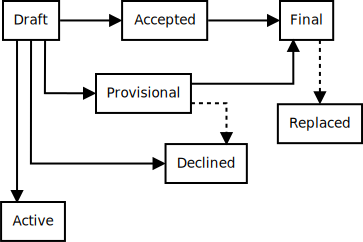

===========================
GDP 0 — Purpose and Process
===========================

:Author: Enrique González Paredes <enriqueg@cscs.ch>
:Status: Draft
:Type: Process
:Created: 24-03-2020
:Discussion PR: `https://github.com/GridTools/gt4py/pull/18 <https://github.com/GridTools/gt4py/pull/18>`_

What is a GDP?
--------------

GDP stands for GT4Py Development Proposal. A GDP is a design document
providing information to the GT4Py developers community, describing
a new feature for GT4Py (or GTScript) or changes in the development processes.
The GDP should provide a concise technical specification and a rationale
of the new feature, possibly with some examples.

We intend GDPs to be the primary mechanisms for proposing major new
features, for collecting community input on an issue, and for documenting
the design decisions that have gone into GT4Py. The GDP author is
responsible for building consensus within the community and documenting
dissenting opinions.

Because the GDPs are maintained as text files in a versioned
repository, their revision history is the historical record of the
feature proposal, which is available by the normal git commands for
retrieving older revisions from the ``docs/GDPs`` folder.

Types
^^^^^

There are three kinds of GDPs:

1. A **Feature** GDP describes a new feature or implementation
   for GT4Py or GTScript.

2. An **Informational** GDP describes a GT4Py design issue, or provides
   general guidelines or information to the community, but does not propose
   a new feature. Informational GDPs do not necessarily represent a GT4Py
   community consensus or recommendation.

3. A **Process** GDP describes a process surrounding GT4Py, or proposes a
   change to a process. Process GDPs are like Feature GDPs but apply to
   areas other than the GT4Py framework itself. Examples include
   procedures, guidelines, changes to the decision-making process, and
   changes to the tools or environment used in GT4Py development.
   Any meta-GDP is also considered a Process GDP.

GDP Workflow
------------

The GDP process begins with a new idea for GT4Py. It is highly
recommended that a single GDP contains a single key proposal or new
idea. Small enhancements or patches often don't need a GDP and can be
injected into the GT4Py development workflow with a pull request to
the `GT4Py repo`_. The more focused the GDP, the more successful it tends
to be. If in doubt, split a large GDP into several well-focused ones.

Each GDP must have a champion—someone who writes the GDP using the style
and format described below, shepherds the discussions in the appropriate
forums, and attempts to build community consensus around the idea. The GDP
champion (a.k.a. Author) should first attempt to ascertain whether the idea is
suitable for a GDP. Posting to the `GT4Py Slack channel`_ is the best
way to start.

The proposal should be submitted as a draft GDP via a `GitHub pull request`_
(PR) to the ``docs/GDPs`` directory with the name ``gdp-<n>-<name>.rst`` where
``<n>`` is an appropriately assigned four-digit number and ``<name>`` is a short
*kebab-case name* (e.g., ``gdp-0000-gdp-process.rst``). The draft must use the
:doc:`gdp-template` file.  The GT4Py core developers may reject a draft GDP (and
thus avoiding any discussion on the topic) if the draft GDP is considered as
completely out of the scope of the project or if the PR does not follow the
conventions documented here.

Once the PR for the GDP is in place, a message should be posted to the
`GT4Py Slack channel`_  to announce the start of the discussion
on the new feature. The full GDP discussion should happen on the pull
request, also including additional implementation details.

After the discussion is finished, the PR should be merged regardless of
whether it is accepted or not, to preserve the discussion and the outcome
of the proposal. Additional PRs may be made by the Author to update
or expand the GDP, or by maintainers to set its status, etc.

It is generally recommended that at least a prototype implementation of a
Feature GDP co-developed together with the GDP, as ideas that sound
good in principle sometimes turn out to be impractical when subjected to the
test of implementation. Often it makes sense for the prototype implementation
to be made available as PR to the GT4Py repo (making sure to appropriately
mark the PR as a Draft/WIP PR).

Review and Resolution
^^^^^^^^^^^^^^^^^^^^^

GDPs are discussed on the pull request review. The possible paths of the
status of GDPs are as follows:

All GDPs should be created with the ``Draft`` status.

Eventually, after discussion, there may be a consensus that the GDP
should be accepted—see the next section for details. At this point
the status becomes ``Accepted``.

Once a GDP has been ``Accepted``, the reference implementation must be
completed. When the reference implementation is complete and incorporated
into the main source code repository, the status will be changed to ``Final``.

To allow gathering of additional design and interface feedback before
committing to long term stability for a new feature or API, a GDP may
also be marked as ``Provisional``. This is short for "Provisionally Accepted",
and indicates that the proposal has been accepted for inclusion in the GT4Py
implementation, but additional user feedback is needed before the full
design can be considered "Final". Unlike regular accepted GDPs, provisionally
accepted GDPs may still be ``Declined`` even after the related changes have
been included in a GT4Py release.

Wherever possible, it is considered preferable to reduce the scope of a
proposal to avoid the need to rely on the ``Provisional`` status (e.g. by
deferring some features to later GDPs), as this status can lead to version
compatibility challenges between GT4Py versions and other libraries of the
ecosystem.

A GDP can also be ``Declined``. Perhaps after all is said and done it
was not a good idea, or the GDP author themselves has decided that the
GDP is actually a bad idea, or has accepted that a competing proposal
is a better alternative. It is still important to have a record of these
facts and the discussion which led to that decision.

When a GDP is ``Accepted`` or ``Declined``, the GDP should be updated
accordingly, which means updating, at the very least, the ``Status`` field
and the ``Discussion PR`` header with a link to the relevant pull request
comment discussion.

GDPs can also be ``Replaced`` or superseded by a different GDP, rendering
the original obsolete. The ``Replaced-By`` and ``Replaces`` headers
should be added to the original and new GDPs respectively.

Process GDPs may also have a status of ``Active`` if they are never
meant to be completed, e.g. GDP 0 (this GDP).

How a GDP becomes Accepted
^^^^^^^^^^^^^^^^^^^^^^^^^^

A GDP is ``Accepted`` by consensus of all interested contributors. We
need a concrete way to tell whether consensus has been reached. When
you think a GDP is ready to be accepted, post a message both to the
pull request discussion and to the GT4Py Slack channel with a subject
line like:

  Proposal to accept GDP #<number>: <title>

In the body of the message, you should:

* link to the latest version of the GDP,

* briefly describe any major points of contention and how they were
  resolved,

* include a sentence like: "If there are no substantive objections
  within 7 days from this message, then the GDP will be accepted; see
  GDP 0 for more details."

Generally the GDP author will be the one to send this message, but
anyone can do it—the important thing is to make sure that everyone
knows when a GDP is on the verge of acceptance, and give them a final
chance to respond. If there's some special reason to extend this final
comment period beyond 7 days, then that's fine, just say so in the
message. You shouldn't do less than 7 days, because sometimes people are
travelling or similar and need some time to respond.

In general, the goal is to make sure that the community has consensus,
not provide a rigid policy for people to try to game. When in doubt,
err on the side of asking for more feedback and looking for
opportunities to compromise.

If the final comment period passes without any substantive objections,
then the GDP can officially be marked ``Accepted``. You should send a
followup message notifying the channel (celebratory emoji optional but
encouraged 🎉✨), and then update the GDP by setting its ``:Status:``
to ``Accepted``.

If there *are* substantive objections, then the GDP remains in
``Draft`` state, discussion continues as normal, and it can be
proposed for acceptance again later once the objections are resolved.

In controversial cases, the GT4Py core developers may decide whether a
GDP is finally ``Accepted`` or not.

Maintenance
^^^^^^^^^^^

In general, Feature GDPs are no longer modified after they have
reached the Final state as the code and project documentation are considered
the ultimate reference for the implemented feature. However, finalized
Feature GDPs may be updated as needed.

Process GDPs may be updated over time to reflect changes to development
practices and other details. The precise process followed in these cases
will depend on the nature and purpose of the GDP being updated.

Format and Template
-------------------

GDPs are UTF-8 encoded text files using the reStructuredText_ format. Please
see the :doc:`gdp-template` file and the reStructuredTextPrimer_ for more
information. The Sphinx_ tools should be used to convert GDPs to HTML or other
formats.

Header Preamble
^^^^^^^^^^^^^^^

Each GDP must begin with a header preamble. The headers
must appear in the following order. Headers marked with ``*`` are
optional. All other headers are required. ::

    :Author: <list of authors' real names and optionally, email addresses>
    :Status: <Draft | Active | Accepted | Declined | Provisional | Final | Replaced>
    :Type: <Feature | Informational | Process>
    :Created: <date created on, in dd-mmm-yyyy format>
    :Discussion PR: <PR url>
  * :Requires: <GDP numbers>
  * :GT4Py-Version: <version number>
  * :Replaces: <GDP number>
  * :Replaced-By: <GDP number>

The Author header lists the names, and optionally the email addresses
of all the authors of the GDP. The format of the Author header
value must be

    Random J. User <address@dom.ain>

if the email address is included, and just

    Random J. User

if the address is not given. If there are multiple authors, each should be on
a separate line.

.. disabled References and Footnotes
.. disabled ------------------------

.. _`GitHub pull request`: https://github.com/GridTools/gt4py/pulls

.. _`GT4Py Slack channel`: https://gridtools.slack.com/archives/C0E0R7LQK

.. _`GT4Py repo`: https://github.com/GridTools/gt4py

.. _reStructuredText: http://docutils.sourceforge.net/rst.html

.. _reStructuredTextPrimer: http://www.sphinx-doc.org/en/stable/rest.html

.. _Sphinx: http://www.sphinx-doc.org/en/stable/

Copyright
---------

This document has been placed in the public domain.
