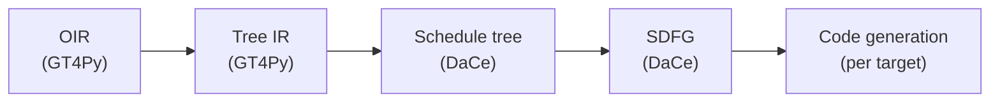

# DaCe backends: schedule tree

In the context of [DaCe backends](./backend-dace.md), facing tech-debt, a lack of understanding of the current stack, and under performing map- & state fusion, we decided to rewrite substantial parts of the DaCe backends with schedule trees to achieve hardware dependent macro-level optimizations (e.g. loop merging and loop re-ordering) at a new IR level before going to SDFGs. We considered writing custom SDFG fusion passes and accept that we have to contribute a schedule tree to SDFG conversion in DaCe.

## Context

Basically three forces were driving this drastic change:

- We were unhappy with the performance of the DaCe backends, especially on CPU.
- We had little understanding of the previous GT4Py-DaCe bridge.
- The previous GT4Py-DaCe bridge accumulated a lot of tech debt, making it clumsy to work with and hard to inject major changes.

## Decision

We chose to directly translate GT4Py's optimization IR (OIR) to DaCe's schedule tree (and from there to SDFG and code generation) because this allows to separate macro-level and micro-level optimizations. DaCe's schedule tree is ideally suited for schedule-level optimizations like loop re-ordering or loop merges with over-computation. The (simplified) pipeline looks like this:

OIR to Tree IR conversion has two visitors in separate files:

1. `dace/oir_to_treeir.py` transpiles control flow
2. `dace/oir_to_tasklet.py` transpiles computations (i.e. bodies of control flow elements)

While this incurs a bit of code duplications (e.g. for resolving indices), it allows for separation of concerns: Everything that is related to the schedule is handled in `oir_to_treeir.py`. Note, for example, that we keep the distinction between horizontal mask and general `if` statements. This distinction is kept because horizontal regions might influence scheduling decisions, while general `if` statements do not.

The subsequent conversion from Tree IR to schedule tree is a straight forward visitor located in `dace/treeir_to_stree.py`. Notice the simplicity of that visitor.

## Consequences

What it now easier to do? What becomes more difficult with this change?

Describe the positive (e.g., improvement of quality attribute satisfaction, follow-up decisions required, ...) as well as the negative (e.g., compromising quality attribute, follow-up decisions required, ...) outcomes of this decision.

## Alternatives considered

### OIR -> SDFG -> schedule tree -> SDFG

- Allows to keep the current OIR -> SDFG bridge, i.e. no need to write and OIR -> schedule tree bridge.
- The first SDFG is unnecessary and translation times are a real problem.
- And we were unhappy with the OIR -> SDFG bridge anyway.
- Looses some context between OIR and schedule tree (e.g. horizontal regions)

### Improve the existing SDFG map fusion

GT4Py next has gone this route and an improved version is merged in the mainline version of DaCe. We think we'll need a custom map fusion pass which lets us decide low-level things like under which circumstances over-computation is desirable. A general map fusion pass will never be able to allow this.

### Write custom map fusion based on SDFG syntax

Possible, but a lot more cumbersome than writing the same transformation based on the schedule tree syntax.

## References

If it helps, add references e.g. to issues and/or other planning documents.
