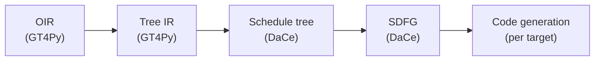

# DaCe backends: Schedule tree

In the context of [DaCe backends](./dace.md), facing tech-debt, a lack of understanding of the current stack, and under performing map- & state fusion, we decided to rewrite substantial parts of the DaCe backends with so called "Schedule Trees" to achieve hardware dependent macro-level optimizations (e.g. loop merging and loop re-ordering) at a new IR level before going down to SDFGs. We considered writing custom SDFG fusion passes and accept that we have to contribute a conversion from Schedule Tree to SDFG in DaCe.

## Context

Basically, three forces were driving this drastic change:

1. We were unhappy with the performance of the DaCe backends, especially on CPU.
2. We had little understanding of the previous GT4Py-DaCe bridge.
3. The previous GT4Py-DaCe bridge accumulated a lot of tech debt, making it clumsy to work with and hard to inject major changes.

## Decision

We chose to directly translate GT4Py's optimization IR (OIR) to DaCe's schedule tree (and from there to SDFG and code generation) because this allows to separate macro-level and data-specific optimizations. DaCe's schedule tree is ideally suited for schedule-level optimizations like loop re-ordering or loop merges with over-computation. The (simplified) pipeline looks like this:

OIR to Tree IR conversion has two visitors in separate files:

1. `dace/oir_to_treeir.py` transpiles control flow elements
2. `dace/oir_to_tasklet.py` transpiles computations (i.e. bodies of control flow elements)

While this incurs a bit of code duplications (e.g. resolving index accesses), it allows for separation of concerns: Everything that is related to the schedule is handled in `oir_to_treeir.py`. Note, for example, that we keep the distinction between horizontal mask and general `if` statements. This distinction is kept because horizontal regions might influence scheduling decisions, while general `if` statements do not.

The subsequent conversion from Tree IR to schedule tree is a straight forward visitor located in `dace/treeir_to_stree.py`. Notice the simplicity of that visitor.

## Consequences

The schedule tree introduces a transpilation layer ideally suited for macro-level optimizations, which are targeting the program's execution schedule. This is particularly interesting for the DaCe backends because we use the same backend pipeline to generate code for CPU and GPU targets.

In particular, the schedule tree allows to easily re-order/modify/change the loop structure. This not only allows us to generate hardware-specific loop order and tile-sizes, but also gives us fine grained control over loop merges and/or which loops to generate in the first place. For example, going directly from OIR to Tree IR allows us to translate horizontal regions to either `if` statements inside a bigger horizontal loop (for small regions) or break them out into separate loops (for bigger regions) if that makes sense for the target architecture.

## Alternatives considered

### OIR -> SDFG -> schedule tree -> SDFG

- Seems smart because it allows to keep the current OIR -> SDFG bridge, i.e. no need to write and OIR -> schedule tree bridge,
- but the first SDFG is unnecessary and translation times are a real problem
- and we were unhappy with the OIR -> SDFG bridge anyway
- and ,in addition, we loose some context between OIR and schedule tree (e.g. horizontal regions).

### Improve the existing SDFG map fusion

GT4Py next has gone this route and an improved version is merged in the mainline version of DaCe. We think we'll need a custom map fusion pass which lets us decide low-level things like under which circumstances over-computation is desirable. A general map fusion pass will never be able to allow this.

### Write custom map fusion based on SDFG syntax

Possible, but a lot more cumbersome than writing the same transformation based on the schedule tree syntax.
