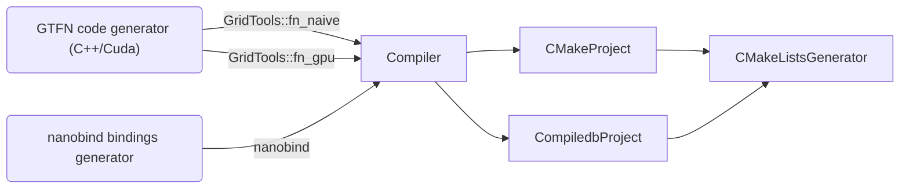

# Support for Multiple Backends, Build Systems and Libraries

- **Status**: valid
- **Authors**: Rico Häuselmann (@DropD)
- **Created**: 2023-10-11
- **Updated**: 2023-10-11

In the process of enabling CUDA for the GTFN backend, we encountered a potential support matrix of build systems x target language libraries. The current design requires build systems about all the libraries they can be used with. We decided that the matrix is too small for now and to not revisit the existing design yet.

## Context

ADRs [0009](0009-Compiled_Backend_Integration.md), [0011](0011-On_The_Fly_Compilation.md) and [0012](0012-GridTools_Cpp_OTF_Steps.md) detail the design decisions around what is loosely referred as "gt4py.next backends". In summary the goals are:

- extensibility
  - adding backends should not require changing existing code
  - adding / modifying backend modules like build systems / compilers should not be blocked by assumptions in other modules.
- modularity
  - increase the chance that two different backends (for example GTFN and another C++ backend) can share code.

Therefore the concerns of generating code in the target language, generating python bindings in the target language and of building (compiling) the generated code are separated it code generator, bindings generator and compile step / build system. The compile step is written to be build system agnostic.

There is one category that connects all these concerns: libraries written in the target language and used in generated / bindings code.

Current design:



The current design contains two mappings:

- library name -> CMake `find_package()` call
- library name -> CMake target name

and the gridtools cpu/gpu link targets are differentiated by internally separating between two fictitious "gridtools_cpu" and "gridtools_gpu" libraries.

## concerns

### Usage

The "gridtools_cpu" and "gridtools_gpu" fake library names add to the learning curve for this part of the code. Reuse of the existing components might require this knowledge.

### Scalability

Adding a new backend using the existing build systems but relying on different libraries has to modify existing build system components (at the very least CMakeListsGenerator).

### Separation of concerns

It makes more sense to separate the concerns of how to generate a valid build system configuration and how to use a particular library in a particular build system than to mix the two.

## Decision

Currently the code overhead is in the tens of lines, and there are no concrete plans to add more compiled backends or different build systems. Therefore we decide to keep the current design for now but to redesign as soon as the matrix grows.
To this end ToDo comments are added in the relevant places

## Consequences

Initial GTFN gpu support will not be blocked by design work.

## Alternatives Considered

### Push build system support to the LibraryDependency instance

```
#src/gt4py/next/otf/binding/interface.py

...
class LibraryDependency:
    name: str
    version: str
    link_targets: list[str]
    include_headers: list[str]
```

- Simple, choice is made at code generator level, where the knowledge should be
- Interface might not suit every build system
- Up to the implementer to make the logic for choosing reusable (or not)

### Create additional data structures to properly separate concerns

```
class BuildSystemConfig:
    device_type: core_defs.DeviceType
    ...


class LibraryAdaptor:
    library: LibraryDependency
    build_system: CMakeProject

    def config_phase(self, config: BuildSystemConfig) -> str:
        import gridtools_cpp
        cmake_dir = gridtools_cpp.get_cmake_dir()

        return f"find_package(... {cmake_dir} ... )"

def build_phase(self, config: BuildSystemConfig) -> str:
        return "" # header only library

def link_phase(self, main_target_name: str, config: BuildSystemConfig) -> str:
        return f"target_link_libraries({main_target_name} ...)"
```

- More general and fully extensible, adaptors can be added for any required library / build system combination without touching existing code (depending on the registering mechanism).
- More likely to be reusable as choices are explicit and can be overridden separately by sub classing.
- More design work required. Open questions:
  - Design the interface to work with any build system
  - How to register adaptors? entry points? global dictionary?
