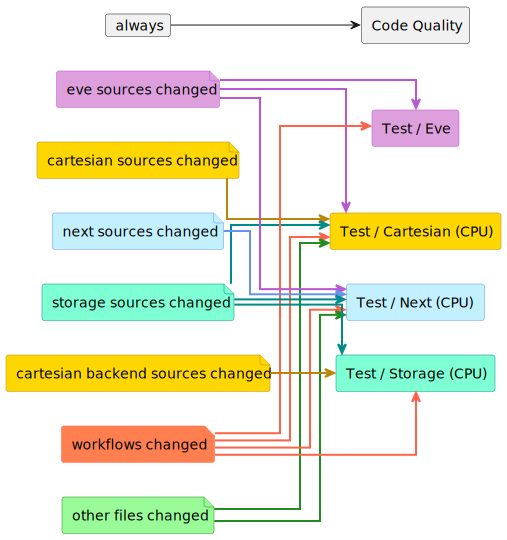

# CI infrastructure

## Workflows

The following workflows are currently active:

<!--
@startuml workflows

left to right direction
skinparam linetype ortho

'!include <C4/C4_Component>

card always [
always
]
file src_eve #Plum;line:MediumOrchid;text:black [
eve sources changed
]
file src_car #Gold;line:DarkGoldenRod;text:black [
cartesian sources changed
]
file src_nxt #APPLICATION;line:CornFlowerBlue;text:black [
next sources changed
]
file src_sto #Aquamarine;line:DarkCyan;text:black [
storage sources changed
]
file src_cab #Gold;line:DarkGoldenRod;text:black [
cartesian backend sources changed
]
file cfg_wfl #Coral;line:Tomato;text:black[
workflows changed
]
file other #PaleGreen;line:ForestGreen;text:black [
other files changed, excluding examples (the examples folder) and docs (.md and .rst files)
]
file pkg_cfg #PaleGreen;line:ForestGreen;text:black [
package config files changed
]

agent eve #Plum;line:MediumOrchid;text:black [
Test / Eve
]
agent car #Gold;line:DarkGoldenRod;text:black [
Test / Cartesian (CPU)
]
agent nxt #APPLICATION;line:CornFlowerBlue;text:black [
Test / Next (CPU)
]
agent sto #Aquamarine;line:DarkCyan;text:black [
Test / Storage (CPU)
]
agent qua [
Code Quality
]

always  -[hidden]r-> src_eve
src_eve -[hidden]r-> src_car
src_car -[hidden]r-> src_nxt
src_nxt -[hidden]r-> src_sto
src_sto -[hidden]r-> src_cab
src_cab -[hidden]r-> cfg_wfl
cfg_wfl -[hidden]r-> other

always  -d-> qua

src_eve -[#MediumOrchid,thickness=2]d-> car
src_car -[#DarkGoldenRod,thickness=2]d-> car
src_sto -[#DarkCyan,thickness=2]d-> car
cfg_wfl -[#Tomato,thickness=2]d-> car
other   -[#ForestGreen,thickness=2]d-> car

src_eve -[#MediumOrchid,thickness=2]d-> eve
cfg_wfl -[#Tomato,thickness=2]d-> eve
pkg_cfg -[#ForestGreen,thickness=2]d-> eve

src_eve -[#MediumOrchid,thickness=2]d-> nxt
src_nxt -[#CornFlowerBlue,thickness=2]d-> nxt
src_sto -[#DarkCyan,thickness=2]d-> nxt
cfg_wfl -[#Tomato,thickness=2]d-> nxt
other   -[#ForestGreen,thickness=2]d-> nxt

src_sto -[#DarkCyan,thickness=2]d-> sto
src_cab -[#DarkGoldenRod,thickness=2]d-> sto
cfg_wfl -[#Tomato,thickness=2]d-> sto
pkg_cfg -[#ForestGreen,thickness=2]d-> sto

@enduml
-->

The `Test Eve`, `Test Storage (CPU)`, `Test Cartesian (CPU)`, and `Test Next (CPU)` workflows run the automated tests for the respective subpackages. In all cases only tests are run that do not require the presence of a GPU.

The `Code Quality` workflow runs pre-commit to check code quality requirements through tools like mypy or flake8.

Code coverage workflows are currently disabled.

### When are workflows triggered

The general idea is to run workflows only when needed. In this monorepo structure, this practically means that a set of tests are only run when the associated sources or the sources of a dependency change. For example, eve tests will not be run when only GT4Py sources are changed.

## CSCS-CI

CI pipelines for all tests can be triggered via CSCS-CI. These automatically run from a Gitlab mirror for whitelisted users only, and have to be explicitly run by a whitelisted user via the comment "cscs-ci run default" on PRs from other users. There is currently no finegrained control over which subpackage tests are run. Neither can a subset be started manually from the comments nor can tests be skipped based on which files have been changed. Both are achievable (the latter with considerable effort), however given the current duration of the pipeline it does not seem worth doing so.

Since all tests routinely run here, this might be a better match for reintroducing test coverage in the future than github workflows.

Additional information on how to change this process, such as adding whitelisted users, regenerating tokens etc can be found in [cscs-ci.md](cscs-ci.md)

## Integration with external tools

Workflows that integrate with external code quality services (i.e. codecov.io, SonarCloud) need special treatment for security reasons. Such workflows use a secret token to interact with the external services. Anyone having access to the secret token can read or write data to the external services and can thus "hack" it by publishing spoofed code coverage results, for example. To prevent the exposure of the secret tokens, GitHub allows repository owners to record secret tokens associated with the repository. These repository secrets can then be safely accessed from CI workflows.

The repository secrets, however, are only available within the main repository, not its forks. Otherwise, someone could make a fork, create a pull request with a malicious workflow, and steal the secrets. As a side-effect, it's impossible to publish code coverage results from a workflow triggered by a pull request from a fork.

To resolve this issue, the coverage workflows are triggered in the context of the main repository via the `workflow_run` trigger after the tests in the context of the fork have finished. The test workflows upload the coverage results as artifacts which are then downloaded in the subsequent workflow that publishes them to codecov.io. The test workflows also save the context such as run ID or PR number in an artifact, which is then forwarded by the subsequent workflow to the external tool.

## Tested operating systems

The testing workflows already use a matrix strategy to run the automated tests on multiple operating systems. There is, however, a baseline 2000 hour monthly limit for the total time CI runs take. Since MacOS builds consume node hours 10 times as fast, this leaves an effective 200 hours for MacOS CI runs. This was already exhausted during testing of the workflows, thus MacOS was temporarily disabled in the configuration matrices, leaving only Ubuntu. It would be nice to further test the limits or pay for some more hours to restore MacOS builds.

## Future improvements

- Reenable code coverage workflows (potentially on CSCS-CI).
- Split code quality: it might be better to run code quality tools separate for each project in the monorepo.
- Split documentation: once there is proper HTML documentation generated for the projects, it might make sense to have that run as one job per project.
- Template for tests: although there is a reusable workflow for the code coverage uploading, it probably make sense to reuse some of the workflow description for the tests as well.
