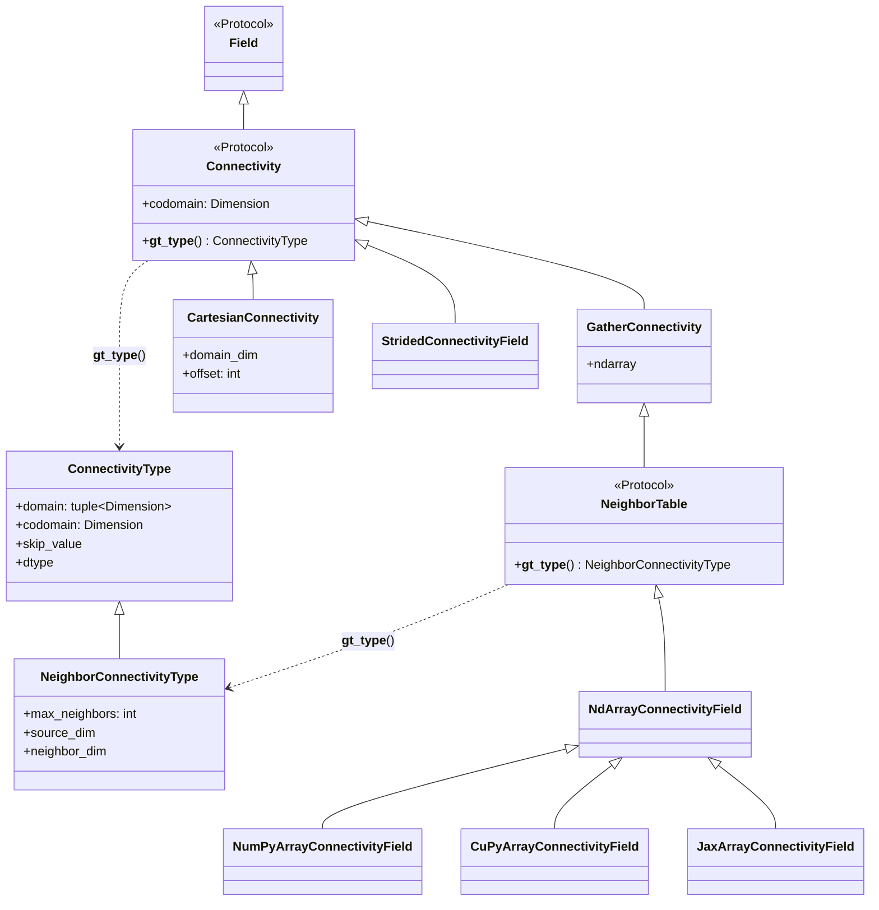
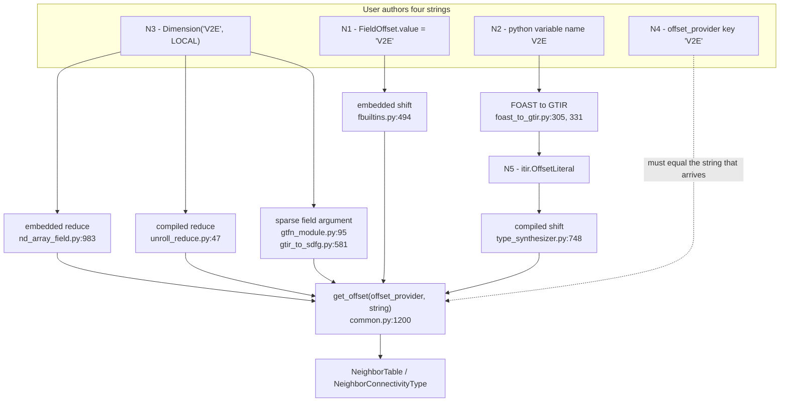

# Tag and name constraints for `FieldOffset`, `Dimension` and offset providers

Analysis of the *string-identity* assumptions that connect `FieldOffset` tags,
`Dimension` names and `offset_provider` keys in `gt4py.next`, across the
embedded, IR and backend contexts.

Status: descriptive — this documents the implementation as it is, it does not
propose a change. Line references are against `main` at `b3c53fa7e`
(v1.2.2, 2026-09-03).

Related: [ADR 0019 Connectivities](../ADRs/next/0019-Connectivities.md),
[ADR 0026 Staggered Dimensions](../ADRs/next/0026-Staggered_Dimensions.md).

## 0. The five name spaces

| #      | Name space                                                         | Type                                                 | Defined at                                                 |
| ------ | ------------------------------------------------------------------ | ---------------------------------------------------- | ---------------------------------------------------------- |
| **N1** | `FieldOffset.value` — the *offset tag*                             | `str` (from `runtime.Offset.value: Union[int, str]`) | `iterator/runtime.py:36-37`, `ffront/fbuiltins.py:471-472` |
| **N2** | The **Python closure-variable name** the `FieldOffset` is bound to | `str`                                                | consumed at `ffront/foast_to_gtir.py:305, 331`             |
| **N3** | `Dimension.value` — the *dimension tag*                            | `str`                                                | `common.py:79-81`                                          |
| **N4** | `offset_provider` **dict key**                                     | `str`                                                | `common.py:1200-1209`                                      |
| **N5** | ITIR `OffsetLiteral.value` / `AxisLiteral.value`                   | `str`                                                | `iterator/ir.py:88-96`                                     |

`ts.OffsetType` carries **only** `source`/`target`
(`type_system/type_specifications.py:73-76`); N1 is discarded at
`fbuiltins.py:484-485`. That erasure is the root cause of most rows below.

The only validation `FieldOffset` performs on itself is on the *kind*, never on
any name (`ffront/fbuiltins.py:470-482`):

```python
class FieldOffset(runtime.Offset):  # .value is the tag, inherited from runtime.Offset
    source: common.Dimension
    target: tuple[Dimension] | tuple[Dimension, Dimension]

    def __post_init__(self) -> None:
        if len(self.target) == 2 and self.target[1].kind != common.DimensionKind.LOCAL:
            raise ValueError("Second dimension in offset must be a local dimension.")
```

## 1. Concept inventory

Every class and type alias in `src/gt4py/next/` that participates in the
offset/connectivity vocabulary, grouped by layer.

### L0 — Vocabulary (`common.py`)

| Concept                                           | Where                          | Role                                                                       |
| ------------------------------------------------- | ------------------------------ | -------------------------------------------------------------------------- |
| `Tag = str`                                       | `common.py:63`                 | the alias that makes every name space stringly-typed                       |
| `DimensionKind`                                   | `common.py:66-72`              | `HORIZONTAL` / `VERTICAL` / `LOCAL`                                        |
| `Dimension`                                       | `common.py:79-81`              | `(value: str, kind)`; `__add__`/`__sub__` build Cartesian shifts           |
| `UnitRange`, `NamedRange`, `NamedIndex`, `Domain` | `common.py:196, 358, 369, 432` | index-space vocabulary; `Domain.dims` is where local dims appear on fields |

### L1 — Connectivity objects (runtime data)

| Concept                       | Where                         | Role                                                                |
| ----------------------------- | ----------------------------- | ------------------------------------------------------------------- |
| `Connectivity`                | `common.py:990`               | `Protocol`; a `Field` of indices with a `codomain`                  |
| `GatherConnectivity`          | `common.py:1099`              | nominal (not a `Protocol`): `premap` is a data-moving gather        |
| `NeighborTable`               | `common.py:1149`              | `Protocol`; 2-D table-backed neighbor connectivity                  |
| `NdArrayConnectivityField`    | `nd_array_field.py:516`       | the concrete implementation                                         |
| `NumPyArrayConnectivityField` | `nd_array_field.py:1032`      | array-library variant                                               |
| `CuPyArrayConnectivityField`  | `nd_array_field.py:1049`      | array-library variant                                               |
| `JaxArrayConnectivityField`   | `nd_array_field.py:1087`      | array-library variant                                               |
| `CartesianConnectivity`       | `common.py:1241`              | affine shift; no `ndarray`, **not** a `GatherConnectivity`          |
| `StridedConnectivityField`    | `iterator/embedded.py:107`    | incomplete; iterator-view only (`TODO(havogt)`)                     |
| `_ConnectivityFileRef`        | `otf/compilation_tasks.py:50` | lazy pickling stand-in; dumps to `.npy` to cross process boundaries |

Constructors: `constructors.as_connectivity`, plus the `_field` / `_connectivity`
`singledispatch` pair at `common.py:1121-1146`.

### L2 — Connectivity *types* (compile time)

| Concept                    | Where               | Contents                                                                    |
| -------------------------- | ------------------- | --------------------------------------------------------------------------- |
| `ConnectivityType`         | `common.py:964-973` | `domain`, `codomain`, `skip_value`, `dtype`                                 |
| `NeighborConnectivityType` | `common.py:976-986` | `+ max_neighbors`; `.source_dim == domain[0]`, `.neighbor_dim == domain[1]` |

### L3 — The provider (name to data binding)

| Concept                                                                  | Where                 |
| ------------------------------------------------------------------------ | --------------------- |
| `OffsetProvider = Mapping[Tag, NeighborTable]`                           | `common.py:1177`      |
| `OffsetProviderType = Mapping[Tag, NeighborConnectivityType]`            | `common.py:1178`      |
| `OffsetProviderElem`, `OffsetProviderTypeElem`                           | `common.py:1172-1173` |
| `get_offset`, `get_offset_type`, `has_offset`, `offset_provider_to_type` | `common.py:1193-1221` |

### L4 — Frontend declarations

| Concept                            | Where                       | Contents                                       |
| ---------------------------------- | --------------------------- | ---------------------------------------------- |
| `runtime.Offset`                   | `iterator/runtime.py:36-37` | `value: int \| str`                            |
| `FieldOffset(runtime.Offset)`      | `ffront/fbuiltins.py:472`   | `+ source`, `target`                           |
| `as_offset` builtin                | `ffront/experimental.py:17` | dynamic Cartesian shift from an index field    |
| `connectivity_for_cartesian_shift` | `common.py:1467`            | builds a `CartesianConnectivity`; needs no tag |

### L5 — Frontend types

| Concept             | Where                          | Note                                                 |
| ------------------- | ------------------------------ | ---------------------------------------------------- |
| `ts.OffsetType`     | `type_specifications.py:73-79` | `source`/`target` only — **the tag is dropped here** |
| `ts.DimensionType`  | `type_specifications.py:55`    | wraps a `Dimension`                                  |
| `ts.FieldType.dims` | `type_specifications.py:121`   | sparse fields carry the local dim as a list member   |

### L6 — ITIR nodes

| Node                   | Where                   | Carries                                             |
| ---------------------- | ----------------------- | --------------------------------------------------- |
| `itir.OffsetLiteral`   | `iterator/ir.py:88-89`  | a bare `str` tag — unstructured                     |
| `itir.AxisLiteral`     | `iterator/ir.py:92-96`  | `value` + `kind` — a serialized `Dimension`         |
| `itir.CartesianOffset` | `iterator/ir.py:99-101` | two `AxisLiteral`s — **no tag, no provider lookup** |

### L7 — ITIR types

| Concept                     | Where                                            | Contents                                          |
| --------------------------- | ------------------------------------------------ | ------------------------------------------------- |
| `it_ts.OffsetLiteralType`   | `iterator/type_system/type_specifications.py:19` | `value: ScalarType \| str`                        |
| `it_ts.CartesianOffsetType` | `…:23`                                           | `domain`, `codomain`                              |
| `it_ts.NamedRangeType`      | `…:15`                                           | `dim`                                             |
| `it_ts.IteratorType`        | `…:28`                                           | `position_dims`, `defined_dims`                   |
| `ts.ListType`               | `type_specifications.py:108-118`                 | `element_type` + `offset_type: Dimension \| None` |

`ListType`'s docstring states the frontend/IR split explicitly: *"not used in the
frontend. The concept is represented as Field with local Dimension."*

### L8 — Embedded iterator runtime

| Concept                            | Where                             | Role                                                      |
| ---------------------------------- | --------------------------------- | --------------------------------------------------------- |
| `SparseTag(Tag)`                   | `iterator/embedded.py:102`        | marks a shift into the sparse axis                        |
| `MDIterator`, `SparseListIterator` | `iterator/embedded.py:~800, 1507` | iterators; the latter holds `list_offset: Tag`            |
| `_List`, `_ConstList`              | `iterator/embedded.py:1399, 1420` | neighbor-list values                                      |
| `_CONST_DIM`                       | `iterator/embedded.py:220`        | reserved LOCAL dim, deliberately absent from the provider |
| position dicts                     | `iterator/embedded.py:597-616`    | keyed by `Dimension.value` strings                        |

### L9 — Backend representations

| Concept                                     | Where                                       | Role                                                  |
| ------------------------------------------- | ------------------------------------------- | ----------------------------------------------------- |
| `gtfn_ir.OffsetLiteral`                     | `gtfn/gtfn_ir.py:52`                        | lowered tag                                           |
| `gtfn_ir.TagDefinition`                     | `gtfn/gtfn_ir.py:249-251`                   | `name`, optional `alias`; emits `generated::<name>_t` |
| `gtfn_ir.UnstructuredDomain.connectivities` | `gtfn/gtfn_ir.py:90-93`                     | `SymRef` to an offset declaration                     |
| `gtfn_ir.TaggedValues`                      | `gtfn/gtfn_ir.py:80-82`                     | tag-keyed sizes/offsets                               |
| `dace FieldopData`                          | `dace/lowering/gtir_to_sdfg_types.py:27-34` | carries the local-dim/offset-provider association     |
| `dace connectivity_identifier`              | `dace/sdfg_args.py:56-70`                   | `gt_conn_<key>` array naming                          |

### Concept count

| Kind                                       | Count | Notes                                                                                                                  |
| ------------------------------------------ | ----- | ---------------------------------------------------------------------------------------------------------------------- |
| Runtime connectivity classes               | 8     | 3 are array-library variants of one; 1 is incomplete                                                                   |
| Connectivity type classes                  | 2     |                                                                                                                        |
| Declaration classes                        | 2     | the subclassing is flagged as a conceptual mismatch at `fbuiltins.py:467`                                              |
| Type-system representations of "an offset" | 5     | `ts.OffsetType`, `it_ts.OffsetLiteralType`, `it_ts.CartesianOffsetType`, `ts.ListType.offset_type`, `ts.DimensionType` |
| IR node kinds                              | 4     | 3 ITIR + 1 GTFN                                                                                                        |
| Provider aliases                           | 4     |                                                                                                                        |

Roughly **25 distinct concepts** for what is conceptually one thing — a mapping
between two index spaces — plus a name for it.

## 2. How the concepts relate

### 2.1 Connectivity class hierarchy

```text
Field (Protocol)
└── Connectivity (Protocol)                              common.py:990
    ├── GatherConnectivity   <- nominal, gather premap   common.py:1099
    │   └── NeighborTable (Protocol, 2-D, table-backed)  common.py:1149
    │       └── NdArrayConnectivityField                 nd_array_field.py:516
    │           ├── NumPyArrayConnectivityField          nd_array_field.py:1032
    │           ├── CuPyArrayConnectivityField           nd_array_field.py:1049
    │           └── JaxArrayConnectivityField            nd_array_field.py:1087
    ├── CartesianConnectivity  <- affine, no ndarray     common.py:1241
    └── StridedConnectivityField  <- WIP, iterator only  iterator/embedded.py:107
```



### 2.2 Declaration vs type vs data — the duplicated triple

`FieldOffset` carries exactly the information in `NeighborConnectivityType` plus
a name, with **inverted vocabulary** and no cross-check. `FieldOffset.source` is
the connectivity's *codomain*; `FieldOffset.target` is its *domain*. The
inversion is because `source`/`target` describe the *field remap* (the field
lives on `source` and ends up on `target`), while `domain`/`codomain` describe
the *table*.

```text
  DECLARATION                TYPE                          DATA
  ───────────                ────                          ────
  FieldOffset                ts.OffsetType                 (none — bound later)
   .value    ─── dropped ──X
   .target[0] ═══════════════ .target[0] ═══ A8 ═══════════ ConnectivityType.domain[0]
   .target[1] ═══════════════ .target[1] ═══ A6 ═══════════ ConnectivityType.domain[1]
   .source    ═══════════════ .source    ═══ A7 ═══════════ ConnectivityType.codomain
                                                            ^^^^^^^^^^^^^^^^^^^^^^^^^
                                            the same information, authored twice,
                                            with inverted vocabulary, never cross-checked
```

### 2.3 Name flow — where the five name spaces diverge

Four independently-authored strings converge on one dict lookup, and *which* of
them arrives there depends on the execution path and the operation.

```text
                    ┌──────────────────────────────────────────────────┐
                    │  V2EDim = Dimension("V2E", LOCAL)          (N3)  │
   USER AUTHORS     │  V2E    = FieldOffset("V2E", Edge,(V,V2EDim))    │
   FOUR STRINGS     │  ^^^                                       (N2)  │
                    │           ^^^^^                            (N1)  │
                    │  offset_provider = {"V2E": table}          (N4)  │
                    └──────────────────────────────────────────────────┘
                                        │
              ┌─────────────────────────┴─────────────────────────┐
              │                                                   │
        EMBEDDED PATH                                     COMPILED PATH
              │                                                   │
   ┌──────────┴──────────┐                          ┌─────────────┴─────────────┐
   │ shift               │ reduce                   │ FOAST -> GTIR             │
   │ fbuiltins.py:494    │ nd_array_field.py:983    │ foast_to_gtir.py:305,331  │
   │   uses N1           │   uses N3 (axis.value)   │   uses N2 (Name.id) -> N5 │
   └──────────┬──────────┘                          └─────────────┬─────────────┘
              │                                                   │
              │                        ┌──────────────────────────┤
              │                        │ reduce: unroll_reduce.py:47
              │                        │   uses N3 (ListType.offset_type.value)
              │                        │
              │                        │ sparse arg: gtfn_module.py:95
              │                        │             gtir_to_sdfg.py:581
              │                        │   uses N3 (dim.value)
              │                        │
              └────────────┬───────────┴─────────────┬────────────┘
                           v                         v
              get_offset(offset_provider, <string>)  ==  N4
                           │
                           v
                 NeighborTable / NeighborConnectivityType
```



### 2.4 The contrast that suggests the fix

Cartesian shifts carry **dimensions** in the IR node; unstructured shifts carry
a **string** that must be resolved against a dict. Every constraint A1-A5 exists
only on the right-hand side.

```text
  CARTESIAN (already clean)            UNSTRUCTURED (entangled)
  ─────────────────────────            ────────────────────────
  field(IDim + 1)                      field(V2E)
      │                                    │
      v                                    v
  CartesianConnectivity                itir.OffsetLiteral("V2E")   <- a string
  (common.py:1241)                         │
      │                                    v
      v                                get_offset(provider, "V2E")
  itir.CartesianOffset                     │
    domain:   AxisLiteral                  v
    codomain: AxisLiteral              NeighborTable
  (iterator/ir.py:99)
      │
      v
  NO tag. NO provider entry. NO lookup.
```

This is the concrete precedent behind any consolidation proposal: the Cartesian
path already eliminated the string indirection, and the unstructured path
retains it only because the neighbor table data must be supplied at runtime.

## 3. Master table — cross-name-space identity constraints

| #       | Constraint                                                                   | Embedded (field) | Embedded (iterator) | IR / type system | GTFN             | DaCe         | Enforced?                     | Source                                                                                       |
| ------- | ---------------------------------------------------------------------------- | ---------------- | ------------------- | ---------------- | ---------------- | ------------ | ----------------------------- | -------------------------------------------------------------------------------------------- |
| **A1**  | `FieldOffset.value` (N1) == provider key (N4)                                | required         | required            | —                | —                | —            | `KeyError`                    | `fbuiltins.py:494, 508`; `common.py:1207-1208`                                               |
| **A2**  | Python var name (N2) == provider key (N4)                                    | —                | —                   | required         | required         | required     | silent; `KeyError` at runtime | `foast_to_gtir.py:305, 331`                                                                  |
| **A3**  | local dim `.value` (N3) == provider key (N4), **reductions**                 | required         | required            | required         | required         | required     | `KeyError`                    | `nd_array_field.py:981-985`; `embedded.py:953, 1517, 1776`; `unroll_reduce.py:43-50, 61-65`  |
| **A4**  | local dim `.value` (N3) == provider key (N4), **sparse field args**          | —                | —                   | —                | required         | required     | `assert` / `ValueError`       | `gtfn_module.py:88-98`; `gtir_to_sdfg.py:572-585, 838-842`; `gtir_to_sdfg_lambda.py:766-770` |
| **A5**  | `FieldOffset.value` (N1) == local dim `.value` (N3), **shift path**          | n/a (A1 governs) | n/a                 | **not** required | **not** required | inconsistent | codegen branch handles it     | `itir_to_gtfn_ir.py:181-190`; regression test                                                |
| **A6**  | `target[-1]` == connectivity `neighbor_dim` (full `Dimension` equality)      | required         | required            | required         | required         | required     | no eager check; index error   | `fbuiltins.py:496`; `common.py:984-986`                                                      |
| **A7**  | `FieldOffset.source` == connectivity `codomain`                              | required         | required            | required         | required         | required     | `assert` only                 | `embedded.py:596-614`; `type_synthesizer.py:748-758`                                         |
| **A8**  | `FieldOffset.target[0]` == connectivity `domain[0]` (`source_dim`)           | required         | required            | required         | required         | required     | `assert found`                | `type_synthesizer.py:752-758`; `embedded.py:597-599`                                         |
| **A9**  | `Dimension.value` (N3) is the key of the embedded **iterator position dict** | —                | required            | —                | —                | —            | `assert ... in pos`           | `embedded.py:574-576, 597-616, 941-950`                                                      |
| **A10** | `Dimension.value` (N3) round-trips through `AxisLiteral.value` (N5)          | —                | —                   | required         | required         | required     | structural                    | `iterator/ir.py:92-96`; `ir_utils/misc.py:234-235`; `inference.py:463-464`                   |

### Notes on A5

A5 is the only row with history. PR #1789 (`fix[next]: gtfn with offset name != local dimension name`) lifted it for shifts and added the
`if offset_name != connectivity_type.neighbor_dim.value` branch at
`itir_to_gtfn_ir.py:185-190`. Its regression test is
`tests/next_tests/regression_tests/ffront_tests/test_offset_dimensions_names.py`,
whose docstring gives the motivation:

> If the value of the `NeighborConnectivityType.neighbor_dim` did not match the
> `FieldOffset` value, gtfn would silently ignore the neighbor index, see
> <https://github.com/GridTools/gridtools/pull/1814>.

That test covers **only** `a(Off[1])` on `GTFN_CPU`. It does not cover
`neighbor_sum`, embedded execution, or DaCe. A3 and A4 were never lifted, so a
mismatch still breaks reductions and sparse arguments.

The DaCe "inconsistent" entry: `gtir_to_sdfg_lambda.py:1155` builds
`Dimension(offset, LOCAL)` — a local dim named after the *tag* — while
`type_synthesizer.py:327-329` builds the same `ListType` from
`conn_type.neighbor_dim`. The two agree only when A5 holds.

## 4. Per-context detail

### 4.1 Embedded — field level (`nd_array_field`, `fbuiltins`)

| Site                                             | Key used          | Constraint                                                                     |
| ------------------------------------------------ | ----------------- | ------------------------------------------------------------------------------ |
| `fbuiltins.py:491-498` `FieldOffset.__getitem__` | `self.value` (N1) | A1; then `NamedIndex(self.target[-1], offset)` gives A6                        |
| `fbuiltins.py:502-520` `as_connectivity_field`   | `self.value` (N1) | A1                                                                             |
| `nd_array_field.py:981-985` reductions           | `axis.value` (N3) | A3 — carries the comment `# assumes offset and local dimension have same name` |
| `nd_array_field.py:972-979`                      | —                 | `axis.kind == LOCAL`; at most one local dim per field                          |
| `nd_array_field.py:317-320` `premap`             | —                 | `FieldOffset` to `Connectivity` via A1                                         |

### 4.2 Embedded — iterator level (`iterator/embedded.py`)

| Site                                    | Key used                                                  | Constraint                        |
| --------------------------------------- | --------------------------------------------------------- | --------------------------------- |
| `:596-616` `execute_shift`              | tag (N4), then `source_dim.value` / `codomain.value` (N3) | A7, A8, A9                        |
| `:566-576` sparse shift                 | tag (N4)                                                  | A3                                |
| `:941-953` `make_in_iterator`           | `sparse_dimensions[0].value` (N3) used as tag             | A3                                |
| `:1517-1519` `SparseListIterator.deref` | `self.list_offset` (N3-derived)                           | A3                                |
| `:1005` `field_setitem`                 | `value.offset.value` used as a **field dim name**         | A3 (tag to N3, reverse direction) |
| `:1410-1416` `_List.__gt_type__`        | tag, then `neighbor_dim`                                  | correct direction, no assumption  |
| `:1436-1451` `neighbors`                | `offset.value` (N1)                                       | A1                                |
| `:1776` `_fieldspec_list_to_value`      | `offset_type.value` (N3)                                  | A3                                |

### 4.3 IR / type system

| Site                                                    | Key used                                        | Constraint                                                                           |
| ------------------------------------------------------- | ----------------------------------------------- | ------------------------------------------------------------------------------------ |
| `type_synthesizer.py:326-329` `neighbors`               | `OffsetLiteral.value` (N5), then `neighbor_dim` | A2; local dim taken from provider, **not** from the tag                              |
| `type_synthesizer.py:740-758` `shift`                   | N5, then `domain[0]`/`codomain`                 | A2, A7, A8 (`assert found`, `assert not found`)                                      |
| `type_synthesizer.py:433-447` `_canonicalize_nb_fields` | field's LOCAL dim to `ListType.offset_type`     | where N3 enters `ListType` and becomes an A3 key downstream                          |
| `type_synthesizer.py:546-556` `_resolve_dimensions`     | N5, then `get_offset_type`                      | A2                                                                                   |
| `unroll_reduce.py:43-50, 61-65`                         | `arg.type.offset_type.value` (N3)               | **A3**                                                                               |
| `domain_utils.py:205-223`                               | `off.value` (N5)                                | A2                                                                                   |
| `pass_manager.py:55-63`                                 | `source_dim.value`/`codomain.value` (N3)        | domain sizes keyed by dimension name                                                 |
| `past_to_itir.py:409-410`                               | —                                               | `ValueError: "common.Dimension '{dim.value}' must not be local."` in program domains |
| `type_deduction.py:459-464`                             | —                                               | `"Second dimension in offset must be a local dimension."`                            |
| `type_info.py:637-650, 848-878`                         | —                                               | shift typing via `source`/`target` only; the tag is never consulted                  |

### 4.4 GTFN backend

| Site                                  | Name used                                          | Constraint                                                 |
| ------------------------------------- | -------------------------------------------------- | ---------------------------------------------------------- |
| `itir_to_gtfn_ir.py:181-190`          | provider key **and** `neighbor_dim.value`          | the only site that anticipates A5 failing; emits both tags |
| `itir_to_gtfn_ir.py:191-196`          | `source_dim.value`, `codomain.value`               | must be `HORIZONTAL`, else `NotImplementedError`           |
| `itir_to_gtfn_ir.py:197-200`          | —                                                  | provider entries must be `NeighborConnectivityType`        |
| `itir_to_gtfn_ir.py:485-492`          | N5 tags                                            | `o in self.offset_provider_type`                           |
| `itir_to_gtfn_ir.py:139-148, 166-180` | `dim.value` (N3)                                   | every field dim name becomes a C++ tag                     |
| `gtfn_module.py:88-98`                | `dim.value` (N3)                                   | **A4**                                                     |
| `gtfn_module.py:126-136`              | `domain[0].value`, `domain[1].value`, provider key | all three become `generated::<name>_t`                     |

### 4.5 DaCe backend

| Site                                                 | Name used                              | Constraint                                                                                                          |
| ---------------------------------------------------- | -------------------------------------- | ------------------------------------------------------------------------------------------------------------------- |
| `gtir_to_sdfg.py:572-585`                            | `local_dim.value` (N3)                 | **A4**, explicit: `ValueError("The provided local dimension {local_dim} does not match any offset provider type.")` |
| `gtir_to_sdfg.py:838-842`                            | `dim.value` (N3)                       | A4 — array shape from `max_neighbors`                                                                               |
| `gtir_to_sdfg_lambda.py:766-770`                     | `local_dim.value` (N3)                 | A4                                                                                                                  |
| `gtir_to_sdfg_lambda.py:1312-1319, 1371, 1443, 1455` | `offset_type.value` (N3)               | A3, plus connectivity array name                                                                                    |
| `gtir_to_sdfg_lambda.py:1155`                        | tag (N5) to `Dimension(offset, LOCAL)` | reverse of A5; conflicts with `type_synthesizer.py:329`                                                             |
| `gtir_to_sdfg_lambda.py:1718-1727`                   | `offset_provider_arg.value` (N5)       | genuine tag lookup — correct                                                                                        |
| `gtir_to_sdfg_primitives.py:324-331`                 | `offset_type.value` (N3)               | A3                                                                                                                  |
| `gtir_to_sdfg_scan.py:385-389`                       | `offset_type.value` (N3)               | A3                                                                                                                  |
| `sdfg_args.py:73-93`                                 | field name plus `dim.value`            | dim matched against `source_dim`/`neighbor_dim`, else `ValueError`                                                  |

## 5. Constraints on the *format* of names

| #      | Constraint                                                                                                                              | Source                                                                      |
| ------ | --------------------------------------------------------------------------------------------------------------------------------------- | --------------------------------------------------------------------------- |
| **F1** | `_Staggered` is a **reserved prefix**: any `Dimension` whose `value` starts with it is treated as staggered                             | `common.py:1444-1464` (`_STAGGERED_PREFIX = "_Staggered"`)                  |
| **F2** | GTFN aliases every staggered tag to its base tag by string surgery                                                                      | `itir_to_gtfn_ir.py:703`, `_add_staggered_aliases:204-215`                  |
| **F3** | `_CONST_DIM` is a reserved LOCAL dimension name, deliberately *absent* from the provider and special-cased at every lookup              | `embedded.py:220, 572, 1513, 1768`; `gtir_to_sdfg_lambda.py:62, 1314, 1355` |
| **F4** | **Dimension names determine memory layout** — `order_dimensions` sorts by `(kind, as_non_staggered(dim).value)`                         | `common.py:1334-1344`                                                       |
| **F5** | GTFN: every dim name and provider key becomes a C++ type `generated::<name>_t`, so it must be a valid C++ identifier and collision-free | `gtfn_module.py:97, 130-136`                                                |
| **F6** | GTFN connectivity params: `gt_conn_<key.lower()>`, so keys must not collide **case-insensitively**                                      | `gtfn_module.py:32, 120, 133`                                               |
| **F7** | DaCe connectivity arrays: `gt_conn_<key>`, recovered by regex `^gt_conn_(\S+)$`                                                         | `sdfg_args.py:24-25, 56-70`                                                 |
| **F8** | DaCe map variables: `i_<dim>_gtx_<kind>[dim]`; map fusion/splitting transformations **rely on these strings matching**                  | `gtir_to_sdfg_utils.py:44-54`                                               |
| **F9** | DaCe field symbols: `__<field>_<dim.value>_size/stride`, `_range_symbol_name(field, dim.value)`                                         | `sdfg_args.py:73-82, 119-122`                                               |

## 6. Structural (kind / arity) constraints

| #   | Constraint                                                                | Enforced                             | Source                                                                        |
| --- | ------------------------------------------------------------------------- | ------------------------------------ | ----------------------------------------------------------------------------- |
| S1  | `len(target) == 2` implies `target[1].kind == LOCAL`                      | eager `ValueError`                   | `fbuiltins.py:480-482`; also `type_deduction.py:459-462`                      |
| S2  | A neighbor table's domain is exactly `(HORIZONTAL, LOCAL)`                | `is_neighbor_table` guard            | `common.py:1160-1168`                                                         |
| S3  | At most one LOCAL dim per field                                           | `ValueError` / `NotImplementedError` | `common.py:1334-1337`; `nd_array_field.py:976-979`; `gtir_to_sdfg.py:586-589` |
| S4  | Cartesian offset iff `len(target)==1 and source==target[0]` and not LOCAL | predicate                            | `fbuiltins.py:524-529`                                                        |
| S5  | Non-Cartesian offset or LOCAL dim implies grid type `UNSTRUCTURED`        | `ValueError`                         | `transform_utils.py:60-77`                                                    |
| S6  | `as_offset` is Cartesian-only                                             | `DSLError`                           | `type_deduction.py:955-965`                                                   |
| S7  | Program domains must not contain LOCAL dims                               | `ValueError`                         | `past_to_itir.py:409-410`                                                     |

## 7. Observed behaviour

Two properties above were confirmed by running them, not only by reading.

### 7.1 A1 vs A2 — embedded and compiled key on different strings

```python
MyOff = gtx.FieldOffset("TAGNAME", source=E, target=(V, Neigh))  # tag != variable name


@gtx.field_operator
def foo(a: Field[Dims[E], float]) -> Field[Dims[V], float]:
    return a(MyOff[1])
```

```text
embedded:  offset_provider={"TAGNAME": conn} -> OK ;  {"MyOff":   conn} -> KeyError 'TAGNAME'
roundtrip: offset_provider={"MyOff":   conn} -> OK ;  {"TAGNAME": conn} -> KeyError 'MyOff'
```

The compiled path uses the Python variable name because `foast_to_gtir.py:302-306`
and `:325-331` emit `im.shift(offset_name.id, ...)` / `im.as_fieldop_neighbors(str(offset_name), ...)`
from the FOAST `Name.id` — never from `FieldOffset.value`. Lowering the operator
above yields:

```text
foo = λ(a) → (⇑(λ(__it) → ·⟪MyOffₒ, 1ₒ⟫(__it)))(a);
```

### 7.2 A3 — reductions still require tag == local dim name

Reusing the deliberately mismatched declaration from the #1789 regression test
(`Off` tagged `"Off"`, local dim named `"Neigh"`):

```python
Off = gtx.FieldOffset("Off", source=E, target=(V, Neigh))


@gtx.field_operator
def bar(a: Field[Dims[E], float]) -> Field[Dims[V], float]:
    return neighbor_sum(a(Off), axis=Neigh)
```

```text
embedded:  FAILED: KeyError: "Offset 'Neigh' not found in offset provider."
roundtrip: OK -> [30. 50. 40.]
```

`unroll_reduce.py:43-50` has the same assumption for the compiled pipeline
(established by reading; the roundtrip backend above does not exercise that pass).

## 8. Practical consequence

To be safe across **all** contexts, four strings must be identical:

```text
FieldOffset.value  ==  <python variable name>  ==  offset_provider key  ==  target[-1].value
```

plus `target[0] == conn.domain[0]` and `source == conn.codomain` as `Dimension`
objects (A6-A8). This is exactly what `tests/next_tests/toy_connectivity.py:18-26`
encodes:

```python
V2EDim = gtx.Dimension("V2E", kind=gtx.DimensionKind.LOCAL)  # value is "V2E", not "V2EDim"
V2E = gtx.FieldOffset("V2E", source=Edge, target=(Vertex, V2EDim))
```

Relaxing any one of the four is currently supported only in the narrow slice
PR #1789 covered: shift-only, GTFN, no sparse arguments. Nothing validates the
full set up front — a violation surfaces as a `KeyError` from `common.py:1208`,
a bare `assert`, or, per the #1789 test docstring, silently wrong results.

Two existing `TODO`s point at this tangle:

- `common.py:976-977` — `NeighborConnectivityType`: *"refactor towards encoding
  this information in the local dimensions of the `ConnectivityType.domain`"*.
- `fbuiltins.py:467-470` — *"`FieldOffset` and `runtime.Offset` are not an exact
  conceptual match. Revisit if we want to continue subclassing here."*
