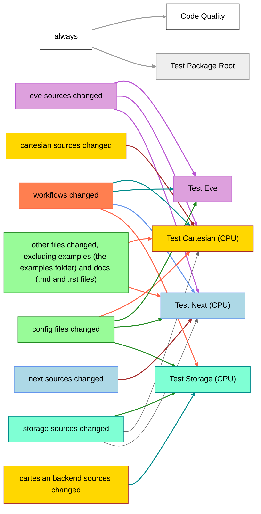

# CI infrastructure

Any test job that runs on CI is encoded in automation tools like **nox** and **pre-commit** and can be run locally instead.

## GitHub Workflows

The following workflows are currently active:

The `Test Cartesian (CPU)`, `Test Eve`, `Test Next (CPU)` and `Test Storage (CPU)` workflows run the automated tests for the respective subpackages. In all cases only tests are run that do not require the presence of a GPU. The `Test Package Root` workflow runs the automated tests for the root package code.

The `Code Quality` workflow runs pre-commit to check code quality requirements through tools like **mypy** or **ruff**.

Code coverage workflows are currently disabled.

### When are workflows triggered

The general idea is to run workflows only when needed. In this monorepo structure, this practically means that a set of tests are only run when the associated sources or the sources of a dependency change. For example, `eve` tests will not be run when only GT4Py sources are changed. In those cases where some subpackage workflows are not triggered, replacement (always-succeeding) `Fallback:` workflows will be executed instead to satisfy the GitHub merge protection rules.

### Daily CI

There is an extra CI workflow on GitHub scheduled to run daily and testing `main` with different sets of requirements: newest dependencies, lowest dependencies versions and lowest dependencies versions including extras. Failures are accessible in [GitHub web interface](https://github.com/GridTools/gt4py/actions/workflows/daily-ci.yml) and as the 'Daily CI' badge in the main [README.md](../../../README.md) file. Additionally, in case of failure a message _might_ be posted in the [#ci-notifications](https://app.slack.com/client/T0A5HP547/C0E145U65) channel of the GridTols slack, but those notifications do not work reliably.

## CSCS-CI

CI pipelines for all tests can be triggered via CSCS-CI. These automatically run from a Gitlab mirror for whitelisted users only, and have to be explicitly run by a whitelisted user via the comment "cscs-ci run default" on PRs from other users. There is currently no finegrained control over which subpackage tests are run. Neither can a subset be started manually from the comments nor can tests be skipped based on which files have been changed. Both are achievable (the latter with considerable effort), however given the current duration of the pipeline it does not seem worth doing so.

Since all tests routinely run here, this might be a better match for reintroducing test coverage in the future than github workflows.

Additional information on how to change this process, such as adding whitelisted users, regenerating tokens etc can be found in [cscs-ci.md](cscs-ci.md)

## Integration with external tools

Workflows that integrate with external code quality services (i.e. codecov.io, SonarCloud) need special treatment for security reasons. Such workflows use a secret token to interact with the external services. Anyone having access to the secret token can read or write data to the external services and can thus "hack" it by publishing spoofed code coverage results, for example. To prevent the exposure of the secret tokens, GitHub allows repository owners to record secret tokens associated with the repository. These repository secrets can then be safely accessed from CI workflows.

The repository secrets, however, are only available within the main repository, not its forks. Otherwise, someone could make a fork, create a pull request with a malicious workflow, and steal the secrets. As a side-effect, it's impossible to publish code coverage results from a workflow triggered by a pull request from a fork.

To resolve this issue, the coverage workflows are triggered in the context of the main repository via the `workflow_run` trigger after the tests in the context of the fork have finished. The test workflows upload the coverage results as artifacts which are then downloaded in the subsequent workflow that publishes them to codecov.io. The test workflows also save the context such as run ID or PR number in an artifact, which is then forwarded by the subsequent workflow to the external tool.

## Tested operating systems

The testing workflows already use a matrix strategy to run the automated tests on multiple operating systems. There is, however, a baseline 2000 hour monthly limit for the total time CI runs take. Since MacOS builds consume node hours 10 times as fast, this leaves an effective 200 hours for MacOS CI runs. This was already exhausted during testing of the workflows, thus MacOS was temporarily disabled in the configuration matrices, leaving only Ubuntu. It would be nice to further test the limits or pay for some more hours to restore MacOS builds.

## Future improvements

- Reenable code coverage workflows (potentially on CSCS-CI).
- Split code quality: it might be better to run code quality tools separate for each project in the monorepo.
- Split documentation: once there is proper HTML documentation generated for the projects, it might make sense to have that run as one job per project.
- Template for tests: It would probably make sense to reuse some of the workflow descriptions for the tests.
