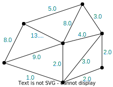

---
jupytext:
  formats: ipynb,md:myst
  text_representation:
    extension: .md
    format_name: myst
    format_version: 0.13
    jupytext_version: 1.13.8
kernelspec:
  display_name: Python 3 (ipykernel)
  language: python
  name: python3
---

# GT4Py User Quickstart Guide

+++

## Installation

GT4Py is distributed as a Python package and can be installed directly from GitHub via pip:

```{raw-cell}
pip install git+https://github.com/gridtools/gt4py.git@functional
```

## Programming GT4Py


### Basic structure of GT4Py apps

In this section, we will write a simple GT4Py application that adds two arrays. The goal is to understand how data is stored in GT4Py and how the data-parallel operations on it can be expressed.

+++

#### Importing features

The following snippet imports the most commonly used functionality from GT4Py. These are all that's needed to run all the code snippets in this document. Numpy is also used for the examples.

```{code-cell} ipython3
import numpy as np

from functional.ffront.fbuiltins import Field, float32, FieldOffset, neighbor_sum
from functional.iterator.runtime import CartesianAxis
from functional.ffront.decorator import field_operator, program
from functional.iterator.embedded import np_as_located_field, NeighborTableOffsetProvider
```

#### Storing data

In GT4Py, *fields* defined over one or more *dimensions* are used to represent array-like data. As seen in the following code snippet, the dimensions are defined as a `CartesianAxis`, whereas the fields are created with helper functions such as 
`np_as_located_field`. The 2D fields used in this section are defined over the *cell* and *K* dimensions, have a size of 5 cells by 6 Ks, and are uniformly filled with the values 2 and 3:

```{code-cell} ipython3
CellDim = CartesianAxis("Cell")
KDim = CartesianAxis("K")

num_cells = 5
num_layers = 6
grid_shape = (num_cells, num_layers)

a_value = 2.0
b_value = 3.0
a = np_as_located_field(CellDim, KDim)(np.full(shape=grid_shape, fill_value=a_value, dtype=np.float32))
b = np_as_located_field(CellDim, KDim)(np.full(shape=grid_shape, fill_value=b_value, dtype=np.float32))
```

#### Data-parallel operations

In GT4Py, operations are done on entire fields at a time as opposed to looping over all elements of a field and processing each element separately. The operations can be defined using *field operators*, which are essentially pure functions that take some immutable fields as arguments and return another field as result. Because of optimizations, field operators are only allowed to use a subset of the Python syntax. Syntactical correctness is checked by the `@field_operator` decorator.

This field operator returns the sum of the two arguments:

```{code-cell} ipython3
@field_operator
def add(a : Field[[CellDim, KDim], float32],
        b : Field[[CellDim, KDim], float32]) -> Field[[CellDim, KDim], float32]:
    return a + b
```

Running the field operator should produce a `result` of which all the elements are equal to 2+3=5:

```{code-cell} ipython3
result = np_as_located_field(CellDim, KDim)(np.zeros(shape=grid_shape))
add(a, b, out=result, offset_provider={})

print("{} + {} = {} ± {}".format(a_value, b_value, np.average(np.asarray(result)), np.std(np.asarray(result))))
```

*Programs* are similar to fields operators, but they allow mutability of the arguments and use a different subset of the Python syntax. Programs are used to call and chain field operators:

```{code-cell} ipython3
@program
def run_add(a : Field[[CellDim, KDim], float32],
                b : Field[[CellDim, KDim], float32],
                out : Field[[CellDim, KDim], float32]):
    add(a, b, out=out)
    add(b, out, out=out)
```

Executing the program should give us the same result as calling the field operator directly:

```{code-cell} ipython3
result = np_as_located_field(CellDim, KDim)(np.zeros(shape=grid_shape))
run_add(a, b, result, offset_provider={})

print("{} + {} = {} ± {}".format(b_value, (a_value + b_value), np.average(np.asarray(result)), np.std(np.asarray(result))))
```

### Unstructured meshes and connectivities

Now that we understand the structure of a GT4Py program, we will step up the game a bit and write an application that performs a laplacian-like operation on an unstructured mesh. Similar to the laplacian on regular grids, we will define the *pseudo-laplacian* as $n$ times the value of the current cell minus the sum of the values of the $n$ neighboring cells. For example, if cell \#1 has two neighbors, cell \#5 and \#8, the pseudo-laplacian for cell \#1 would be $plap(cell_1) = 2\cdot \text{value_of}(\text{cell}_1) - (\text{value_of}(\text{cell}_5) + \text{value_of}(\text{cell}_8))$.

We will calculate the pseudo-laplacian by adding up the differences over all the edges of a cell, where an *edge difference* is defined as the difference between the two cells neighboring the edge. Using the edge differences, the pseudo-laplacian for cell \#1 would be $plap(cell_1) = \text{edge_diff}_{1,5} + \text{edge_diff}_{1,8} = (\text{value_of}(\text{cell}_1) - \text{value_of}(\text{cell}_5)) + (\text{value_of}(\text{cell}_1) - \text{value_of}(\text{cell}_8))$.

This section is broken down into smaller parts to introduce concepts required for the pseudo-laplacian bit by bit:
- defining the mesh and the connectivities (adjacencies) between cells and edges
- learning to apply connectivities within field operators
- learning to use reductions on adjacent mesh elements
- implementing the actual pseudo-laplacian

+++

#### Defining the mesh and the connectivities

Consider the following mesh, of which the <span style="color: #C02020">cells</span> and the <span style="color: #0080FF">edges</span> have been numbered:


+++

To store the values inside the cells, we are going to need a field over the cells of the mesh. This field will have one dimension, *Cell*, and it will have a size of six. We will also assign the values of the cells right away:

```{code-cell} ipython3
CellDim = CartesianAxis("Cell")
cell_values = np_as_located_field(CellDim)(np.array([1.0, 1.0, 2.0, 3.0, 5.0, 8.0]))
```

|  | 
|:--:| 
| *Cell values* |

+++

Storing values on edges is analogous to storing values in cells:

```{code-cell} ipython3
EdgeDim = CartesianAxis("Edge")
edge_values = np_as_located_field(EdgeDim)(np.zeros((12,)))
```

In addition to the cells and edges, we will also define the connectivities: one table for the edges reachable from a cell and another table for the cells reachable form an edge. The $i$th entry of the connectivity table contains the indices of the <span style="color: #C02020">cells</span> (<span style="color: #0080FF">edges</span>) adjacent to the $i$th <span style="color: #0080FF">edge</span> (<span style="color: #C02020">cell</span>). The connectivity tables for the mesh above are:

```{code-cell} ipython3
edge_to_cell_table = np.array([
    [0, -1],
    [2, -1],
    [2, -1],
    [3, -1],
    [4, -1],
    [5, -1],
    [0, 5],
    [0, 1],
    [1, 2],
    [1, 3],
    [3, 4],
    [4, 5]
])

cell_to_edge_table = np.array([
    [0, 6, 7],
    [7, 8, 9],
    [1, 2, 8],
    [3, 9, 10],
    [4, 10, 11],
    [5, 6, 11],
])
```

#### Using connectivities in field operators

*Field offsets* can be used to create a **field** on <span style="color: #0080FF">edges</span> **from** a field on <span style="color: #C02020">cells</span> using a **connectivity** table from <span style="color: #0080FF">edges</span> **to** <span style="color: #C02020">cells</span>. The mapping of the <span style="color: #C02020">cell</span> field to an <span style="color: #0080FF">edge</span> field is done by sampling the field on <span style="color: #C02020">cells</span> at the cell-indices given in the <span style="color: #0080FF">edge</span>-to-<span style="color: #C02020">cell</span> connectivity table. The resulting field will have the same size and dimensions as the connectivity table, but instead of indices, will be filled with the neighbor elements' values.

```{code-cell} ipython3
E2CDim = CartesianAxis("E2C")
E2C = FieldOffset("E2C", source=CellDim, target=(EdgeDim, E2CDim))
```

While the field offset specifies the source and target dimensions of the mapping, the actual connectivity table is provided separately through an *offset provider*:

```{code-cell} ipython3
E2C_offset_provider = NeighborTableOffsetProvider(edge_to_cell_table, EdgeDim, CellDim, 2)
```

The field operator below uses the field offset to create a field on the edges from the field on cells by using the $0$th element in the edge-to-cell connectivity table. Note how the offset provider is passed to the program execution.

```{code-cell} ipython3
@field_operator
def nearest_cell_to_edge(cell_values : Field[[CellDim], float32]) -> Field[[EdgeDim], float32]:
    return cell_values(E2C[0])

@program
def run_nearest_cell_to_edge(cell_values : Field[[CellDim], float32], out : Field[[EdgeDim], float32]):
    nearest_cell_to_edge(cell_values, out=out)
    
run_nearest_cell_to_edge(cell_values, edge_values, offset_provider={"E2C": E2C_offset_provider})

print("0th adjacent cell's value: {}".format(np.asarray(edge_values)))
```

|  |
|:--:| 
| *Resulting edge values* |

+++

#### Reductions on connectivities

Similarly to the previous example, we will yet again output a field on edges. This time, however, instead of taking the $0$th column out of the field created through the connectivity matrix, we will sum the elements alongside the `E2CDim`. For this, we can use the `neighbor_sum` builtin function of GT4Py:

```{code-cell} ipython3
@field_operator
def sum_adjacent_cells(cells : Field[[CellDim], float32]) -> Field[[EdgeDim], float32]:
    return neighbor_sum(cells(E2C), axis=E2CDim)

@program
def run_sum_adjacent_cells(cells : Field[[CellDim], float32], out : Field[[EdgeDim], float32]):
    sum_adjacent_cells(cells, out=out)
    
#run_sum_adjacent_cells(cell_values, edge_values, offset_provider=offset_provider)

print("sum of adjacent cells: {}".format(np.asarray(edge_values)))
```

The results should be unchanged for the border edges, but the inner edges should be the following:



+++

#### Implementing the pseudo-laplacian by combining the above

As explained in the section outline, we will need the cell-to-edge connectivities as well. We have already constructed the connectivity table, so now we only have to define the local dimension, the field offset and the offset provider that describe how to use the connectivity matrix. The procedure is identical to the edge-to-cell connectivity we covered before:

```{code-cell} ipython3
C2EDim = CartesianAxis("C2E")
C2E = FieldOffset("C2E", source=EdgeDim, target=(CellDim, C2EDim))

C2E_offset_provider = NeighborTableOffsetProvider(cell_to_edge_table, CellDim, EdgeDim, 3)
```

**Sign of edge differences:**

Revisiting the example from the beginning of the section, except now with the actual mesh, we can calculate the pseudo-laplacian for cell \#1 by the following equation:
$$\text{plap}(cell_1) = -\text{edge_diff}_{0,1} + \text{edge_diff}_{1,2} + \text{edge_diff}_{1,3}$$

Notice how $\text{edge_diff}_{0,1}$ is actually subtracted from the sum rather than added because the edge to cell connectivity table lists cell \#1 as the second argument rather than the first. To fix this, we will need a table that has 3 elements for every cell to tell the sign of the differences. If you look for cell \#1 in the table below, you will see that the sign is negative for the first edge difference and positive for the second and third, just like in the equation above.

```{code-cell} ipython3
edge_difference_signs = np.array([
    [1, 1, 1],   # cell 0
    [-1, 1, 1],  # cell 1
    [1, 1, -1],  # cell 2
    [1, -1, 1],  # cell 3
    [1, -1, 1],  # cell 4
    [1, -1, -1], # cell 5
])

edge_difference_sign_field = np_as_located_field(CellDim, C2EDim)(edge_difference_signs)
```

**Difference on border edges:**

We cannot actually calculate an edge difference on border edges, because they only have one cell neighbor. For the calculation of the pseudo-laplacian, we want to consider border edges to have a difference of zero. We can achieve this by modifying the edge to cell connectivity so that for the border edges that single neighbor cell is listed twice. This way, as we subtract the value of that single cell from itself, we will get zero. The modified table is the following:

```{code-cell} ipython3
cell_neighbours_of_edges_mod = np.array([
    [0, 0], # edge 0
    [2, 2], # edge 1
    [2, 2], # edge 2
    [3, 3], # edge 3
    [4, 4], # edge 4
    [5, 5], # edge 5
    [0, 5], # edge 6
    [0, 1], # edge 7
    [1, 2], # edge 8
    [1, 3], # edge 9
    [3, 4], # edge 10
    [4, 5]  # edge 11
])

E2C_offset_provider_mod = NeighborTableOffsetProvider(cell_neighbours_of_edges_mod, EdgeDim, CellDim, 2)
```

**TODO**: The code:

```{code-cell} ipython3
@field_operator
def edge_differences(cells : Field[[CellDim], float32]) -> Field[[EdgeDim], float32]:        
    return cells(E2C[0]) - cells(E2C[1])

@field_operator
def sum_differences(differences : Field[[EdgeDim], float32],
                    polarities : Field[[CellDim, C2EDim], float32]) -> Field[[CellDim], float32]:        
    return differences(C2E[0]) + differences(C2E[1]) + differences(C2E[2])

@program
def run_pseudo_laplacian(cells : Field[[CellDim], float32],
                         polarities : Field[[CellDim, C2EDim], float32],
                         diffs : Field[[EdgeDim], float32],
                         out : Field[[CellDim], float32]):
    edge_differences(cells, out=diffs)
    sum_differences(diffs, polarities, out=out)

result_edge_diffs = np_as_located_field(EdgeDim)(np.zeros(shape=(12,)))
result_pseudo_lap = np_as_located_field(CellDim)(np.zeros(shape=(6,)))

run_pseudo_laplacian(cell_values,
                     edge_difference_sign_field,
                     result_edge_diffs,
                     result_pseudo_lap,
                     offset_provider={"E2C": E2C_offset_provider_mod, "C2E": C2E_offset_provider})

print("pseudo-laplacian: {}".format(np.asarray(result_pseudo_lap)))
```

```{code-cell} ipython3

```
