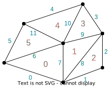

---
jupytext:
  formats: ipynb,md:myst
  text_representation:
    extension: .md
    format_name: myst
    format_version: 0.13
    jupytext_version: 1.13.8
kernelspec:
  display_name: Python 3 (ipykernel)
  language: python
  name: python3
---

# GT4Py User Quickstart Guide

+++

## Info for writing the guide
Goals:
- Read by someone completely new
- Focus on unstructured
They will be able to:
- Install GT4Py
- Write simple code
- Understand basic concepts of GT4Py
Examples could be:
- Laplacian
    - Main concepts: fields, field operators, programs, reductions
- Realistic example: diffusion, advection, solve some simple PDE on a 2D grid

+++

## Installation

GT4Py is distributed as a Python package and can be installed directly from GitHub:

```{code-cell} ipython3
#! pip install git+https://github.com/gridtools/gt4py.git@functional
```

## Concepts

### Basics

We will shortly compute the sum of two 2-dimensional arrays using GT4Py, but let us first import some commonly used tools from GT4Py:

```{code-cell} ipython3
import numpy as np

from functional.ffront.fbuiltins import Field, float32, FieldOffset
from functional.iterator.runtime import CartesianAxis
from functional.ffront.decorator import field_operator, program
from functional.iterator.embedded import np_as_located_field, NeighborTableOffsetProvider
```

GT4Py operates on *fields*, therefore a 2D array will also have to be represented as a `Field`.
*We declare dims then make field of given size blablabla...*

```{code-cell} ipython3
CellDim = CartesianAxis("Cell")
KDim = CartesianAxis("K")

grid_width = 5
grid_height = 6
grid_shape = (grid_width, grid_height)

a_value = 2.0
b_value = 3.0
a = np_as_located_field(CellDim, KDim)(np.full(shape=grid_shape, fill_value=a_value))
b = np_as_located_field(CellDim, KDim)(np.full(shape=grid_shape, fill_value=b_value))
```

To define operations involving one or more fields, we will use *field operators*. Field operators are pure functions (i.e. functions without side effects) that take immutable `Field`s as arguments and output another `Field` as a result. Field operators must be declared with the `@field_operator` decorator, and are allowed to use a certain subset of the Python syntax.

```{code-cell} ipython3
@field_operator
def add(a : Field[[CellDim, KDim], float32],
        b : Field[[CellDim, KDim], float32]) -> Field[[CellDim, KDim], float32]:
    return a + b
```

*Programs* are similar to fields operators, but they allow mutability of the arguments. Programs must be declared with the `@program` decorator and are allowed to use a different subset of the Python syntax compared to field operators. Programs are used to call and chain field operators:

```{code-cell} ipython3
@program
def compute_sum(a : Field[[CellDim, KDim], float32],
                b : Field[[CellDim, KDim], float32],
                out : Field[[CellDim, KDim], float32]):
    add(a, b, out=out)
```

Finally, we will call the program we just declared to compute 2 + 3:

```{code-cell} ipython3
result = np_as_located_field(CellDim, KDim)(np.zeros(shape=grid_shape))
compute_sum(a, b, result, offset_provider={})

print("{} + {} = {} ± {}".format(a_value, b_value, np.average(np.asarray(result)), np.std(np.asarray(result))))
```

### Unstructured grids and connectivity

***E2V, V2E, reductions***

To get familiar with using fields on explicitly connected grids, we will use an unstructured triangular mesh:



The <span style="color: #C02020">faces</span> and the <span style="color: #0080FF">edges</span> of the mesh have been numbered with zero-based indices.

#### Define cell neighbours of edges

The connectivity matrix that defines the cell neighbours of edges is the following:

```{code-cell} ipython3
CellDim = CartesianAxis("Cell")
EdgeDim = CartesianAxis("Edge")
E2CDim = CartesianAxis("E2C")
E2C = FieldOffset("E2C", source=CellDim, target=(EdgeDim, E2CDim))

cell_neighbours_of_edges = np.array([
    [0, -1],
    [2, -1],
    [2, -1],
    [3, -1],
    [4, -1],
    [5, -1],
    [0, 5],
    [0, 1],
    [1, 2],
    [1, 3],
    [3, 4],
    [4, 5]
])

offset_provider={"E2C": NeighborTableOffsetProvider(cell_neighbours_of_edges, EdgeDim, CellDim, 2)}
```

#### Get value of 0th cell adjacent to edge for all edges

```{code-cell} ipython3
CellDim = CartesianAxis("Cell")
EdgeDim = CartesianAxis("Edge")

@field_operator
def nearest_cell_to_edge(cells : Field[[CellDim], float32]) -> Field[[EdgeDim], float32]:
    return cells(E2C[0])

@program
def find_nearest_cell_to_edges(cells : Field[[CellDim], float32], out : Field[[EdgeDim], float32]):
    nearest_cell_to_edge(cells, out=out)
    
cell_values = np_as_located_field(CellDim)(np.array([1.0, 1.0, 2.0, 3.0, 5.0, 8.0]))
result_edge_values = np_as_located_field(EdgeDim)(np.zeros(shape=(12,)))

nearest_cell_to_edge(cell_values, out=result_edge_values, offset_provider=offset_provider)
```


+++

#### Get the average of the two cells adjacent to an edge

```{code-cell} ipython3

```

Follow-up to averages:
- calculate the average of edges around a cell for each cell

+++

## Examples

+++

### Space derivatives

```{code-cell} ipython3
@field_operator
def ddx():
    pass

@program
def compute_ddx():
    pass

get_ddx()
```

### Diffusion

```{code-cell} ipython3
@field_operator
def op1():
    pass

@field_operator
def op1():
    pass

@program
def diffuse():
    pass

timestep = 0.01
endtime = 5
for time in range(0:endtime:timestep):
    diffuse()
```
