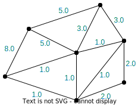

---
jupytext:
  formats: ipynb,md:myst
  text_representation:
    extension: .md
    format_name: myst
    format_version: 0.13
    jupytext_version: 1.13.8
kernelspec:
  display_name: Python 3 (ipykernel)
  language: python
  name: python3
---

# Getting started with the GT4Py declarative frontend

+++

## Installation

You can install the library directly from GitHub using pip:

```{raw-cell}
pip install git+https://github.com/gridtools/gt4py.git@functional
```

For now, use the branch below which contains some bugfixes needed to run the code in the guide:

```{raw-cell}
pip install git+https://github.com/tehrengruber/gt4py.git@fix_reductions
```

## Programming guide

### Key concepts and application structure

This section introduces three key concepts for storing and manipulating data:
- [Fields](#Fields),
- [Field operators](#Field-operators), and
- [Programs](#Programs).

The concepts are demonstrated through a simple application that adds two fields.

+++

#### Importing features

The following snippet imports the most commonly used features that are needed to run the code in this document. The code examples also use numpy.

```{code-cell} ipython3
import numpy as np

from functional.ffront.fbuiltins import Dimension, Field, float32, FieldOffset, neighbor_sum
from functional.ffront.decorator import field_operator, program
from functional.iterator.embedded import np_as_located_field, NeighborTableOffsetProvider
```

#### Fields

Fields store data as a multi-dimensional array, and are defined over named dimensions. The code snippet below defines two named dimensions, *cell* and *K*, and creates the fields `a` and `b` over them using the `np_as_located_field` helper functon. The fields are thus two-dimensional and contain the values 2 and 3 for all entries.

```{code-cell} ipython3
CellDim = Dimension("Cell")
KDim = Dimension("K")

num_cells = 5
num_layers = 6
grid_shape = (num_cells, num_layers)

a_value = 2.0
b_value = 3.0
a = np_as_located_field(CellDim, KDim)(np.full(shape=grid_shape, fill_value=a_value, dtype=np.float32))
b = np_as_located_field(CellDim, KDim)(np.full(shape=grid_shape, fill_value=b_value, dtype=np.float32))
```

*Note: The interface to construct fields is provisional only and will change soon.*

+++

#### Field operators

Field operators perform operations on a set of fields, for example, elementwise addition or reduction along a dimension. You can write field operators as Python functions by using the `@field_operator` decorator. Field operators cannot have side effects, therefore you cannot modify its arguments, nor can you modify variables declared inside field operators. Only a subset of the Python syntax is allowed inside field operators--the library checks for correctness.

Here is an example for a field operator that adds two fields elementwise:

```{code-cell} ipython3
@field_operator
def add(a: Field[[CellDim, KDim], float32],
        b: Field[[CellDim, KDim], float32]) -> Field[[CellDim, KDim], float32]:
    return a + b
```

You can call field operators from [programs](#Programs), other field operators, or directly. The code snippet below shows a direct call, in which case you have to supply two additional arguments: `out`, which is a field to write the return value to, and `offset_provider`, which we leave empty for now. The result of the field operator is a field with all entries equal to 5, but for brevity, only the average and the standard deviation of the entries are printed:

```{code-cell} ipython3
result = np_as_located_field(CellDim, KDim)(np.zeros(shape=grid_shape))
add(a, b, out=result, offset_provider={})

print("{} + {} = {} ± {}".format(a_value, b_value, np.average(np.asarray(result)), np.std(np.asarray(result))))
```

#### Programs

+++

Programs let you group together multiple field operator calls as a sequence of operations. They are similar to field operators in that they also use a decorator (`@program`) and that they can only use a subset of the Python syntax, but programs can mutate their arguments. Currently, the syntax inside programs is limited to calling field operators.

This example program below calls the above elementwise addition field operator twice:

```{code-cell} ipython3
@program
def run_add(a : Field[[CellDim, KDim], float32],
            b : Field[[CellDim, KDim], float32],
            result : Field[[CellDim, KDim], float32]):
    add(a, b, out=result)
    add(b, result, out=result)
```

You can execute the program by simply calling it:

```{code-cell} ipython3
result = np_as_located_field(CellDim, KDim)(np.zeros(shape=grid_shape))
run_add(a, b, result, offset_provider={})

print("{} + {} = {} ± {}".format(b_value, (a_value + b_value), np.average(np.asarray(result)), np.std(np.asarray(result))))
```

#### Composing field operators and programs

When writing a complex application, you have to decompose it into *field operators*, *programs*, and Python (or other) code that glues it all together. The general advice is to follow best practices and write short and concise field operators that serve a single purpose. To maximise automatic optimization, use glue code sparingly and group your field operators inside *programs* as much as you can. As such, directly calling field operators is primarily used for debugging purposes.

+++

### Operations on unstructured meshes

This section introduces additional APIs through a slightly more elaborate application that performs a laplacian-like operation on an unstructured mesh. Within the context of this guide, we define the *pseudo-laplacian* for a cell as the sum of the *edge differences* around the cell. For example, the pseudo-laplacian for cell \#1, which is surrounded by edges \#7, \#8 and \#9, is expressed by the formula:

$$\begin{aligned}\text{pseudolap}(cell_1) =\,& \text{edge_diff}_7 + \text{edge_diff}_8 + \text{edge_diff}_9 \end{aligned}$$.

The edge difference above is defined as the difference between the two cells adjacent to and edge, so for edge \#7 the equation is:

$$\begin{aligned} \text{edge_diff}_7 =\,& \text{edge_diff}_{0,1} = \text{value_of}(\text{cell}_0) - \text{value_of}(\text{cell}_1) \end{aligned}$$

The sign of the edge difference in the sum of the pseudo-laplacian is always such that the neighbor cell is subtracted from the subject cell.

This section approaches the pseudo-laplacian by introducing the required APIs progressively through the following subsections:
- [Defining the mesh and the connectivities (adjacencies) between cells and edges](#Defining-the-mesh-and-its-connectivities)
- [Using connectivities in field operators](#Using-connectivities-in-field-operators)
- [Using reductions on connected mesh elements](#Using-reductions-on-connected-mesh-elements)
- [Implementing the actual pseudo-laplacian](#Implementing-the-pseudo-laplacian)

+++

#### Defining the mesh and its connectivities

The examples related to unstructured meshes use the mesh illustrated below. The edges (in blue) and the cells (in red) are numbered with zero-based indices.

|  |
|:--:| 
| *The mesh with the indices* |

+++

The examples below only use 1D fields over cells and edges, so the associated named dimensions are the following:

```{code-cell} ipython3
CellDim = Dimension("Cell")
EdgeDim = Dimension("Edge")
```

You can express connectivity between elements of the mesh using adjacency (neighborhood) tables. The table below, `edge_to_cell_table`, has one row for every edge where it lists the indices of cells adjacent to that edge. (For example, edge \#6 connects to cells \#0 and \#5.) Similarly, `cell_to_edge_table` lists the edges that are neighbors to a particular cell.

Note, however, that the tables are dense matrices, so if an edge has fewer than 2 neighbor cells, the remaining entries are filled with -1. Additionally, you can specify all kinds of connectivities (edge-to-edge, cell-to-edge, cell-to-cell, etc.), and the adjacency relationships don't have to be reciprocal, so it's possible for example that cell lists an edge as its neighbour, but the edge does not list that particular cell.

The edge-to-cell and cell-to-edge connectivity tables for the mesh are the following:

```{code-cell} ipython3
edge_to_cell_table = np.array([
    [0, -1], # edge 0 (neighbours: cell 0)
    [2, -1], # edge 1
    [2, -1], # edge 2
    [3, -1], # edge 3
    [4, -1], # edge 4
    [5, -1], # edge 5
    [0, 5],  # edge 6 (neighbours: cell 0, cell 5)
    [0, 1],  # edge 7
    [1, 2],  # edge 8
    [1, 3],  # edge 9
    [3, 4],  # edge 10
    [4, 5]   # edge 11
])

cell_to_edge_table = np.array([
    [0, 6, 7],   # cell 0 (neighbors: edge 0, edge 6, edge 7)
    [7, 8, 9],   # cell 1
    [1, 2, 8],   # cell 2
    [3, 9, 10],  # cell 3
    [4, 10, 11], # cell 4
    [5, 6, 11],  # cell 5
])
```

#### Using connectivities in field operators

Let's start by defining two fields: one over the cells and another one over the edges. The field over cells is used as input for subsequent calculations and is therefore filled up with values, whereas the field over the edges is used to store the results and is therefore left blank.

```{code-cell} ipython3
cell_values = np_as_located_field(CellDim)(np.array([1.0, 1.0, 2.0, 3.0, 5.0, 8.0]))
edge_values = np_as_located_field(EdgeDim)(np.zeros((12,)))
```

|  | 
|:--:| 
| *Cell values* |

+++

The call operator of a field together with a *field offset* is used to transform fields over one domain to a field (or tuple of fields) over another domain using connectivities. The field offset declared in the snippet below is used to transform a one-dimensional field over cells to a two-dimensional field over edges and an auxiliary dimension (`E2CDim`) using the edge-to-cell connectivities.

One way to understand this transform is to look at the edge-to-cell connectivity table `edge_to_cell_table` defined above. This table has one dimension over the edges and another auxiliary dimension, just like the output of the transformation, and stores indices into a field over cells. Now replace the indices with the actual values taken from a field over cells, and you get the result of the transform.

Another way is to say that transform uses the edge-to-cell connectivity to look up all the cell neighbors of edges, and associates the values of those neighbor cells with each edge.

```{code-cell} ipython3
E2CDim = Dimension("E2C", local=True)
E2C = FieldOffset("E2C", source=CellDim, target=(EdgeDim,))
```

While the field offset specifies the source and target dimensions of the transform, the actual connectivity table is provided separately through an *offset provider*:

```{code-cell} ipython3
E2C_offset_provider = NeighborTableOffsetProvider(edge_to_cell_table, EdgeDim, CellDim, 2)
```

The field operator below uses the field offset and the transform explained above to create a field on the edges from the field on cells we just defined. Note that we would have two elements for every edge (for a non-border edge has exactly two neighbor cells), but we only keep the first neighbor cell's value in the field operator.

While the field offset `E2C` is simply accessed within the field operator, the offset provider `E2C_offset_provider` is passed via the call to the program.

```{code-cell} ipython3
@field_operator
def nearest_cell_to_edge(cell_values: Field[[CellDim], float32]) -> Field[[EdgeDim], float32]:
    return cell_values(E2C[0])

@program
def run_nearest_cell_to_edge(cell_values: Field[[CellDim], float32], out : Field[[EdgeDim], float32]):
    nearest_cell_to_edge(cell_values, out=out)

run_nearest_cell_to_edge(cell_values, edge_values, offset_provider={"E2C": E2C_offset_provider})

print("0th adjacent cell's value: {}".format(np.asarray(edge_values)))
```

|  | $\mapsto$ |  |
|:--:| :--: | :--: |
| *Domain (edges)* |  | *Edge values* |

+++

#### Using reductions on connected mesh elements

Similarly to the previous example, the output is yet again a field on edges. This time, however, instead of taking the first column (first neighbour) out of the field created using the connectivity table, we sum the elements alongside the `E2CDim`. For this, we first transform the cell field to a field over the cell neighbors of edges (i.e. a field of dimensions Edge × E2CDim) using `cells(E2C)`, then we use the `neighbor_sum` builtin function to sum along the `E2CDim` dimension.

```{code-cell} ipython3
@field_operator
def sum_adjacent_cells(cells : Field[[CellDim], float32]) -> Field[[EdgeDim], float32]:
    # type of cells(E2C) is Field[[CellDim, E2CDim], float32]
    return neighbor_sum(cells(E2C), axis=E2CDim)

@program
def run_sum_adjacent_cells(cells : Field[[CellDim], float32], out : Field[[EdgeDim], float32]):
    sum_adjacent_cells(cells, out=out)
    
run_sum_adjacent_cells(cell_values, edge_values, offset_provider={"E2C": E2C_offset_provider})

print("sum of adjacent cells: {}".format(np.asarray(edge_values)))
```

The results are unchanged compared to the previous example for the border edges, but the inner edges now contain the sum of the two adjacent cells:

|  | $\mapsto$ |  |
|:--:| :--: | :--: |
| *Domain (edges)* |  | *Edge values* |

+++

#### Implementing the pseudo-laplacian

As explained in the section outline, the pseudo-laplacian needs the cell-to-edge connectivities as well in addition to the edge-to-cell connectivities. We have already constructed the connectivity table, so now we only have to define the local dimension, the field offset and the offset provider that describe how to use the connectivity matrix. The procedure is identical to the edge-to-cell connectivity from before:

```{code-cell} ipython3
C2EDim = Dimension("C2E", True)
C2E = FieldOffset("C2E", source=EdgeDim, target=(CellDim, C2EDim))

C2E_offset_provider = NeighborTableOffsetProvider(cell_to_edge_table, CellDim, EdgeDim, 3)
```

+++ {"tags": []}

**Weights of edge differences:**

Revisiting the example from the beginning of the section, except now with the actual mesh, we can calculate the pseudo-laplacian for cell \#1 by the following equation:
$$\text{pseudolap}(cell_1) = -\text{edge_diff}_{0,1} + \text{edge_diff}_{1,2} + \text{edge_diff}_{1,3}$$

Notice how $\text{edge_diff}_{0,1}$ is actually subtracted from the sum rather than added because the edge to cell connectivity table lists cell \#1 as the second argument rather than the first. To fix this, we will need a table that has 3 elements for every cell to tell the sign of the differences. If you look for cell \#1 in the table below, you will see that the sign is negative for the first edge difference and positive for the second and third, just like in the equation above.

+++

In addition to the signs, we also have an issue with the border edges for which we cannot calculate an edge difference because they only have one cell neighbor. For the calculation of the pseudo-laplacian, border edges should have no contribution to the sum in the equation above, that is, they should have an edge difference of zero. We can achieve this by zeroing out the weights for the border edges in the edge weight table.

+++

Incorporating both the signs and the zeros for the border edges, the edge weights are the following:

```{code-cell} ipython3
edge_weights = np.array([
    [0, 1, 1],   # cell 0
    [-1, 1, 1],  # cell 1
    [0, 0, -1],  # cell 2
    [0, -1, 1],  # cell 3
    [0, -1, 1],  # cell 4
    [0, -1, -1], # cell 5
])

edge_weight_field = np_as_located_field(CellDim, C2EDim)(edge_weights)
```

Putting all the above together, we can finally write the field operator for the pseudo-laplacian. The field operator requires the cell field and the edge weights as input, and outputs a cell field of the same shape as the input.

In the first line, we use the edge-to-cell connectivity relationship to construct two fields over the edges: the first field assigns the value of the first neighbor cell to the edges, the second field assigns the value of the second neighbor cell. The difference of the two fields forms the edge differences.

In the second line, we use the cell-to-edge connectivity to create a field over the cells. This field stores three values for each cell: the edge differences for the three edges around the cell. Additionally, we do a summation over these three values to get a field over cells that contains only one sum for each cell.

```{code-cell} ipython3
@field_operator
def pseudo_lap(cells : Field[[CellDim], float32],
               edge_weights : Field[[CellDim, C2EDim], float32]) -> Field[[CellDim], float32]:
    edge_differences = cells(E2C[0]) - cells(E2C[1]) # type: Field[[EdgeDim], float32]
    return neighbor_sum(edge_differences(C2E) * edge_weights, axis=C2EDim)
```

The program itself is just a shallow wrapper over the `pseudo_lap` field operator. Note, however, how we are passing the offset providers that supply both the edge-to-cell and cell-to-edge connectivities when calling the program:

```{code-cell} ipython3
@program
def run_pseudo_laplacian(cells : Field[[CellDim], float32],
                         edge_weights : Field[[CellDim, C2EDim], float32],
                         out : Field[[CellDim], float32]):
    pseudo_lap(cells, edge_weights, out=out)

result_pseudo_lap = np_as_located_field(CellDim)(np.zeros(shape=(6,)))

run_pseudo_laplacian(cell_values,
                     edge_weight_field,
                     result_pseudo_lap,
                     offset_provider={"E2C": E2C_offset_provider, "C2E": C2E_offset_provider})

print("pseudo-laplacian: {}".format(np.asarray(result_pseudo_lap)))
```

As a closure, we will show an example of chaining field operators, which is very simple to do when working with fields. The field operator below executes the pseudo-laplacian, and then calls the pseudo-laplacian on the result of the first, in effect, calculating the laplacian of a laplacian.

```{code-cell} ipython3
@field_operator
def pseudo_laplap(cells : Field[[EdgeDim], float32],
                  edge_weights : Field[[CellDim, C2EDim], float32]) -> Field[[CellDim], float32]:
    return pseudo_lap(pseudo_lap(cells, edge_weights), edge_weights)
```

```{code-cell} ipython3

```
