```python
import dataclasses
import inspect

import gt4py.next as gtx
from gt4py.next import backend

import devtools
```

<link href="https://fonts.googleapis.com/icon?family=Material+Icons" rel="stylesheet"><script src="https://spcl.github.io/dace/webclient2/dist/sdfv.js"></script>
<link href="https://spcl.github.io/dace/webclient2/sdfv.css" rel="stylesheet">

```python
I = gtx.Dimension("I")
Ioff = gtx.FieldOffset("Ioff", source=I, target=(I,))
OFFSET_PROVIDER = {"Ioff": I}
```

# Toolchain Overview

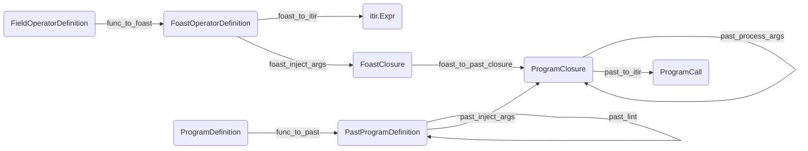

# Walkthrough from Field Operator

## Starting Out

```python
@gtx.field_operator
def example_fo(a: gtx.Field[[I], gtx.float64]) -> gtx.Field[[I], gtx.float64]:
    return a + 1.0
```

```python
start = example_fo.definition_stage
```

```python
gtx.ffront.stages.FieldOperatorDefinition?
```

    Init signature:
    gtx.ffront.stages.FieldOperatorDefinition(
        definition: 'types.FunctionType',
        grid_type: 'Optional[common.GridType]' = None,
        node_class: 'type[OperatorNodeT]' = <class 'gt4py.next.ffront.field_operator_ast.FieldOperator'>,
        attributes: 'dict[str, Any]' = <factory>,
    ) -> None
    Docstring:      FieldOperatorDefinition(definition: 'types.FunctionType', grid_type: 'Optional[common.GridType]' = None, node_class: 'type[OperatorNodeT]' = <class 'gt4py.next.ffront.field_operator_ast.FieldOperator'>, attributes: 'dict[str, Any]' = <factory>)
    File:           ~/Code/gt4py/src/gt4py/next/ffront/stages.py
    Type:           type
    Subclasses:

## DSL -> FOAST

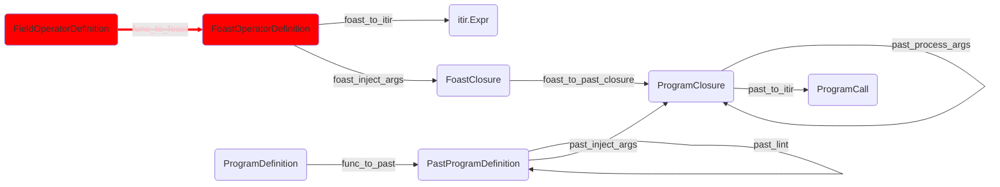

```python
foast = backend.DEFAULT_FIELDOP_TRANSFORMS.func_to_foast(start)
```

```python
gtx.ffront.stages.FoastOperatorDefinition?
```

    Init signature:
    gtx.ffront.stages.FoastOperatorDefinition(
        foast_node: 'OperatorNodeT',
        closure_vars: 'dict[str, Any]',
        grid_type: 'Optional[common.GridType]' = None,
        attributes: 'dict[str, Any]' = <factory>,
    ) -> None
    Docstring:      FoastOperatorDefinition(foast_node: 'OperatorNodeT', closure_vars: 'dict[str, Any]', grid_type: 'Optional[common.GridType]' = None, attributes: 'dict[str, Any]' = <factory>)
    File:           ~/Code/gt4py/src/gt4py/next/ffront/stages.py
    Type:           type
    Subclasses:

## FOAST -> ITIR

This also happens inside the `decorator.FieldOperator.__gt_itir__` method during the lowering from calling Programs to ITIR

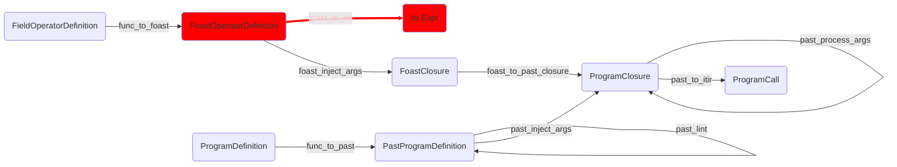

```python
fitir = backend.DEFAULT_FIELDOP_TRANSFORMS.foast_to_itir(foast)
```

```python
fitir.__class__
```

    gt4py.next.iterator.ir.FunctionDefinition

## FOAST -> FOAST closure

This is preparation for "directly calling" a field operator.

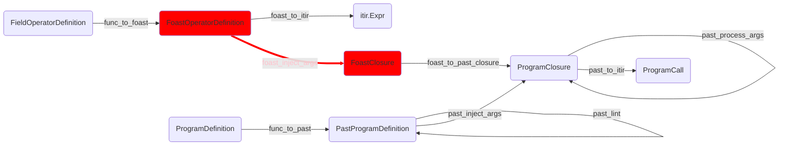

Here we have to dynamically generate a workflow step, because the arguments were not known before.

```python
fclos = backend.DEFAULT_FIELDOP_TRANSFORMS.foast_inject_args.__class__(
    args=(gtx.ones(domain={I: 10}, dtype=gtx.float64),),
    kwargs={
        "out": gtx.zeros(domain={I: 10}, dtype=gtx.float64)
    },
    from_fieldop=example_fo
)(foast)
```

```python
gtx.ffront.stages.FoastClosure?
```

    Init signature:
    gtx.ffront.stages.FoastClosure(
        foast_op_def: 'FoastOperatorDefinition[OperatorNodeT]',
        args: 'tuple[Any, ...]',
        kwargs: 'dict[str, Any]',
        closure_vars: 'dict[str, Any]',
    ) -> None
    Docstring:      FoastClosure(foast_op_def: 'FoastOperatorDefinition[OperatorNodeT]', args: 'tuple[Any, ...]', kwargs: 'dict[str, Any]', closure_vars: 'dict[str, Any]')
    File:           ~/Code/gt4py/src/gt4py/next/ffront/stages.py
    Type:           type
    Subclasses:

## FOAST with args -> PAST closure

This auto-generates a program for us, directly in PAST representation and forwards the call arguments to it

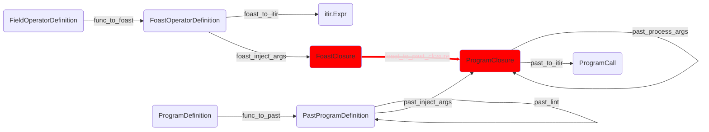

```python
pclos = backend.DEFAULT_FIELDOP_TRANSFORMS.foast_to_past_closure(fclos)
```

```python
gtx.ffront.stages.PastClosure?
```

    Init signature:
    gtx.ffront.stages.PastClosure(
        closure_vars: 'dict[str, Any]',
        past_node: 'past.Program',
        grid_type: 'Optional[common.GridType]',
        args: 'tuple[Any, ...]',
        kwargs: 'dict[str, Any]',
    ) -> None
    Docstring:      PastClosure(closure_vars: 'dict[str, Any]', past_node: 'past.Program', grid_type: 'Optional[common.GridType]', args: 'tuple[Any, ...]', kwargs: 'dict[str, Any]')
    File:           ~/Code/gt4py/src/gt4py/next/ffront/stages.py
    Type:           type
    Subclasses:

## Transform PAST closure arguments

Don't ask me, seems to be necessary though

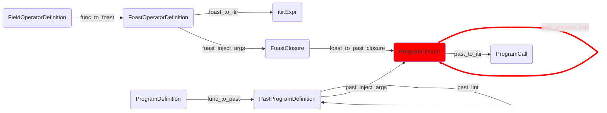

```python
pclost = backend.DEFAULT_PROG_TRANSFORMS.past_transform_args(pclos)
```

## Lower PAST -> ITIR

still forwarding the call arguments

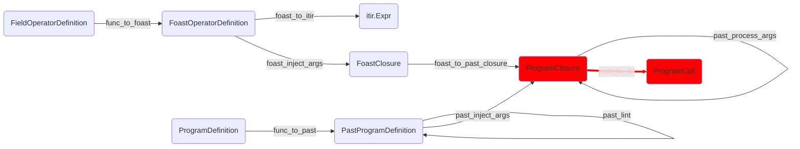

```python
pitir = backend.DEFAULT_PROG_TRANSFORMS.past_to_itir(pclost)
```

```python
gtx.otf.stages.ProgramCall?
```

    Init signature:
    gtx.otf.stages.ProgramCall(
        program: 'itir.FencilDefinition',
        args: 'tuple[Any, ...]',
        kwargs: 'dict[str, Any]',
    ) -> None
    Docstring:      Iterator IR representaion of a program together with arguments to be passed to it.
    File:           ~/Code/gt4py/src/gt4py/next/otf/stages.py
    Type:           type
    Subclasses:

## Executing The Result

```python
gtx.gtfn_cpu.executor(pitir.program, *pitir.args, offset_provider=OFFSET_PROVIDER, **pitir.kwargs)
```

```python
pitir.args
```

    (NumPyArrayField(_domain=Domain(dims=(Dimension(value='I', kind=<DimensionKind.HORIZONTAL: 'horizontal'>),), ranges=(UnitRange(0, 10),)), _ndarray=array([1., 1., 1., 1., 1., 1., 1., 1., 1., 1.])),
     NumPyArrayField(_domain=Domain(dims=(Dimension(value='I', kind=<DimensionKind.HORIZONTAL: 'horizontal'>),), ranges=(UnitRange(0, 10),)), _ndarray=array([2., 2., 2., 2., 2., 2., 2., 2., 2., 2.])),
     10,
     10)

## Full Field Operator Toolchain

using the default step order

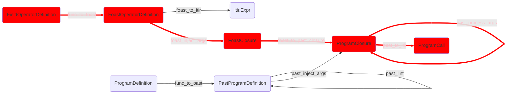

### Starting from DSL

```python
foast_toolchain = backend.DEFAULT_FIELDOP_TRANSFORMS.replace(
    foast_inject_args=backend.FopArgsInjector(args=fclos.args, kwargs=fclos.kwargs, from_fieldop=example_fo)
)
pitir2 = foast_toolchain(start)
assert pitir2 == pitir
```

#### Pass The result to the compile workflow and execute

```python
example_compiled = gtx.gtfn_cpu.executor.otf_workflow(
    dataclasses.replace(pitir2, kwargs=pitir2.kwargs | {"offset_provider": OFFSET_PROVIDER})
)
```

```python
example_compiled(*pitir2.args, offset_provider=OFFSET_PROVIDER)
```

```python
example_compiled(pitir2.args[1], *pitir2.args[1:], offset_provider=OFFSET_PROVIDER)
```

```python
pitir2.args[1].asnumpy()
```

    array([3., 3., 3., 3., 3., 3., 3., 3., 3., 3.])

### Starting from FOAST

Note that it is the exact same call but with a different input stage

```python
pitir3 = foast_toolchain(foast)
assert pitir3 == pitir
```

# Walkthrough starting from Program

## Starting Out

```python
@gtx.program
def example_prog(a: gtx.Field[[I], gtx.float64], out: gtx.Field[[I], gtx.float64]) -> None:
    example_fo(a, out=out)
```

```python
p_start = example_prog.definition_stage
```

```python
gtx.ffront.stages.ProgramDefinition?
```

    Init signature:
    gtx.ffront.stages.ProgramDefinition(
        definition: 'types.FunctionType',
        grid_type: 'Optional[common.GridType]' = None,
    ) -> None
    Docstring:      ProgramDefinition(definition: 'types.FunctionType', grid_type: 'Optional[common.GridType]' = None)
    File:           ~/Code/gt4py/src/gt4py/next/ffront/stages.py
    Type:           type
    Subclasses:

## DSL -> PAST

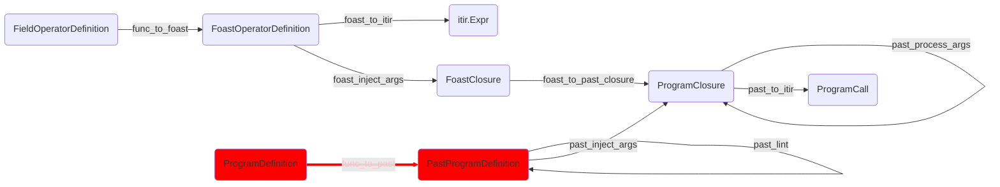

```python
p_past = backend.DEFAULT_PROG_TRANSFORMS.func_to_past(p_start)
```

## PAST -> Closure

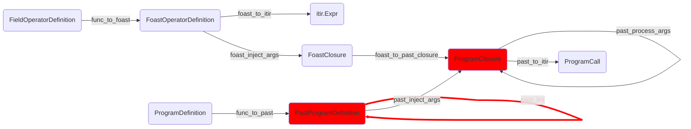

```python
pclos = backend.DEFAULT_PROG_TRANSFORMS.replace(
    past_inject_args=backend.ProgArgsInjector(
        args=fclos.args,
        kwargs=fclos.kwargs
    )
)(p_past)
```

## Full Program Toolchain

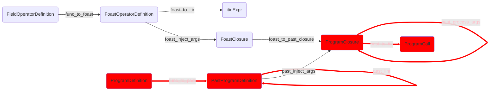

### Starting from DSL

```python
toolchain = backend.DEFAULT_PROG_TRANSFORMS.replace(
    past_inject_args=backend.ProgArgsInjector(
        args=fclos.args,
        kwargs=fclos.kwargs
    )
)
```

```python
p_itir1 = toolchain(p_start)
```

```python
p_itir2 = toolchain(p_past)
```

```python
assert p_itir1 == p_itir2
```

```python
!jupyter nbconvert WorkflowPatterns.ipynb --to slides
```

    [NbConvertApp] WARNING | pattern 'WorkflowPatterns.ipynb' matched no files
    This application is used to convert notebook files (*.ipynb)
            to various other formats.

            WARNING: THE COMMANDLINE INTERFACE MAY CHANGE IN FUTURE RELEASES.

    Options
    =======
    The options below are convenience aliases to configurable class-options,
    as listed in the "Equivalent to" description-line of the aliases.
    To see all configurable class-options for some <cmd>, use:
        <cmd> --help-all

    --debug
        set log level to logging.DEBUG (maximize logging output)
        Equivalent to: [--Application.log_level=10]
    --show-config
        Show the application's configuration (human-readable format)
        Equivalent to: [--Application.show_config=True]
    --show-config-json
        Show the application's configuration (json format)
        Equivalent to: [--Application.show_config_json=True]
    --generate-config
        generate default config file
        Equivalent to: [--JupyterApp.generate_config=True]
    -y
        Answer yes to any questions instead of prompting.
        Equivalent to: [--JupyterApp.answer_yes=True]
    --execute
        Execute the notebook prior to export.
        Equivalent to: [--ExecutePreprocessor.enabled=True]
    --allow-errors
        Continue notebook execution even if one of the cells throws an error and include the error message in the cell output (the default behaviour is to abort conversion). This flag is only relevant if '--execute' was specified, too.
        Equivalent to: [--ExecutePreprocessor.allow_errors=True]
    --stdin
        read a single notebook file from stdin. Write the resulting notebook with default basename 'notebook.*'
        Equivalent to: [--NbConvertApp.from_stdin=True]
    --stdout
        Write notebook output to stdout instead of files.
        Equivalent to: [--NbConvertApp.writer_class=StdoutWriter]
    --inplace
        Run nbconvert in place, overwriting the existing notebook (only
                relevant when converting to notebook format)
        Equivalent to: [--NbConvertApp.use_output_suffix=False --NbConvertApp.export_format=notebook --FilesWriter.build_directory=]
    --clear-output
        Clear output of current file and save in place,
                overwriting the existing notebook.
        Equivalent to: [--NbConvertApp.use_output_suffix=False --NbConvertApp.export_format=notebook --FilesWriter.build_directory= --ClearOutputPreprocessor.enabled=True]
    --coalesce-streams
        Coalesce consecutive stdout and stderr outputs into one stream (within each cell).
        Equivalent to: [--NbConvertApp.use_output_suffix=False --NbConvertApp.export_format=notebook --FilesWriter.build_directory= --CoalesceStreamsPreprocessor.enabled=True]
    --no-prompt
        Exclude input and output prompts from converted document.
        Equivalent to: [--TemplateExporter.exclude_input_prompt=True --TemplateExporter.exclude_output_prompt=True]
    --no-input
        Exclude input cells and output prompts from converted document.
                This mode is ideal for generating code-free reports.
        Equivalent to: [--TemplateExporter.exclude_output_prompt=True --TemplateExporter.exclude_input=True --TemplateExporter.exclude_input_prompt=True]
    --allow-chromium-download
        Whether to allow downloading chromium if no suitable version is found on the system.
        Equivalent to: [--WebPDFExporter.allow_chromium_download=True]
    --disable-chromium-sandbox
        Disable chromium security sandbox when converting to PDF..
        Equivalent to: [--WebPDFExporter.disable_sandbox=True]
    --show-input
        Shows code input. This flag is only useful for dejavu users.
        Equivalent to: [--TemplateExporter.exclude_input=False]
    --embed-images
        Embed the images as base64 dataurls in the output. This flag is only useful for the HTML/WebPDF/Slides exports.
        Equivalent to: [--HTMLExporter.embed_images=True]
    --sanitize-html
        Whether the HTML in Markdown cells and cell outputs should be sanitized..
        Equivalent to: [--HTMLExporter.sanitize_html=True]
    --log-level=<Enum>
        Set the log level by value or name.
        Choices: any of [0, 10, 20, 30, 40, 50, 'DEBUG', 'INFO', 'WARN', 'ERROR', 'CRITICAL']
        Default: 30
        Equivalent to: [--Application.log_level]
    --config=<Unicode>
        Full path of a config file.
        Default: ''
        Equivalent to: [--JupyterApp.config_file]
    --to=<Unicode>
        The export format to be used, either one of the built-in formats
                ['asciidoc', 'custom', 'html', 'latex', 'markdown', 'notebook', 'pdf', 'python', 'qtpdf', 'qtpng', 'rst', 'script', 'slides', 'webpdf']
                or a dotted object name that represents the import path for an
                ``Exporter`` class
        Default: ''
        Equivalent to: [--NbConvertApp.export_format]
    --template=<Unicode>
        Name of the template to use
        Default: ''
        Equivalent to: [--TemplateExporter.template_name]
    --template-file=<Unicode>
        Name of the template file to use
        Default: None
        Equivalent to: [--TemplateExporter.template_file]
    --theme=<Unicode>
        Template specific theme(e.g. the name of a JupyterLab CSS theme distributed
        as prebuilt extension for the lab template)
        Default: 'light'
        Equivalent to: [--HTMLExporter.theme]
    --sanitize_html=<Bool>
        Whether the HTML in Markdown cells and cell outputs should be sanitized.This
        should be set to True by nbviewer or similar tools.
        Default: False
        Equivalent to: [--HTMLExporter.sanitize_html]
    --writer=<DottedObjectName>
        Writer class used to write the
                                            results of the conversion
        Default: 'FilesWriter'
        Equivalent to: [--NbConvertApp.writer_class]
    --post=<DottedOrNone>
        PostProcessor class used to write the
                                            results of the conversion
        Default: ''
        Equivalent to: [--NbConvertApp.postprocessor_class]
    --output=<Unicode>
        Overwrite base name use for output files.
                    Supports pattern replacements '{notebook_name}'.
        Default: '{notebook_name}'
        Equivalent to: [--NbConvertApp.output_base]
    --output-dir=<Unicode>
        Directory to write output(s) to. Defaults
                                      to output to the directory of each notebook. To recover
                                      previous default behaviour (outputting to the current
                                      working directory) use . as the flag value.
        Default: ''
        Equivalent to: [--FilesWriter.build_directory]
    --reveal-prefix=<Unicode>
        The URL prefix for reveal.js (version 3.x).
                This defaults to the reveal CDN, but can be any url pointing to a copy
                of reveal.js.
                For speaker notes to work, this must be a relative path to a local
                copy of reveal.js: e.g., "reveal.js".
                If a relative path is given, it must be a subdirectory of the
                current directory (from which the server is run).
                See the usage documentation
                (https://nbconvert.readthedocs.io/en/latest/usage.html#reveal-js-html-slideshow)
                for more details.
        Default: ''
        Equivalent to: [--SlidesExporter.reveal_url_prefix]
    --nbformat=<Enum>
        The nbformat version to write.
                Use this to downgrade notebooks.
        Choices: any of [1, 2, 3, 4]
        Default: 4
        Equivalent to: [--NotebookExporter.nbformat_version]

    Examples
    --------

        The simplest way to use nbconvert is

                > jupyter nbconvert mynotebook.ipynb --to html

                Options include ['asciidoc', 'custom', 'html', 'latex', 'markdown', 'notebook', 'pdf', 'python', 'qtpdf', 'qtpng', 'rst', 'script', 'slides', 'webpdf'].

                > jupyter nbconvert --to latex mynotebook.ipynb

                Both HTML and LaTeX support multiple output templates. LaTeX includes
                'base', 'article' and 'report'.  HTML includes 'basic', 'lab' and
                'classic'. You can specify the flavor of the format used.

                > jupyter nbconvert --to html --template lab mynotebook.ipynb

                You can also pipe the output to stdout, rather than a file

                > jupyter nbconvert mynotebook.ipynb --stdout

                PDF is generated via latex

                > jupyter nbconvert mynotebook.ipynb --to pdf

                You can get (and serve) a Reveal.js-powered slideshow

                > jupyter nbconvert myslides.ipynb --to slides --post serve

                Multiple notebooks can be given at the command line in a couple of
                different ways:

                > jupyter nbconvert notebook*.ipynb
                > jupyter nbconvert notebook1.ipynb notebook2.ipynb

                or you can specify the notebooks list in a config file, containing::

                    c.NbConvertApp.notebooks = ["my_notebook.ipynb"]

                > jupyter nbconvert --config mycfg.py

    To see all available configurables, use `--help-all`.

```python

```
