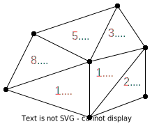
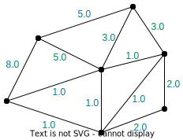
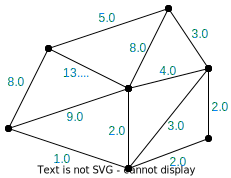

---
jupytext:
  formats: ipynb,md:myst
  text_representation:
    extension: .md
    format_name: myst
    format_version: 0.13
    jupytext_version: 1.14.0
kernelspec:
  display_name: Python 3 (ipykernel)
  language: python
  name: python3
---

# Getting started with the GT4Py declarative frontend

+++

## Installation

You can install the library directly from GitHub using pip:

```{raw-cell}
pip install git+https://github.com/gridtools/gt4py.git@functional
```

## Programming guide

### Key concepts and application structure

This section introduces three concepts for storing and manipulating data:
- [Fields](#Fields),
- [Field operators](#Field-operators), and
- [Programs](#Programs).

The concepts are demonstrated through a simple application that adds two fields.

+++

#### Importing features

The following snippet imports the most commonly used features that are needed to run the code in this document. Numpy is also required by the examples.

```{code-cell} ipython3
import numpy as np

from gt4py.next.common import DimensionKind
from gt4py.next.ffront.fbuiltins import Dimension, Field, float64, FieldOffset, neighbor_sum, where
from gt4py.next.ffront.decorator import field_operator, program
from gt4py.next.iterator.embedded import np_as_located_field, NeighborTableOffsetProvider
```

#### Fields

Fields store data as a multi-dimensional array, and are defined over a set of named dimensions. The code snippet below defines two named dimensions, *cell* and *K*, and creates the fields `a` and `b` over their cartesian product using the `np_as_located_field` helper function. The fields contain the values 2 for `a` and 3 for `b` for all entries.

```{code-cell} ipython3
CellDim = Dimension("Cell")
KDim = Dimension("K")

num_cells = 5
num_layers = 6
grid_shape = (num_cells, num_layers)

a_value = 2.0
b_value = 3.0
a = np_as_located_field(CellDim, KDim)(np.full(shape=grid_shape, fill_value=a_value, dtype=np.float64))
b = np_as_located_field(CellDim, KDim)(np.full(shape=grid_shape, fill_value=b_value, dtype=np.float64))
```

*Note: The interface to construct fields is provisional only and will change soon.*

+++

#### Field operators

Field operators perform operations on a set of fields, for example, elementwise addition or reduction along a dimension. You can write field operators as Python functions by using the `@field_operator` decorator. Field operators cannot have side effects, therefore you cannot modify its arguments within their body. Only a subset of the Python syntax is allowed inside field operators—the library checks for correctness.

Let's see an example for a field operator that adds two fields elementwise:

```{code-cell} ipython3
@field_operator
def add(a: Field[[CellDim, KDim], float64],
        b: Field[[CellDim, KDim], float64]) -> Field[[CellDim, KDim], float64]:
    return a + b
```

You can call field operators from [programs](#Programs), other field operators, or directly. The code snippet below shows a direct call, in which case you have to supply two additional arguments: `out`, which is a field to write the return value to, and `offset_provider`, which is left empty for now. The result of the field operator is a field with all entries equal to 5, but for brevity, only the average and the standard deviation of the entries are printed:

```{code-cell} ipython3
result = np_as_located_field(CellDim, KDim)(np.zeros(shape=grid_shape))
add(a, b, out=result, offset_provider={})

print("{} + {} = {} ± {}".format(a_value, b_value, np.average(np.asarray(result)), np.std(np.asarray(result))))
```

#### Programs

+++

Programs let you group together multiple field operator calls as a sequence of operations. They are similar to field operators in that they also use a decorator (`@program`) and that they can only use a subset of the Python syntax, but programs can mutate their arguments. Currently, the syntax inside programs is limited to calling field operators.

This example program below calls the above elementwise addition field operator twice:

```{code-cell} ipython3
@program
def run_add(a : Field[[CellDim, KDim], float64],
            b : Field[[CellDim, KDim], float64],
            result : Field[[CellDim, KDim], float64]):
    add(a, b, out=result)
    add(b, result, out=result)
```

You can execute the program by simply calling it:

```{code-cell} ipython3
result = np_as_located_field(CellDim, KDim)(np.zeros(shape=grid_shape))
run_add(a, b, result, offset_provider={})

print("{} + {} = {} ± {}".format(b_value, (a_value + b_value), np.average(np.asarray(result)), np.std(np.asarray(result))))
```

#### Composing field operators and programs

When writing complex applications, you have to decompose it into *field operators*, *programs*, and Python (or other) code that glues it all together. The general advice is to follow best practices and write short and concise field operators that serve a single purpose. To maximise automatic optimization, use external glue code sparingly and group your field operators inside *programs* as much as you can. Consequently, directly calling field operators is primarily used for debugging purposes.

+++

### Operations on unstructured meshes

This section introduces additional APIs through a slightly more elaborate application that performs a laplacian-like operation on an unstructured mesh. Within the context of this guide, we define the *pseudo-laplacian* for a cell as the sum of the *edge differences* around the cell. For example, the pseudo-laplacian for cell \#1, which is surrounded by edges \#7, \#8 and \#9, is expressed by the formula:

$$\begin{aligned}\text{pseudolap}(cell_1) =\,& \text{edge_diff}_7 + \text{edge_diff}_8 + \text{edge_diff}_9 \end{aligned}$$.

The edge difference above is defined as the difference between the two cells adjacent to and edge, so for edge \#7 the equation is:

$$\begin{aligned} \text{edge_diff}_7 =\,& \text{edge_diff}_{0,1} = \text{value_of}(\text{cell}_0) - \text{value_of}(\text{cell}_1) \end{aligned}$$

The sign of the edge difference in the sum of the pseudo-laplacian is always such that the neighbor cell is subtracted from the subject cell, not the other way around.

This section approaches the pseudo-laplacian by introducing the required APIs progressively through the following subsections:
- [Defining the mesh and the connectivities (adjacencies) between cells and edges](#Defining-the-mesh-and-its-connectivities)
- [Using connectivities in field operators](#Using-connectivities-in-field-operators)
- [Using reductions on connected mesh elements](#Using-reductions-on-connected-mesh-elements)
- [Implementing the actual pseudo-laplacian](#Implementing-the-pseudo-laplacian)

+++

#### Defining the mesh and its connectivities

The examples related to unstructured meshes use the mesh below. The edges (in blue) and the cells (in red) are numbered with zero-based indices.

|  |
|:--:| 
| *The mesh with the indices* |

+++

The fields in the subsequent code snippets are 1-dimensional, either over the cells or over the edges. The corresponding named dimensions are thus the following:

```{code-cell} ipython3
CellDim = Dimension("Cell")
EdgeDim = Dimension("Edge")
```

You can express connectivity between elements (i.e. cells or edges) of the mesh using connectivity (a.k.a. adjacency or neighborhood) tables. The table below, `edge_to_cell_table`, has one row for every edge where it lists the indices of cells adjacent to that edge. For example, this table says that edge \#6 connects to cells \#0 and \#5. Similarly, `cell_to_edge_table` lists the edges that are neighbors to a particular cell.

Note, however, that the tables are dense matrices, so if an edge has fewer than 2 neighbor cells, the remaining entries are filled with -1. You can also specify all kinds of connectivities like edge-to-edge, cell-to-edge or even cell-to-cell. The adjacency relationships don't have to be reciprocal, so it's possible for example that a cell lists an edge as its neighbour, but the edge does not list that particular cell.

The edge-to-cell and cell-to-edge connectivity tables for the mesh are the following:

```{code-cell} ipython3
edge_to_cell_table = np.array([
    [0, -1], # edge 0 (neighbours: cell 0)
    [2, -1], # edge 1
    [2, -1], # edge 2
    [3, -1], # edge 3
    [4, -1], # edge 4
    [5, -1], # edge 5
    [0, 5],  # edge 6 (neighbours: cell 0, cell 5)
    [0, 1],  # edge 7
    [1, 2],  # edge 8
    [1, 3],  # edge 9
    [3, 4],  # edge 10
    [4, 5]   # edge 11
])

cell_to_edge_table = np.array([
    [0, 6, 7],   # cell 0 (neighbors: edge 0, edge 6, edge 7)
    [7, 8, 9],   # cell 1
    [1, 2, 8],   # cell 2
    [3, 9, 10],  # cell 3
    [4, 10, 11], # cell 4
    [5, 6, 11],  # cell 5
])
```

#### Using connectivities in field operators

Let's start by defining two fields: one over the cells and another one over the edges. The field over cells serves input for subsequent calculations and is therefore filled up with values, whereas the field over the edges stores the output of the calculations and is therefore left blank.

```{code-cell} ipython3
cell_values = np_as_located_field(CellDim)(np.array([1.0, 1.0, 2.0, 3.0, 5.0, 8.0]))
edge_values = np_as_located_field(EdgeDim)(np.zeros((12,)))
```

|  | 
|:--:| 
| *Cell values* |

+++

You can transform fields (or tuples of fields) over one domain to another domain by using the call operator of the source field with a *field offset* as argument. This transform uses the connectivity between the source and target domains to find the values of adjacent mesh elements.

To understand this transform, you can look at the edge-to-cell connectivity table `edge_to_cell_table` listed above. This table has the same shape as the output of the transform, that is, one dimension over the edges and another *local* dimension. The table stores indices into a field over cells, the transform essentially gives you another field where the indices have been replaced with the values in the cell field at the corresponding indices.

Another way to look at it is that transform uses the edge-to-cell connectivity to look up all the cell neighbors of edges, and associates the values of those neighbor cells with each edge.

You can use the field offset `E2C` below to transform a field over cells to a field over edges using the edge-to-cell connectivities:

```{code-cell} ipython3
E2CDim = Dimension("E2C", kind=DimensionKind.LOCAL)
E2C = FieldOffset("E2C", source=CellDim, target=(EdgeDim,E2CDim))
```

Note that the field offset does not contain the actual connectivity table, that's provided through an *offset provider*:

```{code-cell} ipython3
E2C_offset_provider = NeighborTableOffsetProvider(edge_to_cell_table, EdgeDim, CellDim, 2)
```

The field operator `nearest_cell_to_edge` below shows an example of applying this transform. There is a little twist though: the subscript in `E2C[0]` means that only the value of the first connected cell is taken, the second (if exists) is ignored.

Pay attention to the syntax where the field offset `E2C` can be freely accessed in the field operator, but the offset provider `E2C_offset_provider` is passed in a dictionary to the program.

```{code-cell} ipython3
@field_operator
def nearest_cell_to_edge(cell_values: Field[[CellDim], float64]) -> Field[[EdgeDim], float64]:
    return cell_values(E2C[0])

@program
def run_nearest_cell_to_edge(cell_values: Field[[CellDim], float64], out : Field[[EdgeDim], float64]):
    nearest_cell_to_edge(cell_values, out=out)

run_nearest_cell_to_edge(cell_values, edge_values, offset_provider={"E2C": E2C_offset_provider})

print("0th adjacent cell's value: {}".format(np.asarray(edge_values)))
```

Running the above snippet results in the following edge field:

|  | $\mapsto$ |  |
|:--:| :--: | :--: |
| *Domain (edges)* |  | *Edge values* |

+++

#### Using reductions on connected mesh elements

Similarly to the previous example, the output is once again a field on edges. The difference is that this field operator does not take the first column of the transformed field, but sums the columns. In other words, the result is the sum of all the cells adjacent to an edge. You can achieve this by first transforming the cell field to a field over the cell neighbors of edges (i.e. a field of dimensions Edge × E2CDim) using `cells(E2C)`, then calling the `neighbor_sum` builtin function to sum along the `E2CDim` dimension.

```{code-cell} ipython3
@field_operator
def sum_adjacent_cells(cells : Field[[CellDim], float64]) -> Field[[EdgeDim], float64]:
    # type of cells(E2C) is Field[[CellDim, E2CDim], float64]
    return neighbor_sum(cells(E2C), axis=E2CDim)

@program
def run_sum_adjacent_cells(cells : Field[[CellDim], float64], out : Field[[EdgeDim], float64]):
    sum_adjacent_cells(cells, out=out)
    
run_sum_adjacent_cells(cell_values, edge_values, offset_provider={"E2C": E2C_offset_provider})

print("sum of adjacent cells: {}".format(np.asarray(edge_values)))
```

For the border edges, the results are unchanged compared to the previous example, but the inner edges now contain the sum of the two adjacent cells:

|  | $\mapsto$ |  |
|:--:| :--: | :--: |
| *Domain (edges)* |  | *Edge values* |

+++ 

#### Using conditionals on fields

Additionally to the `neighbor_sum` function, other builtins have been implemented. One of these is the `where`.
This function takes 3 input arguments:
 - mask: a field with dtype boolean
 - true branch: a tuple, a field, or a scalar
 - false branch: a tuple, a field, of a scalar
The mask can be directly a field of booleans (e.g. `Field[[CellDim], bool]`) or an expression evaluating to this type (e.g. `Field[[CellDim], float64] > 3`).
The `where` builtin loops over each entry of the mask and returns values corresponding to the same indexes of either the true or the false branch. 
In the case where the true and false branches are either fields or scalars, the resulting output will be a field including all dimensions from all inputs. For example:

```{code-cell} ipython3
mask = np_as_located_field(CellDim, KDim)(np.zeros(shape=grid_shape, dtype=bool))
result_where = np_as_located_field(CellDim, KDim)(np.zeros(shape=grid_shape))
b = 6.0

@field_operator
def conditional(mask: Field[[CellDim, KDim], bool], a: Field[[CellDim, KDim], float64], b: float
) -> Field[[CellDim, KDim], float64]:
    return where(mask, a, b)
    
conditional(mask, a, b, out=result_where, offset_provider={})
print("where return: {}".format(np.asarray(result_where)))
```

**Tuple implementation:**

The `where` supports the return of tuples of fields. To perform promotion of dimensions and dtype of the output, all arguments are analyzed and promoted as in the above section.

```{code-cell} ipython3
result_1 = np_as_located_field(CellDim, KDim)(np.zeros(shape=grid_shape))
result_2 = np_as_located_field(CellDim, KDim)(np.zeros(shape=grid_shape))

@field_operator
def _conditional_tuple(mask: Field[[CellDim, KDim], bool], a: Field[[CellDim, KDim], float64], b: float
) -> tuple[Field[[CellDim, KDim], float64], Field[[CellDim, KDim], float64]]:
    return where(mask, (a, b), (b, a))
    
@program
def conditional_tuple(mask: Field[[CellDim, KDim], bool], a: Field[[CellDim, KDim], float64], b: float, 
result_1: Field[[CellDim, KDim], float64], result_2: Field[[CellDim, KDim], float64]
):
     _conditional_tuple(mask, a, b, out=(result_1, result_2))
    
conditional_tuple(mask, a, b, result_1, result_2, offset_provider={})
print("where tuple return: {}".format((np.asarray(result_1), np.asarray(result_2))))
```

The `where` builtin also allows for nesting of tuples. In this scenario, it will first perform an unrolling: 

```where(mask, ((a, b), (b, a)), ((c, d), (d, c)))``` --> ```where(mask, (a, b), (c, d))``` and ```where(mask, (b, a), (d, c))```

and then combine results to match the return type:

```{code-cell} ipython3
a = np_as_located_field(CellDim, KDim)(np.full(shape=grid_shape, fill_value=2.0, dtype=np.float64))
b = np_as_located_field(CellDim, KDim)(np.full(shape=grid_shape, fill_value=3.0, dtype=np.float64))
c = np_as_located_field(CellDim, KDim)(np.full(shape=grid_shape, fill_value=4.0, dtype=np.float64))
d = np_as_located_field(CellDim, KDim)(np.full(shape=grid_shape, fill_value=5.0, dtype=np.float64))

result_1 = np_as_located_field(CellDim, KDim)(np.zeros(shape=grid_shape))
result_2 = np_as_located_field(CellDim, KDim)(np.zeros(shape=grid_shape))

@field_operator
def _conditional_tuple_nested(
    mask: Field[[CellDim, KDim], bool], a: Field[[CellDim, KDim], float64], b: Field[[CellDim, KDim], float64], c: Field[[CellDim, KDim], float64], d: Field[[CellDim, KDim], float64]
) -> tuple[
    tuple[Field[[CellDim, KDim], float64], Field[[CellDim, KDim], float64]],
    tuple[Field[[CellDim, KDim], float64], Field[[CellDim, KDim], float64]],
]:
    return where(mask, ((a, b), (b, a)), ((c, d), (d, c)))
    
@program
def conditional_tuple_nested(
    mask: Field[[CellDim, KDim], bool], a: Field[[CellDim, KDim], float64], b: Field[[CellDim, KDim], float64], c: Field[[CellDim, KDim], float64], d: Field[[CellDim, KDim], float64],
    result_1: Field[[CellDim, KDim], float64], result_2: Field[[CellDim, KDim], float64]
):
    _conditional_tuple_nested(mask, a, b, c, d, out=((result_1, result_2), (result_2, result_1)))

conditional_tuple_nested(mask, a, b, c, d, result_1, result_2, offset_provider={})
print("where nested tuple return: {}".format(((np.asarray(result_1), np.asarray(result_2)), (np.asarray(result_2), np.asarray(result_1)))))
```

+++

#### Implementing the pseudo-laplacian

As explained in the section outline, the pseudo-laplacian needs the cell-to-edge connectivities as well in addition to the edge-to-cell connectivities. Though the connectivity table has been filled in above, you still need to define the local dimension, the field offset, and the offset provider that describe how to use the connectivity table. The procedure is identical to the edge-to-cell connectivity from before:

```{code-cell} ipython3
C2EDim = Dimension("C2E", kind=DimensionKind.LOCAL)
C2E = FieldOffset("C2E", source=EdgeDim, target=(CellDim, C2EDim))

C2E_offset_provider = NeighborTableOffsetProvider(cell_to_edge_table, CellDim, EdgeDim, 3)
```

**Weights of edge differences:**

Revisiting the example from the beginning of the section, the equation of the pseudo-laplacian for cell \#1 is:
$$\text{pseudolap}(cell_1) = -\text{edge_diff}_{0,1} + \text{edge_diff}_{1,2} + \text{edge_diff}_{1,3}$$

Notice how $\text{edge_diff}_{0,1}$ is actually subtracted from the sum rather than added. This is because the edge to cell connectivity table lists cell \#1 as the second argument to the subtraction rather than the first, so the difference calculated on the edge will be the opposite sign for this particular cell. To fix this, a table that has three elements for every cell is needed, specifying the sign of the difference on the three adjacent edges. If you look for cell \#1 in the `edge_weights` table below, you can see that the sign is negative for the first edge difference and positive for the second and third, just like in the equation above.

+++

In addition to the signs, there is an issue with the border edges as well for which the edge difference is undefined because they only have one cell neighbor. For the pseudo-laplacian, the edge difference for border edges is considered zero. You can achieve this in the calculations by zeroing out the weights for the border edges in the edge weight table.

+++

Incorporating both the signs and the zeros for the border edges, the final edge weights are the following:

```{code-cell} ipython3
edge_weights = np.array([
    [0, 1, 1],   # cell 0
    [-1, 1, 1],  # cell 1
    [0, 0, -1],  # cell 2
    [0, -1, 1],  # cell 3
    [0, -1, 1],  # cell 4
    [0, -1, -1], # cell 5
], dtype=np.float64)

edge_weight_field = np_as_located_field(CellDim, C2EDim)(edge_weights)
```

Now you have everything to implement the pseudo-laplacian. Its field operator requires the cell field and the edge weights as inputs, and outputs a cell field of the same shape as the input.

The first line of the field operator calculates the edge difference for all edges. This is done by creating a temporary field over edges with the value of the first cell neighbour and another temporary field with the value of the second, and the difference of the two fields gives the `edge_differences`.

The second lines first creates a temporary field using `edge_differences(C2E)`, which contains the three adjacent edge differences for every cell. This table is then multiplied elementwise with the `edge_weights`. The final result is a field over cells that contains the pseudo-laplacian.

```{code-cell} ipython3
@field_operator
def pseudo_lap(cells : Field[[CellDim], float64],
               edge_weights : Field[[CellDim, C2EDim], float64]) -> Field[[CellDim], float64]:
    edge_differences = cells(E2C[0]) - cells(E2C[1]) # type: Field[[EdgeDim], float64]
    return neighbor_sum(edge_differences(C2E) * edge_weights, axis=C2EDim)
```

The program itself is just a shallow wrapper over the `pseudo_lap` field operator. The significant part is how offset providers for both the edge-to-cell and cell-to-edge connectivities are supplied when the program is called:

```{code-cell} ipython3
@program
def run_pseudo_laplacian(cells : Field[[CellDim], float64],
                         edge_weights : Field[[CellDim, C2EDim], float64],
                         out : Field[[CellDim], float64]):
    pseudo_lap(cells, edge_weights, out=out)

result_pseudo_lap = np_as_located_field(CellDim)(np.zeros(shape=(6,)))

run_pseudo_laplacian(cell_values,
                     edge_weight_field,
                     result_pseudo_lap,
                     offset_provider={"E2C": E2C_offset_provider, "C2E": C2E_offset_provider})

print("pseudo-laplacian: {}".format(np.asarray(result_pseudo_lap)))
```

As a closure, here is an example of chaining field operators, which is very simple to do when working with fields. The field operator below executes the pseudo-laplacian, and then calls the pseudo-laplacian on the result of the first, in effect, calculating the laplacian of a laplacian.

```{code-cell} ipython3
@field_operator
def pseudo_laplap(cells : Field[[CellDim], float64],
                  edge_weights : Field[[CellDim, C2EDim], float64]) -> Field[[CellDim], float64]:
    return pseudo_lap(pseudo_lap(cells, edge_weights), edge_weights)
```