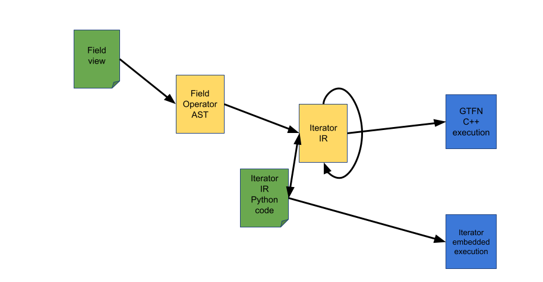
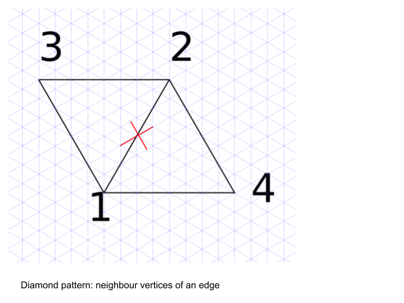

---
jupytext:
  formats: ipynb,md:myst
  text_representation:
    extension: .md
    format_name: myst
    format_version: 0.13
    jupytext_version: 1.15.2
kernelspec:
  display_name: Python 3 (ipykernel)
  language: python
  name: python3
---

# Hands on Session of the GT4Py Workshop

## Installation
Please follow the instructions in the README.md or use the Gitpod setup.

## GT4Py mode

We will implement the examples in field view and execute the Iterator IR program in Python.



## Import Modules

```{code-cell} ipython3
import numpy as np

import gt4py.next as gtx
from gt4py.next.iterator.embedded import MutableLocatedField 
from gt4py.next import neighbor_sum, where
from gt4py.next import Dimension, DimensionKind, FieldOffset
```

```{code-cell} ipython3
def random_field(
    sizes, *dims, low: float = -1.0, high: float = 1.0
) -> MutableLocatedField:
    return gtx.as_field(*dims)( 
        np.random.default_rng().uniform(
            low=low, high=high, size=sizes
        )
    )

def zero_field(
    sizes, *dims: Dimension, dtype=float
) -> MutableLocatedField:
    return np_as_located_field(*dims)( 
        np.zeros(shape=sizes, dtype=dtype)
    )
```

For simplicity we use a triangulated donut in the horizontal.

```
0v---0e-- 1v---3e-- 2v---6e-- 0v
|  \ 0c   |  \ 1c   |  \2c
|   \1e   |   \4e   |   \7e
|2e   \   |5e   \   |8e   \
|  3c   \ |   4c  \ |    5c\
3v---9e-- 4v--12e-- 5v--15e-- 3v
|  \ 6c   |  \ 7c   |  \ 8c
|   \10e  |   \13e  |   \16e
|11e  \   |14e  \   |17e  \
|  9c  \  |  10c \  |  11c \
6v--18e-- 7v--21e-- 8v--24e-- 6v
|  \12c   |  \ 13c  |  \ 14c
|   \19e  |   \22e  |   \25e
|20e  \   |23e  \   |26e  \
|  15c  \ | 16c   \ | 17c  \
0v       1v         2v        0v
```

+++

## Connectivities

```{code-cell} ipython3
n_edges = 27
n_vertices = 9
n_cells = 18
n_levels = 10
e2c2v_table = np.asarray(
    [
        [0, 1, 4, 6],  # 0
        [0, 4, 1, 3],  # 1
        [0, 3, 4, 2],  # 2
        [1, 2, 5, 7],  # 3
        [1, 5, 2, 4],  # 4
        [1, 4, 5, 0],  # 5
        [2, 0, 3, 8],  # 6
        [2, 3, 5, 0],  # 7
        [2, 5, 1, 3],  # 8
        [3, 4, 0, 7],  # 9
        [3, 7, 4, 6],  # 10
        [3, 6, 7, 5],  # 11
        [4, 5, 8, 1],  # 12
        [4, 8, 7, 5],  # 13
        [4, 7, 3, 8],  # 14
        [5, 3, 6, 2],  # 15
        [6, 5, 3, 8],  # 16
        [8, 5, 6, 4],  # 17
        [6, 7, 3, 1],  # 18
        [6, 1, 7, 0],  # 19
        [6, 0, 1, 8],  # 20
        [7, 8, 2, 4],  # 21
        [7, 2, 8, 1],  # 22
        [7, 1, 2, 6],  # 23
        [8, 6, 0, 5],  # 24
        [8, 0, 6, 2],  # 25
        [8, 2, 0, 6],  # 26
    ]
)

e2c_table = np.asarray(
    [
        [0, 15],
        [0, 3],
        [3, 2],
        [1, 16],
        [1, 4],
        [0, 4],
        [2, 17],
        [2, 5],
        [1, 5],
        [3, 6],
        [6, 9],
        [9, 8],
        [4, 7],
        [7, 10],
        [6, 10],
        [5, 8],
        [8, 11],
        [7, 11],
        [9, 12],
        [12, 15],
        [15, 14],
        [10, 13],
        [13, 16],
        [12, 16],
        [11, 14],
        [14, 17],
        [13, 17],
    ]
)

e2v_table = np.asarray(
    [
        [0, 1],
        [0, 4],
        [0, 3],
        [1, 2],
        [1, 5],
        [1, 4],
        [2, 0],
        [2, 3],
        [2, 5],
        [3, 4],
        [3, 7],
        [3, 6],
        [4, 5],
        [4, 8],
        [4, 7],
        [5, 3],
        [5, 6],
        [5, 8],
        [6, 7],
        [6, 1],
        [6, 0],
        [7, 8],
        [7, 2],
        [7, 1],
        [8, 6],
        [8, 0],
        [8, 2],
    ]
)

e2c2e_table = np.asarray(
    [
        [1, 5, 19, 20],
        [0, 5, 2, 9],
        [1, 9, 6, 7],
        [4, 8, 22, 23],
        [3, 8, 5, 12],
        [0, 1, 4, 12],
        [7, 2, 25, 26],
        [6, 2, 8, 15],
        [3, 4, 7, 15],
        [1, 2, 10, 14],
        [9, 14, 11, 18],
        [10, 18, 15, 16],
        [4, 5, 13, 17],
        [12, 17, 14, 21],
        [9, 10, 13, 21],
        [7, 8, 16, 11],
        [15, 11, 17, 24],
        [12, 13, 16, 24],
        [10, 11, 19, 23],
        [18, 23, 20, 0],
        [19, 0, 24, 25],
        [13, 14, 22, 26],
        [21, 26, 23, 3],
        [18, 19, 22, 3],
        [16, 17, 25, 20],
        [24, 20, 26, 6],
        [25, 6, 21, 22],
    ]
)

e2c2eO_table = np.asarray(
    [
        [0, 1, 5, 19, 20],
        [0, 1, 5, 2, 9],
        [1, 2, 9, 6, 7],
        [3, 4, 8, 22, 23],
        [3, 4, 8, 5, 12],
        [0, 1, 5, 4, 12],
        [6, 7, 2, 25, 26],
        [6, 7, 2, 8, 15],
        [3, 4, 8, 7, 15],
        [1, 2, 9, 10, 14],
        [9, 10, 14, 11, 18],
        [10, 11, 18, 15, 16],
        [4, 5, 12, 13, 17],
        [12, 13, 17, 14, 21],
        [9, 10, 14, 13, 21],
        [7, 8, 15, 16, 11],
        [15, 16, 11, 17, 24],
        [12, 13, 17, 16, 24],
        [10, 11, 18, 19, 23],
        [18, 19, 23, 20, 0],
        [19, 20, 0, 24, 25],
        [13, 14, 21, 22, 26],
        [21, 22, 26, 23, 3],
        [18, 19, 23, 22, 3],
        [16, 17, 24, 25, 20],
        [24, 25, 20, 26, 6],
        [25, 26, 6, 21, 22],
    ]
)

c2e_table = np.asarray(
    [
        [0, 1, 5],  # cell 0
        [3, 4, 8],  # cell 1
        [6, 7, 2],  # cell 2
        [1, 2, 9],  # cell 3
        [4, 5, 12],  # cell 4
        [7, 8, 15],  # cell 5
        [9, 10, 14],  # cell 6
        [12, 13, 17],  # cell 7
        [15, 16, 11],  # cell 8
        [10, 11, 18],  # cell 9
        [13, 14, 21],  # cell 10
        [16, 17, 24],  # cell 11
        [18, 19, 23],  # cell 12
        [21, 22, 26],  # cell 13
        [24, 25, 20],  # cell 14
        [19, 20, 0],  # cell 15
        [22, 23, 3],  # cell 16
        [25, 26, 6],  # cell 17
    ]
)

v2c_table = np.asarray(
    [
        [17, 14, 3, 0, 2, 15],
        [0, 4, 1, 12, 16, 15],
        [1, 5, 2, 16, 13, 17],
        [3, 6, 9, 5, 8, 2],
        [6, 10, 7, 4, 0, 3],
        [7, 11, 8, 5, 1, 4],
        [9, 12, 15, 8, 11, 14],
        [12, 16, 13, 10, 6, 9],
        [13, 17, 14, 11, 7, 10],
    ]
)

v2e_table = np.asarray(
    [
        [0, 1, 2, 6, 25, 20],
        [3, 4, 5, 0, 23, 19],
        [6, 7, 8, 3, 22, 26],
        [9, 10, 11, 15, 7, 2],
        [12, 13, 14, 9, 1, 5],
        [15, 16, 17, 12, 4, 8],
        [18, 19, 20, 24, 16, 11],
        [21, 22, 23, 18, 10, 14],
        [24, 25, 26, 21, 13, 17],
    ]
)

diamond_table = np.asarray(
    [
        [0, 1, 4, 6],  # 0
        [0, 4, 1, 3],
        [0, 3, 4, 2],
        [1, 2, 5, 7],  # 3
        [1, 5, 2, 4],
        [1, 4, 5, 0],
        [2, 0, 3, 8],  # 6
        [2, 3, 0, 5],
        [2, 5, 1, 3],
        [3, 4, 0, 7],  # 9
        [3, 7, 4, 6],
        [3, 6, 5, 7],
        [4, 5, 1, 8],  # 12
        [4, 8, 5, 7],
        [4, 7, 3, 8],
        [5, 3, 2, 6],  # 15
        [5, 6, 3, 8],
        [5, 8, 4, 6],
        [6, 7, 3, 1],  # 18
        [6, 1, 7, 0],
        [6, 0, 1, 8],
        [7, 8, 4, 2],  # 21
        [7, 2, 8, 1],
        [7, 1, 6, 2],
        [8, 6, 5, 0],  # 24
        [8, 0, 6, 2],
        [8, 2, 7, 0],
    ]
)

c2e2cO_table = np.asarray(
    [
        [15, 4, 3, 0],
        [16, 5, 4, 1],
        [17, 3, 5, 2],
        [0, 6, 2, 3],
        [1, 7, 0, 4],
        [2, 8, 1, 5],
        [3, 10, 9, 6],
        [4, 11, 10, 7],
        [5, 9, 11, 8],
        [6, 12, 8, 9],
        [7, 13, 6, 10],
        [8, 14, 7, 11],
        [9, 16, 15, 12],
        [10, 17, 16, 13],
        [11, 15, 17, 14],
        [12, 0, 14, 15],
        [13, 1, 12, 16],
        [14, 2, 13, 17],
    ]
)

c2e2c_table = np.asarray(
    [
        [15, 4, 3],
        [16, 5, 4],
        [17, 3, 5],
        [0, 6, 2],
        [1, 7, 0],
        [2, 8, 1],
        [3, 10, 9],
        [4, 11, 10],
        [5, 9, 11],
        [6, 12, 8],
        [7, 13, 6],
        [8, 14, 7],
        [9, 16, 15],
        [10, 17, 16],
        [11, 15, 17],
        [12, 0, 14],
        [13, 1, 12],
        [14, 2, 13],
    ]
)
```

# Excercises

## 1. point wise stencil

We start off with a simple point wise stencil, where we want to write the following piece of Fortran code in gt4py:

+++

```fortran
      DO jb = i_startblk,i_endblk

        CALL get_indices_e(p_patch, jb, i_startblk, i_endblk, &
                           i_startidx, i_endidx, start_bdydiff_e, grf_bdywidth_e)
        DO jk = 1, nlev
          DO je = i_startidx, i_endidx
            p_nh_prog%vn(je,jk,jb) =   &
              p_nh_prog%vn(je,jk,jb) + &
              z_nabla2_e(je,jk,jb) * &
              p_patch%edges%area_edge(je,jb)*fac_bdydiff_v
          ENDDO
        ENDDO
      ENDDO
```

+++

The loops over `jk` and `je` are the horizontal and vertical loops. The additional loop over `jb` is used in ICON in order to partition the horizontal `je` loop into multiple pieces for cache optimization reasons, so the `jb` loop has no physical meaning. The `get_indices_e` function is used to fetch the exact horizontal start and end indices `i_startidx` and `i_endidx` for this specific stencil.

Further we see that `p_nh_prog%vn`, `z_nabla2_e` are fields with horizontal and vertical extends, while `p_patch%edges%area_edge` is a purely horizontal field and `fac_bdydiff_v` is a scalar.

On the gt4py side, we want to define some dimensions for Vertices, Cells, Edges and the vertical K direction first:

```{code-cell} ipython3
C = Dimension("C")
V = Dimension("V")
E = Dimension("E")
K = Dimension("K")
```

Next we implement the stencil and a numpy reference version, in order to verify them against each other.

```{code-cell} ipython3
@gtx.field_operator
def mo_nh_diffusion_stencil_06_gt4py(
    z_nabla2_e: gtx.Field[[E, K], float],
    area_edge: gtx.Field[[E], float],
    vn: gtx.Field[[E, K], float],
    fac_bdydiff_v: float,
) -> gtx.Field[[E, K], float]:
    vn = vn + (z_nabla2_e * area_edge * fac_bdydiff_v)
    return vn
```

```{code-cell} ipython3
def mo_nh_diffusion_stencil_06_numpy(
    z_nabla2_e: np.array, area_edge: np.array, vn: np.array, fac_bdydiff_v
) -> np.array:
    area_edge = np.expand_dims(area_edge, axis=-1)
    vn = vn + (z_nabla2_e * area_edge * fac_bdydiff_v)
    return vn
```

```{code-cell} ipython3
def test_mo_nh_diffusion_stencil_06():
    
    fac_bdydiff_v = 5.0
    z_nabla2_e = random_field((n_edges, n_levels), E, K)
    area_edge = random_field((n_edges), E)
    vn = random_field((n_edges, n_levels), E, K)
    
    vn_numpy = mo_nh_diffusion_stencil_06_numpy(
        np.asarray(z_nabla2_e), np.asarray(area_edge), np.asarray(vn), fac_bdydiff_v
    )

    vn_gt4py = zero_field((n_edges, n_levels), E, K)

    mo_nh_diffusion_stencil_06_gt4py(
        z_nabla2_e, area_edge, vn, fac_bdydiff_v, out=vn_gt4py, offset_provider={}
    )
    
    assert np.allclose(vn_gt4py, vn_numpy)
```

```{code-cell} ipython3
test_mo_nh_diffusion_stencil_06()
```

## 2. reduction: divergence

+++

Next we will translate a divergence stencil. The normal velocity of each edge is multipled with the edge length, the contributions from all three edges of a cell are summed up and then divided by the area of the cell. In the next pictures we can see a graphical representation of all of the quantities involved:

The orientation of the edge plays a role for this operation in ICON, as we need to be aware if the normal vector of an edge points inwards or outwards of the cell we are currently looking at.

One such divergence stencil is stencil 02 in diffusion:

```fortran
      DO jb = i_startblk,i_endblk

        CALL get_indices_c(p_patch, jb, i_startblk, i_endblk, &
                           i_startidx, i_endidx, rl_start, rl_end)
        DO jk = 1, nlev
          DO jc = i_startidx, i_endidx

            div(jc,jk) = p_nh_prog%vn(ieidx(jc,jb,1),jk,ieblk(jc,jb,1))*p_int%geofac_div(jc,1,jb) + &
                         p_nh_prog%vn(ieidx(jc,jb,2),jk,ieblk(jc,jb,2))*p_int%geofac_div(jc,2,jb) + &
                         p_nh_prog%vn(ieidx(jc,jb,3),jk,ieblk(jc,jb,3))*p_int%geofac_div(jc,3,jb)
          ENDDO
        ENDDO
      ENDDO
```
where `p_int%geofac_div` is set up as a constant field at ICON startup time and contains the geometrical factors for the divergence operator:
```fortran
    DO jb = i_startblk, i_endblk

      CALL get_indices_c(ptr_patch, jb, i_startblk, i_endblk, &
        & i_startidx, i_endidx, rl_start, rl_end)

      DO je = 1, ptr_patch%geometry_info%cell_type
        DO jc = i_startidx, i_endidx

          ile = ptr_patch%cells%edge_idx(jc,jb,je)
          ibe = ptr_patch%cells%edge_blk(jc,jb,je)

          ptr_int%geofac_div(jc,je,jb) = &
            & ptr_patch%edges%primal_edge_length(ile,ibe) * &
            & ptr_patch%cells%edge_orientation(jc,jb,je)  / &
            & ptr_patch%cells%area(jc,jb)

        ENDDO !cell loop
      ENDDO

    END DO !block loop

```

```{code-cell} ipython3
C2EDim = Dimension("C2E", kind=DimensionKind.LOCAL)
C2E = FieldOffset("C2E", source=E, target=(C, C2EDim))
```

```{code-cell} ipython3
@gtx.field_operator
def mo_nh_diffusion_stencil_02_gt4py(
    vn: gtx.Field[[E, K], float],
    geofac_div: gtx.Field[[C, C2EDim], float],
) -> gtx.Field[[C, K], float]:
    div = neighbor_sum(vn(C2E) * geofac_div, axis=C2EDim)
    return div
```

```{code-cell} ipython3
def mo_nh_diffusion_stencil_02_numpy(
    c2e: np.array,
    vn: np.array,
    geofac_div: np.array,
) -> tuple[np.array]:
    geofac_div = np.expand_dims(geofac_div, axis=-1)
    vn_geofac = vn[c2e] * geofac_div
    div = np.sum(vn_geofac, axis=1)

    return div
```

```{code-cell} ipython3
def test_mo_nh_diffusion_stencil_02():
    vn = random_field((n_edges, n_levels), E, K)
    geofac_div = random_field((n_cells, 3), C, C2EDim)

    div_numpy = mo_nh_diffusion_stencil_02_numpy(
        c2e_table,
        np.asarray(vn),
        np.asarray(geofac_div),
    )

    c2e_connectivity = gtx.NeighborTableOffsetProvider(c2e_table, C, E, 3)

    div_gt4py = zero_field((n_cells, n_levels), C, K)

    mo_nh_diffusion_stencil_02_gt4py(
        vn, geofac_div, out = div_gt4py, offset_provider = {C2E.value: c2e_connectivity}
    )
    
    assert np.allclose(div_gt4py, div_numpy)
```

```{code-cell} ipython3
test_mo_nh_diffusion_stencil_02()
```

## 3. Neighbor access without reduction

The following is a slightly simplified loop nest from mo_nh_diffusion.f90. Maybe the experts can easily map it back to the mathematical formulation (it's very close to an expression in the ICON paper).

It is computing a quantity on edges, accessing vertex neighbors from the *diamond* pattern. `e2c2v_table` contains the mapping from edge index to vertex neighbor indices. The first 2 entries are the close neighbors, the 2 second entries are the far neighbors. See picture.



The computation can be expressed as reductions (tricky) or (simpler) by directly accessing the neighbor. Here we propose to implement the version without reductions.

### NumPy implementation

```{code-cell} ipython3
def mo_nh_diffusion_stencil_04_numpy(
    e2c2v: np.array,
    u_vert: np.array,
    v_vert: np.array,
    z_nabla2_e: np.array,
    inv_vert_vert_length: np.array,
    inv_primal_edge_length: np.array,
) -> np.array:
    u_vert_e2c2v = u_vert[e2c2v] # Numpy advanced indexing
    v_vert_e2c2v = v_vert[e2c2v]
    inv_vert_vert_length = np.expand_dims(inv_vert_vert_length, axis=-1) # add k dimension
    inv_primal_edge_length = np.expand_dims(inv_primal_edge_length, axis=-1)

    nabv_tang = u_vert_e2c2v[:, 0] + v_vert_e2c2v[:, 0] + u_vert_e2c2v[:, 1] + v_vert_e2c2v[:, 1]
    nabv_norm = u_vert_e2c2v[:, 2] + v_vert_e2c2v[:, 2] + u_vert_e2c2v[:, 3] + v_vert_e2c2v[:, 3]
    z_nabla4_e2 = 4.0 * (
        (nabv_norm - 2.0 * z_nabla2_e) * inv_vert_vert_length**2
        + (nabv_tang - 2.0 * z_nabla2_e) * inv_primal_edge_length**2
    )
    return z_nabla4_e2
```

### Alternative (Fortran-like) loop implementation

```{code-cell} ipython3
def mo_nh_diffusion_stencil_04_numpy2(
    e2c2v: np.array,
    u_vert: np.array,
    v_vert: np.array,
    z_nabla2_e: np.array,
    inv_vert_vert_length: np.array,
    inv_primal_edge_length: np.array,
) -> np.array:
    z_nabla4_e2 = np.zeros_like(z_nabla2_e) 
    for e in range(z_nabla4_e2.shape[0]):
        for k in range(z_nabla4_e2.shape[1]):
            nabv_tang = u_vert[e2c2v[e,0],k] + v_vert[e2c2v[e,0],k] + u_vert[e2c2v[e,1],k] + v_vert[e2c2v[e,1],k]
            nabv_norm = u_vert[e2c2v[e,2],k] + v_vert[e2c2v[e,2],k] + u_vert[e2c2v[e,3],k] + v_vert[e2c2v[e,3],k]
            z_nabla4_e2[e,k] = 4.0 * (
                (nabv_norm - 2.0 * z_nabla2_e[e,k]) * inv_vert_vert_length[e]**2
                + (nabv_tang - 2.0 * z_nabla2_e[e,k]) * inv_primal_edge_length[e]**2
            )
    return z_nabla4_e2
```

### Solution 1

```{code-cell} ipython3
# %%script echo Skipping this cell! Remove when working on this example.

V = Dimension("V")
E = Dimension("E")
K = Dimension("K", kind=DimensionKind.VERTICAL)
ECVDim = Dimension("ECV", kind=DimensionKind.LOCAL)

E2C2V = FieldOffset("E2C2V", source=V, target=[E, ECVDim])

@gtx.field_operator
def nabv_tang(
    u_vert: gtx.Field[[V,K], float],
    v_vert: gtx.Field[[V,K], float]
):
    return u_vert(E2C2V[0]) + v_vert(E2C2V[0]) + u_vert(E2C2V[1]) + v_vert(E2C2V[1])
              
@gtx.field_operator
def nabv_norm(
    u_vert: gtx.Field[[V,K], float],
    v_vert: gtx.Field[[V,K], float]
):
    return u_vert(E2C2V[2]) + v_vert(E2C2V[2]) + u_vert(E2C2V[3]) + v_vert(E2C2V[3])

@gtx.field_operator
def z_nabla4_e2(
    u_vert: gtx.Field[[V,K], float],
    v_vert: gtx.Field[[V,K], float],
    z_nabla2_e: gtx.Field[[E,K], float],
    inv_vert_vert_length: gtx.Field[[E], float],
    inv_primal_edge_length: gtx.Field[[E], float]
):
    return 4.0 * (
        (nabv_norm(u_vert, v_vert) - 2.0 * z_nabla2_e) * inv_vert_vert_length**2
        + (nabv_tang(u_vert, v_vert) - 2.0 * z_nabla2_e) * inv_primal_edge_length**2
    )

@gtx.program
def mo_nh_diffusion_stencil_04_gt4py(
    u_vert: gtx.Field[[V,K], float],
    v_vert: gtx.Field[[V,K], float],
    z_nabla2_e: gtx.Field[[E,K], float],
    inv_vert_vert_length: gtx.Field[[E], float],
    inv_primal_edge_length: gtx.Field[[E], float],
    out: gtx.Field[[E,K], float]
):
    z_nabla4_e2(u_vert, v_vert, z_nabla2_e, inv_vert_vert_length, inv_primal_edge_length, out=out)
```

### Solution 2

```{code-cell} ipython3
# %%script echo Skipping this cell! Remove when working on this example.

V = Dimension("V")
E = Dimension("E")
K = Dimension("K", kind=DimensionKind.VERTICAL)
DCDim = Dimension("DC", kind=DimensionKind.LOCAL)
DFDim = Dimension("DF", kind=DimensionKind.LOCAL)

DiamondClose = FieldOffset("DiamondClose", source=V, target=[E, DCDim])
DiamondFar = FieldOffset("DiamondFar", source=V, target=[E, DFDim])

@gtx.field_operator
def nabv_tang_2(
    u_vert: gtx.Field[[V,K], float],
    v_vert: gtx.Field[[V,K], float]
):
    return neighbor_sum(u_vert(DiamondClose) + v_vert(DiamondClose), axis=DCDim)
              
@gtx.field_operator
def nabv_norm_2(
    u_vert: gtx.Field[[V,K], float],
    v_vert: gtx.Field[[V,K], float]
):
    return neighbor_sum(u_vert(DiamondFar) + v_vert(DiamondFar), axis=DFDim)

@gtx.field_operator
def z_nabla4_e2_2(
    u_vert: gtx.Field[[V,K], float],
    v_vert: gtx.Field[[V,K], float],
    z_nabla2_e: gtx.Field[[E,K], float],
    inv_vert_vert_length: gtx.Field[[E], float],
    inv_primal_edge_length: gtx.Field[[E], float]
):
    return 4.0 * (
        (nabv_norm_2(u_vert, v_vert) - 2.0 * z_nabla2_e) * inv_vert_vert_length**2
        + (nabv_tang_2(u_vert, v_vert) - 2.0 * z_nabla2_e) * inv_primal_edge_length**2
    )

@gtx.program
def mo_nh_diffusion_stencil_04_gt4py2(
    u_vert: gtx.Field[[V,K], float],
    v_vert: gtx.Field[[V,K], float],
    z_nabla2_e: gtx.Field[[E,K], float],
    inv_vert_vert_length: gtx.Field[[E], float],
    inv_primal_edge_length: gtx.Field[[E], float],
    out: gtx.Field[[E,K], float]
):
    z_nabla4_e2_2(u_vert, v_vert, z_nabla2_e, inv_vert_vert_length, inv_primal_edge_length, out=out)
```

### Test setup

```{code-cell} ipython3
u_vert = np.random.rand(n_vertices, n_levels)
v_vert = np.random.rand(n_vertices, n_levels)
z_nabla2_e = np.random.rand(n_edges, n_levels)
inv_vert_vert_length = np.random.rand(n_edges)
inv_primal_edge_length = np.random.rand(n_edges)

z_nabla4_e2_numpy = mo_nh_diffusion_stencil_04_numpy(e2c2v_table, u_vert, v_vert, z_nabla2_e, inv_vert_vert_length, inv_primal_edge_length)
z_nabla4_e2_numpy2 = mo_nh_diffusion_stencil_04_numpy2(e2c2v_table, u_vert, v_vert, z_nabla2_e, inv_vert_vert_length, inv_primal_edge_length)
assert np.allclose(z_nabla4_e2_numpy, z_nabla4_e2_numpy2)

z_nabla4_e2_gt4py = np.zeros(shape=(n_edges, n_levels))
z_nabla4_e2_gt4py2 = np.zeros(shape=(n_edges, n_levels))
```

```{code-cell} ipython3
# %%script echo Skipping this cell! Remove when working on this example.

as_vk_field = np_as_located_field(V,K)
as_ek_field = np_as_located_field(E,K)
as_e_field = np_as_located_field(E,)

u_vert_field = as_vk_field(u_vert)
v_vert_field = as_vk_field(v_vert)
z_nabla2_e_field = as_ek_field(z_nabla2_e)
inv_vert_vert_length_field = as_e_field(inv_vert_vert_length)
inv_primal_edge_length_field = as_e_field(inv_primal_edge_length)

z_nabla4_e2_gt4py_field = as_ek_field(z_nabla4_e2_gt4py)

e2c2v_connectivity = gtx.NeighborTableOffsetProvider(e2c2v_table, E, V, 4)

mo_nh_diffusion_stencil_04_gt4py(
    u_vert_field,
    v_vert_field,
    z_nabla2_e_field,
    inv_vert_vert_length_field,
    inv_primal_edge_length_field,
    z_nabla4_e2_gt4py_field,
    offset_provider = {E2C2V.value: e2c2v_connectivity}
)

assert np.allclose(z_nabla4_e2_gt4py, z_nabla4_e2_numpy)

z_nabla4_e2_gt4py_field2 = as_ek_field(z_nabla4_e2_gt4py2)
close_conn = gtx.NeighborTableOffsetProvider(e2c2v_table[:,:2], E, V, 2)
far_conn = gtx.NeighborTableOffsetProvider(e2c2v_table[:,2:], E, V, 2)

mo_nh_diffusion_stencil_04_gt4py2(
    u_vert_field,
    v_vert_field,
    z_nabla2_e_field,
    inv_vert_vert_length_field,
    inv_primal_edge_length_field,
    z_nabla4_e2_gt4py_field2,
    offset_provider = {DiamondClose.value: close_conn,DiamondFar.value: far_conn}
)

assert np.allclose(z_nabla4_e2_gt4py2, z_nabla4_e2_numpy)
```

```{code-cell} ipython3
def mo_nh_diffusion_stencil_04_numpy(
    e2c2v: np.array,
    u_vert: np.array,
    v_vert: np.array,
    z_nabla2_e: np.array,
    inv_vert_vert_length: np.array,
    inv_primal_edge_length: np.array,
) -> np.array:
    u_vert_e2c2v = u_vert[e2c2v] # Numpy advanced indexing
    v_vert_e2c2v = v_vert[e2c2v]
    inv_vert_vert_length = np.expand_dims(inv_vert_vert_length, axis=-1) # add a dimensionL
    inv_primal_edge_length = np.expand_dims(inv_primal_edge_length, axis=-1)

    nabv_tang = u_vert_e2c2v[:, 0] + v_vert_e2c2v[:, 0] + u_vert_e2c2v[:, 1] + v_vert_e2c2v[:, 1]
    nabv_norm = u_vert_e2c2v[:, 2] + v_vert_e2c2v[:, 2] + u_vert_e2c2v[:, 3] + v_vert_e2c2v[:, 3]
    z_nabla4_e2 = 4.0 * (
        (nabv_norm - 2.0 * z_nabla2_e) * inv_vert_vert_length**2
        + (nabv_tang - 2.0 * z_nabla2_e) * inv_primal_edge_length**2
    )
    return z_nabla4_e2
```

```{code-cell} ipython3
V = Dimension("V")
E = Dimension("E")
K = Dimension("K")
ECVDim = Dimension("ECV", kind=DimensionKind.LOCAL)

E2C2V = FieldOffset("E2C2V", source=V, target=[E, ECVDim])

@gtx.field_operator
def nabv_tang(
    u_vert: gtx.Field[[V,K], float],
    v_vert: gtx.Field[[V,K], float]
):
    return u_vert(E2C2V[0]) + v_vert(E2C2V[0]) + u_vert(E2C2V[1]) + v_vert(E2C2V[1])
              
@gtx.field_operator
def nabv_norm(
    u_vert: gtx.Field[[V,K], float],
    v_vert: gtx.Field[[V,K], float]
):
    return u_vert(E2C2V[2]) + v_vert(E2C2V[2]) + u_vert(E2C2V[3]) + v_vert(E2C2V[3])

@gtx.field_operator
def z_nabla4_e2(
    u_vert: gtx.Field[[V,K], float],
    v_vert: gtx.Field[[V,K], float],
    z_nabla2_e: gtx.Field[[E,K], float],
    inv_vert_vert_length: gtx.Field[[E], float],
    inv_primal_edge_length: gtx.Field[[E], float]
):
    return 4.0 * (
        (nabv_norm(u_vert, v_vert) - 2.0 * z_nabla2_e) * inv_vert_vert_length**2
        + (nabv_tang(u_vert, v_vert) - 2.0 * z_nabla2_e) * inv_primal_edge_length**2
    )

@gtx.program
def mo_nh_diffusion_stencil_04_gt4py(
    u_vert: gtx.Field[[V,K], float],
    v_vert: gtx.Field[[V,K], float],
    z_nabla2_e: gtx.Field[[E,K], float],
    inv_vert_vert_length: gtx.Field[[E], float],
    inv_primal_edge_length: gtx.Field[[E], float],
    out: gtx.Field[[E,K], float]
):
    z_nabla4_e2(u_vert, v_vert, z_nabla2_e, inv_vert_vert_length, inv_primal_edge_length, out=out)
    
```

```{code-cell} ipython3
u_vert = np.random.rand(n_vertices, n_levels)
v_vert = np.random.rand(n_vertices, n_levels)
z_nabla2_e = np.random.rand(n_edges, n_levels)
inv_vert_vert_length = np.random.rand(n_edges)
inv_primal_edge_length = np.random.rand(n_edges)

z_nabla4_e2_numpy = mo_nh_diffusion_stencil_04_numpy(e2c2v_table, u_vert, v_vert, z_nabla2_e, inv_vert_vert_length, inv_primal_edge_length)

z_nabla4_e2_gt4py = np.zeros(shape=(n_edges, n_levels))

# TODO
# 1. call GT4Py program
# 2. enable test
# assert np.allclose(z_nabla4_e2_numpy, z_nabla4_e2_gt4py)
```

```{code-cell} ipython3
%%script echo Skipping! Remove when working on this example.

mo_nh_diffusion_stencil_04_gt4py()
    
```

## 4. Scan Operator

The unique feature of this operator is that it provides the return state of the previous iteration as its first argument (i.e., the result from the previous grid point). In other words, all the arguments of the current `return` will be available (as a tuple) in the next iteration from the first argument of the defined function.  

Example: A FORTRAN pseudocode for integrating a moisture variable (e.g., cloud water or water vapour) over a column could look as follows:


```FORTRAN
SUBROUTINE column_integral( var_in, rho, dz, var_out, ie, je, ke )
    ! Return the column integral of a moist species.
    INTEGER, INTENT (IN) :: &
      ie, je, ke         ! array dimensions of the I/O-fields (horizontal, horizontal, vertical)

    REAL (KIND=wp), INTENT (OUT) :: &
      q_colsum (ie,je) ! Vertically-integrated mass of water species

    REAL (KIND=wp), INTENT (IN) ::  &
      rho (ie,je,ke),  & 
      dz (ie,je,ke),   & ! height of model half levels
      var_in  (ie,je,ke) ! humidity mass concentration at time-level nnow
    
    !$acc parallel present( iq ) if (lzacc)
    !$acc loop gang
    DO j=1,je
      !$acc loop vector
      DO i=1,ie
        q_sum(i,j) = 0.0
      END DO
    END DO
    !$acc end parallel
    
    
    !$acc parallel present( iq, rho, hhl, q ) if (lzacc)
    DO k = 1, ke ! Vertical loop
      !$acc loop gang
      DO j=1,je
        !$acc loop vector
        DO i=1,ie
          q_colsum(i,j) = q_colsum(i,j) + var_in(i,j,k) * rho(i,j,k)* dz(i,j,k)
        END DO
      END DO
    END DO
    !$acc end parallel
END SUBROUTINE column_integral
```

Where `var_in` is the 3D variable that will be summed up, `q_colsum` is the resulting 2D variable, `rho` the air density and `dz`the thickness of the vertical layers.

In the first loop nest, `column_sum` is set to zero for all grid columns. The vertical dependency enters on the RHS of the second loop nest `q_colsum(i,j) = q_colsum(i,j) + ...`. Note that `q_colsum(i, j)` does not contain a `k` index and thus sums up over all k-levels (i.e., a reduction operator).

Using the `scan_operator` this operation would be written like this:

```python
@scan_operator(axis=KDim, forward=True, init=0.0)
def column_integral(float: state_kminus1, float: var, float: rho, float: dz)
    """Return the column integral of a moist species."""
    return var * rho * dz + state_kminus1
```

Here the vertical dependency is expressed by the first function argument (`state_kminus1`).  This argument carries the return from the previous level (from k minus 1) and does not need to be specified when the function is called (similar to the `self` argument of Python classes). The argument is intialized to `init=0.0` in the function decorator (first loop nest above) and the dimension of the integral is specified with `axis=KDim`.


```python
q_colsum = column_integral(qv, rho, dz)
```

+++

### **Task**: Port a toy cloud microphysics scheme from python/numpy using the tempate of a `scan_operator` blelow. In the scheme, the individual levels are connected by the sedimentation of rain (`qr`).

```{code-cell} ipython3
# Configuration: Single column
CellDim = Dimension("Cell")
KDim = Dimension("K", kind=DimensionKind.VERTICAL)

num_cells = 1
num_layers = 6
grid_shape = (num_cells, num_layers)
```

```{code-cell} ipython3
def toy_microphyiscs_numpy(qc, qr, autoconversion_rate=0.1, sedimentaion_constant=0.05):
    """A toy model of a microphysics scheme contaning autoconversion and scavenging"""

    #Init
    sedimentation_flux = 0.0

    for cell, k in np.ndindex(qc.shape):
        
        # Autoconversion: Cloud Drops -> Rain Drops
        autoconversion_tendency = qc[cell, k] * autoconversion_rate
        
        qc[cell, k] -= autoconversion_tendency
        qr[cell, k] += autoconversion_tendency

        # Sedimentaion
        
        ## Apply sedimentation flux from level above
        qr[cell, k] += sedimentation_flux

        ## If the qr amount of the previous level exceeds a treshold, a part of it precipitates to the current cell.
        if qr[cell, k] >= 0.1:
            sedimentation_flux = sedimentaion_constant * qr[cell, k]
        else:
            sedimentation_flux = 0.0

        ## Remove mass due to sedimentation flux from the current cell
        qr[cell, k] -= sedimentation_flux
```

### Solution

When implementing the scheme, keep the following caveats in mind:
- Optional arguments are not yet supported
- `If statements` are currently not supported, use ternary operator instead

```{code-cell} ipython3
@gtx.scan_operator(axis=KDim, forward=True, init=(0.0, 0.0, 0.0))
def _graupel_toy_scan(state_kMinus1: tuple[float, float, float], qc_in: float, qr_in: float):

    # Local config 
    autoconversion_rate = 0.1
    sedimentaion_constant = 0.05

    # unpack state of previous iteration
    _, _, sedimentation_flux_kMinus1 = state_kMinus1

    # Autoconversion: Cloud Drops -> Rain Drops
    autoconv_t = qc_in * autoconversion_rate
    qc = qc_in - autoconv_t
    qr = qr_in + autoconv_t

    # Sedimentaion
    
    ## Add sedimentation flux from level above
    qr = qr + sedimentation_flux_kMinus1
    
    ## Obtain sedimentation flux
    sedimentation_flux = sedimentaion_constant * qr if qr >= 0.1 else 0.0

    # Remove mass due to sedimentation flux
    qr = qr - sedimentation_flux

    return qc, qr, sedimentation_flux
```

The `scan_operator` in embedded a `field_operator`. For now we do this, such that sedimentation flux is treated as a temporary, and deleted upon exit of the `field_operator`:

```{code-cell} ipython3
@gtx.field_operator
def graupel_toy_scan(qc: gtx.Field[[CellDim, KDim], float], qr: gtx.Field[[CellDim, KDim], float],
    ) -> tuple[gtx.Field[[CellDim, KDim], float], gtx.Field[[CellDim, KDim], float], gtx.Field[[CellDim, KDim], float]]:
    
    qc, qr, _ = _graupel_toy_scan(qc, qr)

    return qc, qr, _
```

### Test

You can test your implementaion by executing the following test:

```{code-cell} ipython3
# Initialize GT4Py fields to zero
qc = np_as_located_field(CellDim, KDim)(np.full(shape=grid_shape, fill_value=1.0, dtype=np.float64))
qr = np_as_located_field(CellDim, KDim)(np.full(shape=grid_shape, fill_value=0.0, dtype=np.float64))
qd = np_as_located_field(CellDim, KDim)(np.full(shape=grid_shape, fill_value=0.0, dtype=np.float64))

#Initialize Numpy fields from GT4Py fields
qc_numpy = np.asarray(qc).copy()
qr_numpy = np.asarray(qr).copy()

#Execute the Numpy version of scheme
toy_microphyiscs_numpy(qc_numpy, qr_numpy)

#Execute the GT4Py version of scheme
graupel_toy_scan(qc, qr, out=(qc, qr, qd), offset_provider={})

# Compare results
assert np.allclose(np.asarray(qc), qc_numpy)
assert np.allclose(np.asarray(qr), qr_numpy)

print("Test successful")
```

```{code-cell} ipython3

```
