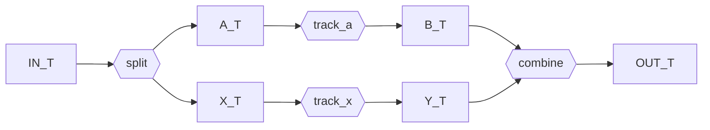

```python
import dataclasses
import typing

from gt4py import next as gtx
from gt4py.next.otf import workflow
from gt4py.next.ffront import field_operator_ast as foast, stages as ff_stages
from gt4py import eve
```

<link href="https://fonts.googleapis.com/icon?family=Material+Icons" rel="stylesheet"><script src="https://spcl.github.io/dace/webclient2/dist/sdfv.js"></script>
<link href="https://spcl.github.io/dace/webclient2/sdfv.css" rel="stylesheet">

## Replace Steps

```python
cached_lowering_toolchain = gtx.backend.DEFAULT_TRANSFORMS.replace(
    past_to_itir=gtx.ffront.past_to_itir.past_to_gtir_factory(cached=False)
)
```

## Skip Steps / Change Order

```python
DUMMY_FOP = workflow.ProgramWithArgs(
    definition=ff_stages.DSLFieldOperatorDef(definition=None), args=None
)
```

```python
gtx.backend.DEFAULT_TRANSFORMS.step_order(DUMMY_FOP)
```

```python
@dataclasses.dataclass(frozen=True)
class SkipLinting(gtx.backend.Transforms):
    def step_order(self, inp):
        order = super().step_order(inp)
        if "past_lint" in order:
            order.remove("past_lint")  # not running "past_lint"
        return order


same_steps = dataclasses.asdict(gtx.backend.DEFAULT_TRANSFORMS)
skip_linting_transforms = SkipLinting(**same_steps)
skip_linting_transforms.step_order(DUMMY_FOP)
```

## Alternative Workflow

A toolchain is built from one configuration, `GTFNConfig` (or `DaCeConfig`),
which holds the settings all steps must agree on: the device, the build type,
the cache lifetime, the data layout. Each step is created by a step builder
that receives that configuration. To change a single setting of one step, pass
a `functools.partial` of its default builder; the other settings still come
from the configuration.

```python
import functools

gtfn = gtx.program_processors.runners.gtfn

debug_gpu_no_transforms = gtfn.make_gtfn_toolchain(
    gtfn.GTFNConfig(gpu=True, cmake_build_type=gtx.config.CMakeBuildType.DEBUG),
    name_postfix="_debug_no_transforms",
    translation=functools.partial(gtfn.make_gtfn_translation, enable_itir_transforms=False),
)
```

To replace a step, pass any callable that takes the configuration and returns
the step. It is still wrapped in the translation cache, and a step that
records a device other than the configured one is rejected.

```python
class MyCodeGen: ...


class Cpp2BindingsGen: ...


pure_cpp2_workflow = gtfn.make_gtfn_compile_workflow(
    gtfn.GTFNConfig(cmake_build_type=gtx.config.CMakeBuildType.DEBUG, cached_translation=False),
    translation=lambda cfg: MyCodeGen(),
    bindings=lambda cfg: Cpp2BindingsGen(),
)
```

## Invent new Workflow Types



```python
IN_T = typing.TypeVar("IN_T")
A_T = typing.TypeVar("A_T")
B_T = typing.TypeVar("B_T")
X_T = typing.TypeVar("X_T")
Y_T = typing.TypeVar("Y_T")
OUT_T = typing.TypeVar("OUT_T")


@dataclasses.dataclass(frozen=True)
class FullyModularDiamond(
    workflow.ChainableWorkflowMixin[IN_T, OUT_T],
    workflow.ReplaceEnabledWorkflowMixin[IN_T, OUT_T],
    typing.Protocol[IN_T, OUT_T, A_T, B_T, X_T, Y_T],
):
    split: workflow.Workflow[IN_T, tuple[A_T, X_T]]
    track_a: workflow.Workflow[A_T, B_T]
    track_x: workflow.Workflow[X_T, Y_T]
    combine: workflow.Workflow[tuple[B_T, Y_T], OUT_T]

    def __call__(self, inp: IN_T) -> OUT_T:
        a, x = self.split(inp)
        b = self.track_a(a)
        y = self.track_x(x)
        return self.combine((b, y))


@dataclasses.dataclass(frozen=True)
class PartiallyModularDiamond(
    workflow.ChainableWorkflowMixin[IN_T, OUT_T],
    workflow.ReplaceEnabledWorkflowMixin[IN_T, OUT_T],
    typing.Protocol[IN_T, OUT_T, A_T, B_T, X_T, Y_T],
):
    track_a: workflow.Workflow[A_T, B_T]
    track_x: workflow.Workflow[X_T, Y_T]

    def split(inp: IN_T) -> tuple[A_T, X_T]: ...

    def combine(b: B_T, y: Y_T) -> OUT_T: ...

    def __call__(inp: IN_T) -> OUT_T:
        a, x = self.split(inp)
        return self.combine(b=self.track_a(a), y=self.track_x(x))
```
