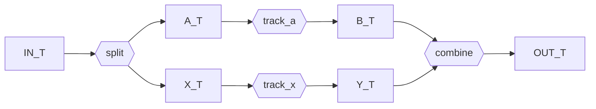

```python
import dataclasses
import typing

from gt4py import next as gtx
from gt4py.next.otf import workflow
```

<link href="https://fonts.googleapis.com/icon?family=Material+Icons" rel="stylesheet"><script src="https://spcl.github.io/dace/webclient2/dist/sdfv.js"></script>
<link href="https://spcl.github.io/dace/webclient2/sdfv.css" rel="stylesheet">

## Replace Steps

Pipelines are frozen dataclasses whose fields are the steps, so a variant is built with `dataclasses.replace`.

```python
cached_lowering_toolchain = dataclasses.replace(
    gtx.backend.DEFAULT_TRANSFORMS,
    past_to_itir=gtx.ffront.past_to_itir.past_to_gtir_factory(cached=False),
)
```

## Skip Steps

Which steps run is decided by `Transforms.__call__` from the type of the input definition; that selection is not configurable. Behavior is customized by replacing a step, so skipping one means replacing it with an identity step.

```python
skip_linting_transforms = dataclasses.replace(
    gtx.backend.DEFAULT_TRANSFORMS,
    past_lint=lambda past_def: past_def,  # identity step: linting skipped
)
```

## Alternative Factory

```python
class MyCodeGen: ...


class Cpp2BindingsGen: ...


class PureCpp2WorkflowFactory(gtx.program_processors.runners.gtfn.GTFNCompileWorkflowFactory):
    translation: workflow.Step[
        gtx.otf.stages.CompilableProgram, gtx.otf.artifacts.ProgramSource
    ] = MyCodeGen()
    bindings: workflow.Step[gtx.otf.artifacts.ProgramSource, gtx.otf.artifacts.ExtensionSource] = (
        Cpp2BindingsGen()
    )


PureCpp2WorkflowFactory(cmake_build_type=gtx.config.CMAKE_BUILD_TYPE.DEBUG)
```

## Invent new Pipeline Types

A pipeline is just a frozen dataclass of steps with an explicit, fully typed `__call__`. Nothing else is needed, so a non-linear shape is written the same way as a linear one.



```python
IN_T = typing.TypeVar("IN_T")
A_T = typing.TypeVar("A_T")
B_T = typing.TypeVar("B_T")
X_T = typing.TypeVar("X_T")
Y_T = typing.TypeVar("Y_T")
OUT_T = typing.TypeVar("OUT_T")


@dataclasses.dataclass(frozen=True)
class Diamond(typing.Generic[IN_T, OUT_T, A_T, B_T, X_T, Y_T]):
    split: workflow.Step[IN_T, tuple[A_T, X_T]]
    track_a: workflow.Step[A_T, B_T]
    track_x: workflow.Step[X_T, Y_T]
    combine: workflow.Step[tuple[B_T, Y_T], OUT_T]

    def __call__(self, inp: IN_T) -> OUT_T:
        a, x = self.split(inp)
        b = self.track_a(a)
        y = self.track_x(x)
        return self.combine((b, y))


Diamond(
    split=lambda inp: (inp, inp),
    track_a=lambda a: a + 1,
    track_x=lambda x: x * 2,
    combine=lambda by: by[0] + by[1],
)(3)
```
