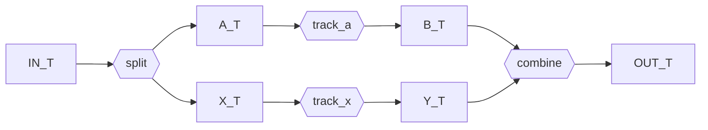

```python
import dataclasses
import typing

from gt4py import next as gtx
from gt4py.next.otf import workflow
```

<link href="https://fonts.googleapis.com/icon?family=Material+Icons" rel="stylesheet"><script src="https://spcl.github.io/dace/webclient2/dist/sdfv.js"></script>
<link href="https://spcl.github.io/dace/webclient2/sdfv.css" rel="stylesheet">

## Replace Steps

Pipelines are frozen dataclasses whose fields are the steps, so a variant is built with `dataclasses.replace`.

```python
cached_lowering_toolchain = dataclasses.replace(
    gtx.backend.DEFAULT_TRANSFORMS,
    past_to_itir=gtx.ffront.past_to_itir.past_to_gtir_factory(cached=False),
)
```

## Skip Steps

Which steps run is decided by `Transforms.__call__` from the type of the input definition; that selection is not configurable. Behavior is customized by replacing a step, so skipping one means replacing it with an identity step.

```python
skip_linting_transforms = dataclasses.replace(
    gtx.backend.DEFAULT_TRANSFORMS,
    past_lint=lambda past_def: past_def,  # identity step: linting skipped
)
```

## Alternative Pipeline

A toolchain is built from one configuration, `GTFNConfig` (or `DaCeConfig`),
which holds the settings all steps must agree on: the device, the build type,
the cache lifetime, the data layout. Each step is created by a step builder
that receives that configuration. To change a single setting of one step, pass
a `functools.partial` of its default builder; the other settings still come
from the configuration.

```python
import functools

gtfn = gtx.program_processors.runners.gtfn

debug_gpu_no_transforms = gtfn.make_gtfn_toolchain(
    gtfn.GTFNConfig(gpu=True, cmake_build_type=gtx.config.CMakeBuildType.DEBUG),
    name_postfix="_debug_no_transforms",
    translation=functools.partial(gtfn.make_gtfn_translation, enable_itir_transforms=False),
)
```

To replace a step, pass any callable that takes the configuration and returns
the step. It is still wrapped in the translation cache, and a step that
records a device other than the configured one is rejected.

```python
class MyCodeGen: ...


class Cpp2BindingsGen: ...


pure_cpp2_pipeline = gtfn.make_gtfn_compile_workflow(
    gtfn.GTFNConfig(cmake_build_type=gtx.config.CMakeBuildType.DEBUG, cached_translation=False),
    translation=lambda cfg: MyCodeGen(),
    bindings=lambda cfg: Cpp2BindingsGen(),
)
```

An existing pipeline, such as the one of a pre-built toolchain, can also be varied after the fact with `dataclasses.replace`. Unlike a step builder, a step passed this way is used exactly as given, with two consequences:

- **Caching is not carried over.** The builders wrap the translation step in a persistent `CachedStep`. Replacing `translation` replaces that wrapper as well, so the variant does not cache translations unless you wrap the new step yourself. Passing a step builder instead keeps the caching.
- **Device agreement is checked, but only for steps that declare a device.** If a step has a `device_type` attribute, it must match every other step that declares one, and the toolchain's allocator. `CompilePipeline` and `Toolchain` check this whenever they are constructed, `dataclasses.replace` included, and raise a `ValueError` on a mismatch. Steps without a `device_type`, like `MyCodeGen` above, are not checked, so keeping them consistent is up to you.

```python
from gt4py.next import fingerprinting

gtfn_pipeline = gtx.program_processors.runners.gtfn.run_gtfn.backend
cached_translation = gtfn_pipeline.translation  # a `CachedStep` around the translation step
no_transforms = dataclasses.replace(cached_translation.step, enable_itir_transforms=False)

uncached_variant = dataclasses.replace(gtfn_pipeline, translation=no_transforms)
cached_variant = dataclasses.replace(
    gtfn_pipeline,
    translation=workflow.CachedStep.in_memory(
        step=no_transforms, input_fingerprinter=fingerprinting.strict_fingerprinter
    ),
)

gpu_translation = dataclasses.replace(cached_translation.step, device_type=gtx.DeviceType.CUDA)
try:
    dataclasses.replace(gtfn_pipeline, translation=gpu_translation)
except ValueError as error:
    print(error)
```

## Invent new Pipeline Types

A pipeline is just a frozen dataclass of steps with an explicit, fully typed `__call__`. Nothing else is needed, so a non-linear shape is written the same way as a linear one.



```python
IN_T = typing.TypeVar("IN_T")
A_T = typing.TypeVar("A_T")
B_T = typing.TypeVar("B_T")
X_T = typing.TypeVar("X_T")
Y_T = typing.TypeVar("Y_T")
OUT_T = typing.TypeVar("OUT_T")


@dataclasses.dataclass(frozen=True)
class Diamond(typing.Generic[IN_T, OUT_T, A_T, B_T, X_T, Y_T]):
    split: workflow.Step[IN_T, tuple[A_T, X_T]]
    track_a: workflow.Step[A_T, B_T]
    track_x: workflow.Step[X_T, Y_T]
    combine: workflow.Step[tuple[B_T, Y_T], OUT_T]

    def __call__(self, inp: IN_T) -> OUT_T:
        a, x = self.split(inp)
        b = self.track_a(a)
        y = self.track_x(x)
        return self.combine((b, y))


Diamond(
    split=lambda inp: (inp, inp),
    track_a=lambda a: a + 1,
    track_x=lambda x: x * 2,
    combine=lambda by: by[0] + by[1],
)(3)
```
