```python
import dataclasses
import inspect

import gt4py.next as gtx
from gt4py.next import backend

import devtools
```

<link href="https://fonts.googleapis.com/icon?family=Material+Icons" rel="stylesheet"><script src="https://spcl.github.io/dace/webclient2/dist/sdfv.js"></script>
<link href="https://spcl.github.io/dace/webclient2/sdfv.css" rel="stylesheet">

```python
I = gtx.Dimension("I")
Ioff = gtx.FieldOffset("Ioff", source=I, target=(I,))
OFFSET_PROVIDER = {"Ioff": I}
```

# Toolchain Overview

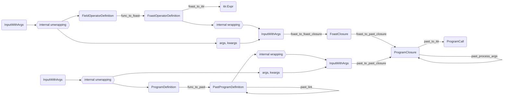

# Walkthrough from Field Operator

## Starting Out

```python
@gtx.field_operator
def example_fo(a: gtx.Field[[I], gtx.float64]) -> gtx.Field[[I], gtx.float64]:
    return a + 1.0
```

```python
start = example_fo.definition_stage
```

```python
gtx.ffront.stages.FieldOperatorDefinition?
```

    Init signature:
    gtx.ffront.stages.FieldOperatorDefinition(
        definition: 'types.FunctionType',
        grid_type: 'Optional[common.GridType]' = None,
        node_class: 'type[OperatorNodeT]' = <class 'gt4py.next.ffront.field_operator_ast.FieldOperator'>,
        attributes: 'dict[str, Any]' = <factory>,
    ) -> None
    Docstring:      FieldOperatorDefinition(definition: 'types.FunctionType', grid_type: 'Optional[common.GridType]' = None, node_class: 'type[OperatorNodeT]' = <class 'gt4py.next.ffront.field_operator_ast.FieldOperator'>, attributes: 'dict[str, Any]' = <factory>)
    File:           ~/Code/gt4py/src/gt4py/next/ffront/stages.py
    Type:           type
    Subclasses:

## DSL -> FOAST

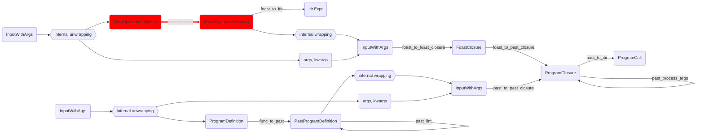

```python
foast = backend.DEFAULT_FIELDOP_TRANSFORMS.func_to_foast(start)
```

```python
gtx.ffront.stages.FoastOperatorDefinition?
```

    Init signature:
    gtx.ffront.stages.FoastOperatorDefinition(
        foast_node: 'OperatorNodeT',
        closure_vars: 'dict[str, Any]',
        grid_type: 'Optional[common.GridType]' = None,
        attributes: 'dict[str, Any]' = <factory>,
    ) -> None
    Docstring:      FoastOperatorDefinition(foast_node: 'OperatorNodeT', closure_vars: 'dict[str, Any]', grid_type: 'Optional[common.GridType]' = None, attributes: 'dict[str, Any]' = <factory>)
    File:           ~/Code/gt4py/src/gt4py/next/ffront/stages.py
    Type:           type
    Subclasses:

## FOAST -> ITIR

This also happens inside the `decorator.FieldOperator.__gt_itir__` method during the lowering from calling Programs to ITIR

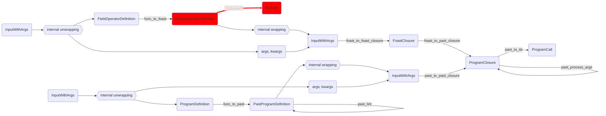

```python
fitir = backend.DEFAULT_FIELDOP_TRANSFORMS.foast_to_itir(foast)
```

```python
fitir.__class__
```

    gt4py.next.iterator.ir.FunctionDefinition

## FOAST -> FOAST closure

This is preparation for "directly calling" a field operator.

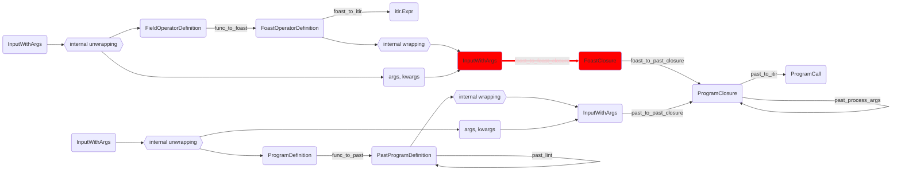

Here we have to manually combine the previous result with the call arguments. When we call the toolchain as a whole later we will only have to do this once at the beginning.

```python
fclos = backend.DEFAULT_FIELDOP_TRANSFORMS.foast_to_foast_closure(
    gtx.otf.workflow.InputWithArgs(
        data=foast,
        args=(gtx.ones(domain={I: 10}, dtype=gtx.float64),),
        kwargs={
            "out": gtx.zeros(domain={I: 10}, dtype=gtx.float64),
            "from_fieldop": example_fo
        },
    )
)
```

```python
fclos.closure_vars["example_fo"].backend
```

```python
gtx.ffront.stages.FoastClosure??
```

    Init signature:
    gtx.ffront.stages.FoastClosure(
        foast_op_def: 'FoastOperatorDefinition[OperatorNodeT]',
        args: 'tuple[Any, ...]',
        kwargs: 'dict[str, Any]',
        closure_vars: 'dict[str, Any]',
    ) -> None
    Docstring:      FoastClosure(foast_op_def: 'FoastOperatorDefinition[OperatorNodeT]', args: 'tuple[Any, ...]', kwargs: 'dict[str, Any]', closure_vars: 'dict[str, Any]')
    Source:
    @dataclasses.dataclass(frozen=True)
    class FoastClosure(Generic[OperatorNodeT]):
        foast_op_def: FoastOperatorDefinition[OperatorNodeT]
        args: tuple[Any, ...]
        kwargs: dict[str, Any]
        closure_vars: dict[str, Any]
    File:           ~/Code/gt4py/src/gt4py/next/ffront/stages.py
    Type:           type
    Subclasses:

## FOAST with args -> PAST closure

This auto-generates a program for us, directly in PAST representation and forwards the call arguments to it

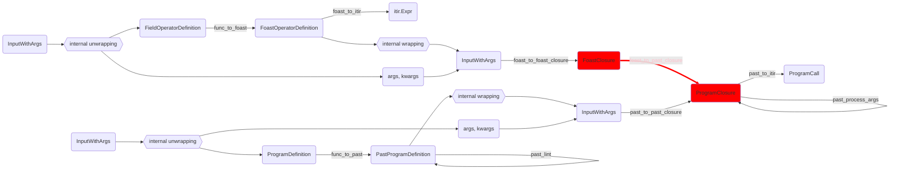

```python
pclos = backend.DEFAULT_FIELDOP_TRANSFORMS.foast_to_past_closure(fclos)
```

```python
gtx.ffront.stages.PastClosure?
```

    Init signature:
    gtx.ffront.stages.PastClosure(
        closure_vars: 'dict[str, Any]',
        past_node: 'past.Program',
        grid_type: 'Optional[common.GridType]',
        args: 'tuple[Any, ...]',
        kwargs: 'dict[str, Any]',
    ) -> None
    Docstring:      PastClosure(closure_vars: 'dict[str, Any]', past_node: 'past.Program', grid_type: 'Optional[common.GridType]', args: 'tuple[Any, ...]', kwargs: 'dict[str, Any]')
    File:           ~/Code/gt4py/src/gt4py/next/ffront/stages.py
    Type:           type
    Subclasses:

## Transform PAST closure arguments

Don't ask me, seems to be necessary though

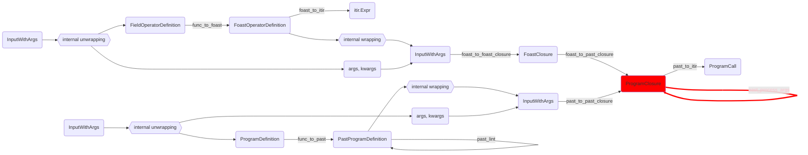

```python
pclost = backend.DEFAULT_PROG_TRANSFORMS.past_transform_args(pclos)
```

```python
pclost.kwargs
```

    {}

## Lower PAST -> ITIR

still forwarding the call arguments

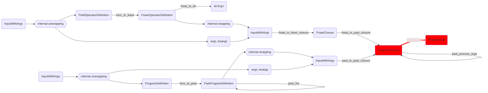

```python
pitir = backend.DEFAULT_PROG_TRANSFORMS.past_to_itir(pclost)
```

```python
gtx.otf.stages.ProgramCall?
```

    Init signature:
    gtx.otf.stages.ProgramCall(
        program: 'itir.FencilDefinition',
        args: 'tuple[Any, ...]',
        kwargs: 'dict[str, Any]',
    ) -> None
    Docstring:      Iterator IR representaion of a program together with arguments to be passed to it.
    File:           ~/Code/gt4py/src/gt4py/next/otf/stages.py
    Type:           type
    Subclasses:

## Executing The Result

```python
gtx.program_processors.runners.roundtrip.executor(pitir.program, *pitir.args, offset_provider=OFFSET_PROVIDER, **pitir.kwargs)
```

```python
pitir.args
```

    (NumPyArrayField(_domain=Domain(dims=(Dimension(value='I', kind=<DimensionKind.HORIZONTAL: 'horizontal'>),), ranges=(UnitRange(0, 10),)), _ndarray=array([1., 1., 1., 1., 1., 1., 1., 1., 1., 1.])),
     NumPyArrayField(_domain=Domain(dims=(Dimension(value='I', kind=<DimensionKind.HORIZONTAL: 'horizontal'>),), ranges=(UnitRange(0, 10),)), _ndarray=array([2., 2., 2., 2., 2., 2., 2., 2., 2., 2.])),
     10,
     10)

## Full Field Operator Toolchain

using the default step order

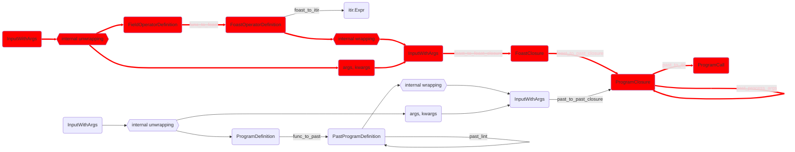

### Starting from DSL

```python
pitir2 = backend.DEFAULT_FIELDOP_TRANSFORMS(
    gtx.otf.workflow.InputWithArgs(data=start, args=fclos.args, kwargs=fclos.kwargs | {"from_fieldop": example_fo})
)
assert pitir2 == pitir
```

#### Pass The result to the compile workflow and execute

```python
example_compiled = gtx.program_processors.runners.roundtrip.executor.otf_workflow(
    dataclasses.replace(pitir2, kwargs=pitir2.kwargs | {"offset_provider": OFFSET_PROVIDER})
)
```

```python
example_compiled(*pitir2.args, offset_provider=OFFSET_PROVIDER)
```

We can re-run with the output from the previous run as in- and output.

```python
example_compiled(pitir2.args[1], *pitir2.args[1:], offset_provider=OFFSET_PROVIDER)
```

```python
pitir2.args[2]
```

    10

```python
pitir.args
```

    (NumPyArrayField(_domain=Domain(dims=(Dimension(value='I', kind=<DimensionKind.HORIZONTAL: 'horizontal'>),), ranges=(UnitRange(0, 10),)), _ndarray=array([1., 1., 1., 1., 1., 1., 1., 1., 1., 1.])),
     NumPyArrayField(_domain=Domain(dims=(Dimension(value='I', kind=<DimensionKind.HORIZONTAL: 'horizontal'>),), ranges=(UnitRange(0, 10),)), _ndarray=array([3., 3., 3., 3., 3., 3., 3., 3., 3., 3.])),
     10,
     10)

### Starting from FOAST

Note that it is the exact same call but with a different input stage

```python
pitir3 = backend.DEFAULT_FIELDOP_TRANSFORMS(
    gtx.otf.workflow.InputWithArgs(
        data=foast,
        args=fclos.args,
        kwargs=fclos.kwargs | {"from_fieldop": example_fo}
    )
)
assert pitir3 == pitir
```

# Walkthrough starting from Program

## Starting Out

```python
@gtx.program
def example_prog(a: gtx.Field[[I], gtx.float64], out: gtx.Field[[I], gtx.float64]) -> None:
    example_fo(a, out=out)
```

```python
p_start = example_prog.definition_stage
```

```python
gtx.ffront.stages.ProgramDefinition?
```

    Init signature:
    gtx.ffront.stages.ProgramDefinition(
        definition: 'types.FunctionType',
        grid_type: 'Optional[common.GridType]' = None,
    ) -> None
    Docstring:      ProgramDefinition(definition: 'types.FunctionType', grid_type: 'Optional[common.GridType]' = None)
    File:           ~/Code/gt4py/src/gt4py/next/ffront/stages.py
    Type:           type
    Subclasses:

## DSL -> PAST

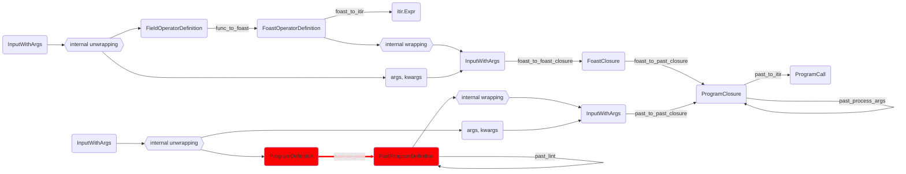

```python
p_past = backend.DEFAULT_PROG_TRANSFORMS.func_to_past(p_start)
```

## PAST -> Closure

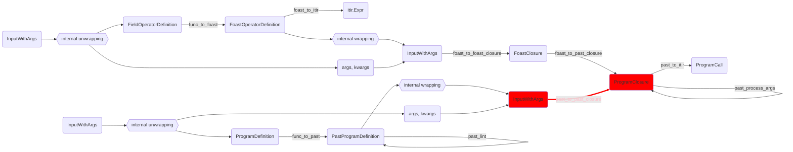

```python
pclos = backend.DEFAULT_PROG_TRANSFORMS(
    gtx.otf.workflow.InputWithArgs(
        data=p_past,
        args=fclos.args,
        kwargs=fclos.kwargs
    )
)
```

## Full Program Toolchain

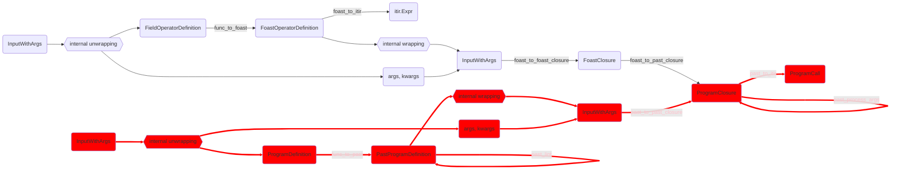

### Starting from DSL

```python
p_itir1 = backend.DEFAULT_PROG_TRANSFORMS(
    gtx.otf.workflow.InputWithArgs(
        data=p_start,
        args=fclos.args,
        kwargs=fclos.kwargs
    )
)
```

```python
p_itir2 = backend.DEFAULT_PROG_TRANSFORMS(
    gtx.otf.workflow.InputWithArgs(
        data=p_past,
        args=fclos.args,
        kwargs=fclos.kwargs
    )
)
```

```python
assert p_itir1 == p_itir2
```
