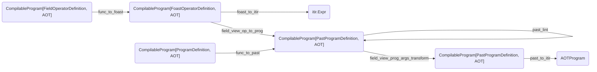
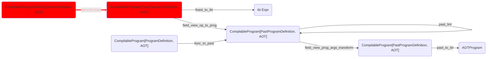
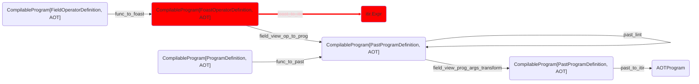
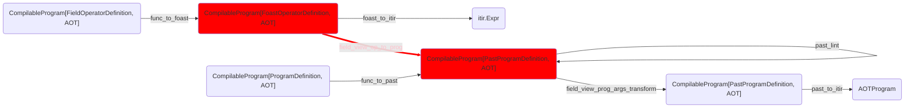
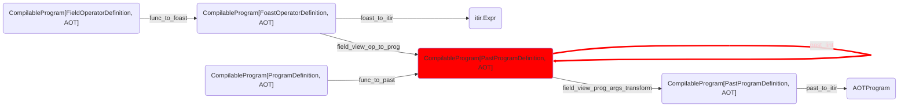
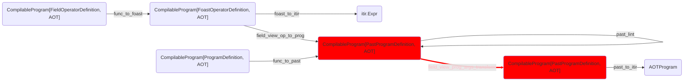
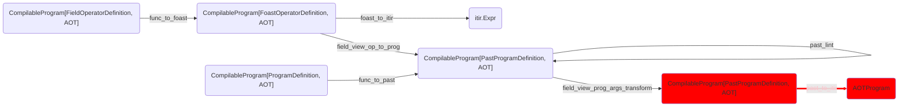
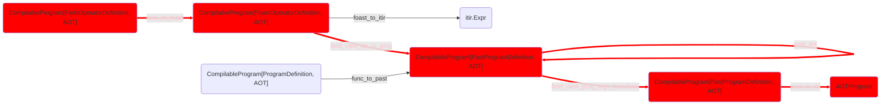
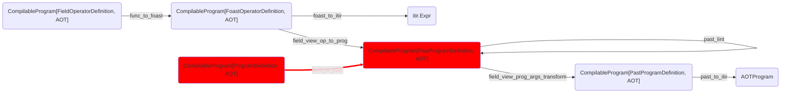
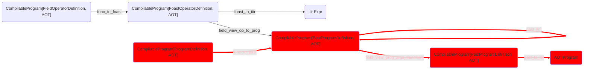

```python
import dataclasses
import inspect
import pprint

import gt4py.next as gtx
from gt4py.next import backend

import devtools
```

<link href="https://fonts.googleapis.com/icon?family=Material+Icons" rel="stylesheet"><script src="https://spcl.github.io/dace/webclient2/dist/sdfv.js"></script>
<link href="https://spcl.github.io/dace/webclient2/sdfv.css" rel="stylesheet">

```python
I = gtx.Dimension("I")
Ioff = gtx.FieldOffset("Ioff", source=I, target=(I,))
OFFSET_PROVIDER = {"Ioff": I}
```

# Toolchain Overview



# Walkthrough from Field Operator

## Starting Out

```python
@gtx.field_operator
def example_fo(a: gtx.Field[[I], gtx.float64]) -> gtx.Field[[I], gtx.float64]:
    return a + 1.0
```

```python
start = example_fo.definition_stage
```

```python
gtx.ffront.stages.FieldOperatorDefinition?
```

## DSL -> FOAST



```python

foast = backend.DEFAULT_TRANSFORMS.func_to_foast(
    gtx.otf.toolchain.CompilableProgram(start, gtx.otf.arguments.CompileTimeArgs.empty())
)
```

```python
foast.data.__class__?
```

## FOAST -> ITIR

This also happens inside the `decorator.FieldOperator.__gt_itir__` method during the lowering from calling Programs to ITIR



```python
fitir = backend.DEFAULT_TRANSFORMS.foast_to_itir(foast)
```

```python
fitir.__class__
```

## FOAST with args -> PAST with args

This auto-generates a program for us, directly in PAST representation and forwards the call arguments to it



So far we have gotten away with empty compile time arguments, now we need to supply actual types. The easiest way to do that is from concrete arguments.

```python
jit_args = gtx.otf.arguments.JITArgs.from_signature(
    gtx.ones(domain={I: 10}, dtype=gtx.float64),
    out=gtx.zeros(domain={I: 10}, dtype=gtx.float64),
    offset_provider=OFFSET_PROVIDER
)

aot_args = gtx.otf.arguments.CompileTimeArgs.from_concrete_no_size(
    *jit_args.args, **jit_args.kwargs
)
```

```python
pclos = backend.DEFAULT_TRANSFORMS.field_view_op_to_prog(gtx.otf.toolchain.CompilableProgram(data=foast.data, args=aot_args))
```

```python
pclos.data.__class__?
```

## Lint ProgramAST

This checks the generated (or manually passed) PAST node.



```python
linted = backend.DEFAULT_TRANSFORMS.past_lint(pclos)
```

## Transform PAST closure arguments

This turns data arguments (or rather, their compile-time standins) passed as keyword args (allowed in DSL programs) into positional args (the only way supported by all compiled programs). Included in this is the 'out' argument which is automatically added when generating a fieldview program from a fieldview operator.



```python
pclost = backend.DEFAULT_TRANSFORMS.field_view_prog_args_transform(pclos)
```

```python
pprint.pprint(pclos.args)
```

```python
pprint.pprint(pclost.args)
```

## Lower PAST -> ITIR

still forwarding the call arguments



```python
pitir = backend.DEFAULT_TRANSFORMS.past_to_itir(pclost)
```

```python
pitir.__class__?
```

## Executing The Result

```python
pprint.pprint(jit_args)
```

```python
gtx.program_processors.runners.roundtrip.executor.otf_workflow(pitir)(*jit_args.args, **jit_args.kwargs)
```

```python
pprint.pprint(jit_args)
```

## Full Field Operator Toolchain

using the default step order



### Starting from DSL

```python
pitir2 = backend.DEFAULT_TRANSFORMS(
    gtx.otf.toolchain.CompilableProgram(data=start, args=aot_args)
)
assert pitir2 == pitir
```

#### Pass The result to the compile workflow and execute

```python
example_compiled = gtx.program_processors.runners.roundtrip.executor.otf_workflow(pitir2)
```

```python
example_compiled(*jit_args.args, **jit_args.kwargs)
```

We can re-run with the output from the previous run as in- and output.

```python
example_compiled(jit_args.kwargs["out"], *jit_args.args[1:], **jit_args.kwargs)
```

```python
pprint.pprint(jit_args)
```

### Starting from FOAST

Note that it is the exact same call but with a different input stage

```python
pitir3 = backend.DEFAULT_TRANSFORMS(
    gtx.otf.toolchain.CompilableProgram(
        data=foast.data,
        args=aot_args
    )
)
assert pitir3 == pitir
```

# Walkthrough starting from Program

## Starting Out

```python
@gtx.program
def example_prog(a: gtx.Field[[I], gtx.float64], out: gtx.Field[[I], gtx.float64]) -> None:
    example_fo(a, out=out)
```

```python
p_start = example_prog.definition_stage
```

```python
p_start.__class__?
```

## DSL -> PAST



```python
p_past = backend.DEFAULT_TRANSFORMS.func_to_past(
    gtx.otf.toolchain.CompilableProgram(data=p_start, args=gtx.otf.arguments.CompileTimeArgs.empty()))
```

## Full Program Toolchain



### Starting from DSL

```python
p_itir1 = backend.DEFAULT_TRANSFORMS(
    gtx.otf.toolchain.CompilableProgram(
        data=p_start,
        args=jit_args
    )
)
```

```python
p_itir2 = backend.DEFAULT_TRANSFORMS(
    gtx.otf.toolchain.CompilableProgram(
        data=p_past.data,
        args=aot_args
    )
)
```

```python
assert p_itir1 == p_itir2
```
