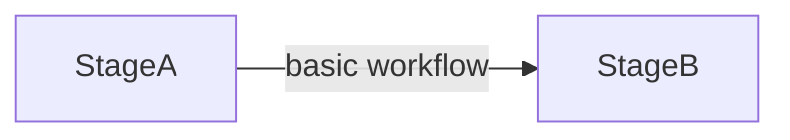
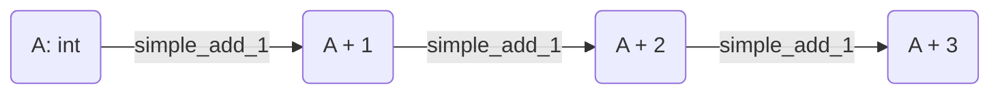
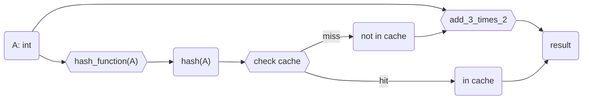
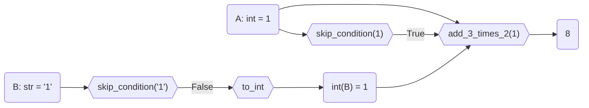
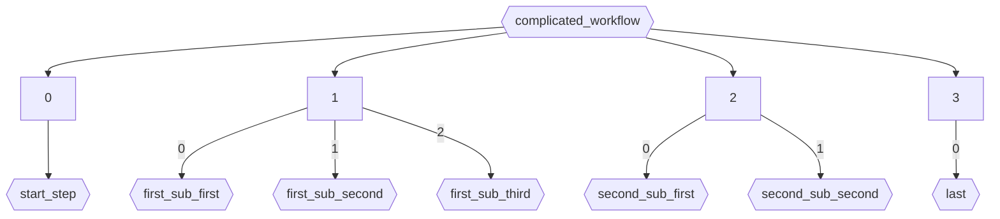
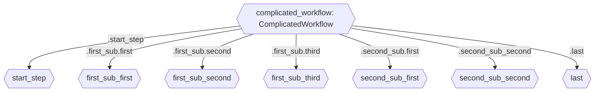

---
jupyter:
  jupytext:
    formats: ipynb,md
    text_representation:
      extension: .md
      format_name: markdown
      format_version: "1.3"
      jupytext_version: 1.16.2
  kernelspec:
    display_name: Python 3 (ipykernel)
    language: python
    name: python3
---

```python editable=true slideshow={"slide_type": ""}
import dataclasses
import re

import factory

import gt4py.next as gtx

import devtools
```

<!-- #region editable=true slideshow={"slide_type": ""} -->

# How to read (toolchain) workflows

<!-- #endregion -->

<!-- #region editable=true slideshow={"slide_type": ""} -->

## Basic workflow (single step)



Where "Stage" describes any data structure, and where `StageA` contains all the input data and `StageB` contains all the output data.

<!-- #endregion -->

<!-- #region editable=true slideshow={"slide_type": ""} -->

### Simplest possible

<!-- #endregion -->

```python editable=true slideshow={"slide_type": ""}
def simple_add_1(inp: int) -> int:
    return inp + 1

simple_add_1(1)
```

<!-- #region editable=true slideshow={"slide_type": ""} -->

This is already a (single step) workflow. We can build a more complex one by chaining it multiple times.



<!-- #endregion -->

```python editable=true slideshow={"slide_type": ""}
manual_add_3 = gtx.otf.workflow.StepSequence.start(
    simple_add_1
).chain(simple_add_1).chain(simple_add_1)

manual_add_3(1)
```

<!-- #region editable=true slideshow={"slide_type": ""} -->

### Simplest Composable Step

All we have to do for chaining to work out of the box is add the `make_step` decorator!

<!-- #endregion -->

```python editable=true slideshow={"slide_type": ""}
@gtx.otf.workflow.make_step
def chainable_add_1(inp: int) -> int:
    return inp + 1
```

```python editable=true slideshow={"slide_type": ""}
add_3 = chainable_add_1.chain(chainable_add_1).chain(chainable_add_1)
add_3(1)
```

### Example in the Wild

```python
gtx.ffront.func_to_past.func_to_past.steps.inner[0]??
```

<!-- #region editable=true slideshow={"slide_type": ""} -->

### Step with Parameters

Sometimes we want to allow for different configurations of a step.

<!-- #endregion -->

```python editable=true slideshow={"slide_type": ""}
@dataclasses.dataclass(frozen=True)
class MathOp(gtx.otf.workflow.ChainableWorkflowMixin[int, int]):
    op: str
    rhs: int = 0

    def __call__(self, inp: int) -> int:
        return getattr(self, self.op)(inp, self.rhs)

    def add(self, lhs: int, rhs: int) -> int:
        return lhs + rhs

    def mul(self, lhs: int, rhs: int) -> int:
        return lhs * rhs

add_3_times_2 = (
    MathOp("add", 3)
    .chain(MathOp("mul", 2))
)
add_3_times_2(1)
```

### Example in the Wild

```python
gtx.program_processors.runners.roundtrip.Roundtrip??
```

<!-- #region editable=true slideshow={"slide_type": ""} -->

### Wrapper Steps

Sometimes we want to make a step behave slightly differently without modifying the step itself. In this case we can wrap it into a wrapper step. These behave a little bit like (limited) decorators.
Below we will go through the existing wrapper steps, which you might encounter.

#### Caching / memoizing

For example we might want to cach the output (memoize) for which we need to add a way of hashing the input:



For this we can use the `CachedStep`, you will see something like below

<!-- #endregion -->

```python editable=true slideshow={"slide_type": ""}
@gtx.otf.workflow.make_step
def debug_print(inp: int) -> int:
    print("cache miss!")
    return inp

cached_calc = gtx.otf.workflow.CachedStep(
    step=debug_print.chain(add_3_times_2),
    hash_function=lambda i: str(i)  # using ints as their own hash
)

cached_calc(1)
cached_calc(1)
cached_calc(1)
```

### Example in the Wild

```python
gtx.backend.DEFAULT_PROG_TRANSFORMS.past_lint??
```

<!-- #region editable=true slideshow={"slide_type": ""} -->

Though we execute the workflow three times we only get the debug print once, it worked! Btw, hashing is rarely that easy in the wild...

#### Conditionally skipping steps

The `SkippableStep` pattern can be used to skip a step under a given condition. A main use case is when you might want to run a workflow either from the start or from further along (with the same interface).

Let's say we want to make our calculation workflow compatible with string input. We can add a conversion step (which only works with strings).

<!-- #endregion -->

```python editable=true slideshow={"slide_type": ""}
@gtx.otf.workflow.make_step
def to_int(inp: str) -> int:
    assert isinstance(inp, str), "Can not work with 'int'!"  # yes, this is horribly contrived
    return int(inp)

str_calc = to_int.chain(add_3_times_2)

str_calc("1")
```

<!-- #region editable=true slideshow={"slide_type": ""} -->

Now we can start from a string that contains an int. But if we already have an int, it will fail.

<!-- #endregion -->

```python editable=true slideshow={"slide_type": ""}
try:
    str_calc(1)
except AssertionError as err:
    print(err)
```

<!-- #region editable=true slideshow={"slide_type": ""} tags=["skip-execution"] -->

What to do? What we want is a to conditionally skip the first step, so we replace it with a `SkippableStep`:

```python
class OptionalStrToInt(SkippableStep[str | int, int]):
    step: Workflow[str, int]

    def skip_condition(self, inp: str | int) -> bool:
        ... # return True to skip (if we get an int) or False to run the conversion (str case)

```



<!-- #endregion -->

```python editable=true slideshow={"slide_type": ""}
@dataclasses.dataclass(frozen=True)
class OptionalStrToInt(gtx.otf.workflow.SkippableStep[str | int, int]):
    step: gtx.otf.workflow.Workflow[str, int] = to_int

    def skip_condition(self, inp: str | int) -> bool:
        match inp:
            case int():
                return True
            case str():
                return False
            case _:
                # optionally raise an error with good advice
                return False

strint_calc = OptionalStrToInt().chain(add_3_times_2)
strint_calc(1) == strint_calc("1")
```

<!-- #region editable=true slideshow={"slide_type": ""} -->

### Example in the Wild

<!-- #endregion -->

```python editable=true slideshow={"slide_type": ""}
gtx.backend.DEFAULT_PROG_TRANSFORMS.func_to_past??
```

<!-- #region editable=true slideshow={"slide_type": ""} -->

### Step with factory (builder)

If a step can be useful with different combinations of parameters and wrappers, it should have a factory. In this case we will add a neutral wrapper around it, so we can put any combination of wrappers into that:

<!-- #endregion -->

```python editable=true slideshow={"slide_type": ""}
@dataclasses.dataclass(frozen=True)
class AnyStrToInt(gtx.otf.workflow.ChainableWorkflowMixin[str | int, int]):
    inner_step: gtx.otf.workflow.Workflow[str, int] = to_int

    def __call__(self, inp: str | int) -> int:
        return self.inner_step(inp)


class StrToIntFactory(factory.Factory):
    class Meta:
        model = AnyStrToInt

    class Params:
        default_step = to_int
        optional: bool = False
        optional_or_not = factory.LazyAttribute(lambda o: OptionalStrToInt(step=o.default_step) if o.optional else o.default_step)
        cached = factory.Trait(
            inner_step = factory.LazyAttribute(
                lambda o: gtx.otf.workflow.CachedStep(step=(o.optional_or_not), hash_function=str)
            )
        )
    inner_step = factory.LazyAttribute(lambda o: o.optional_or_not)

cached = StrToIntFactory(cached=True)
optional = StrToIntFactory(optional=True)
both = StrToIntFactory(cached=True, optional=True)
neither = StrToIntFactory()
neither.inner_step
```

### Example in the Wild

```python
gtx.ffront.past_passes.linters.LinterFactory??
```

<!-- #region editable=true slideshow={"slide_type": ""} tags=["skip-execution"] -->

## Composition 1: Chaining

So far we have only seen compsition of workflows by chaining. Any sequence of steps can be represented as a chain. Chains can be built of smaller chains, so a Workflow could be composed and then reused in a bigger workflow.

However, chains are of limited use in the real world, because it's a pain to access a specific step. This we might want to do in order to:

- run that step in isolation for debugging or other purposes
- build a new chain with a step swapped out (workflows are immutable).

Imagine swapping out `sub_third` in `complicated_workflow` below (without copy pasting code):

```python
complicated_workflow = (
    start_step
    .chain(first_sub_first.chain(first_sub_second).chain(first_sub_third))
    .chain(second_sub_first.chain(second_sub_second))
    .chain(last)
)
```



<!-- #endregion -->

<!-- #region editable=true slideshow={"slide_type": ""} tags=["skip-execution"] -->

## Composition 2: Sequence of Named Steps

Let's say we want a string processing workflow where the intermediate stages are also of value on their own. We would want to access individual steps, specifically each step as it was configured for this workflow (with parameters, caching, etc identical).

For this we can use `NamedStepSequence`, giving each step a name, by which we can access it later. For this we have to create a dataclass and derive from `NamedStepSequence`. Each step is then a field of the dataclass, type hinted as a `Workflow`. The resulting workflow will run the steps in order of their apperance in the class body.

To use the same "complicated workflow" example from above:

```python
@dataclasses.dataclass(frozen=True)
class FirstSub(gtx.otf.workflow.NamedStepSequence[B, E]):
    first: Workflow[B, C]
    second: Workflow[C, D]
    third: Workflow[D, E]


@dataclasses.dataclass(frozen=True)
class SecondSub(gtx.otf.workflow.NamedStepSequence[E, G]):
    first: Workflow[E, F]
    second: Workflow[F, G]


@dataclasses.dataclass(frozen=True)
class ComplicatedWorkflow(gtx.otf.workflow.NamedStepSequence[A, F]):
    start_step: Workflow[A, B]
    first_sub: Workflow[B, E]
    second_sub: Workflow[E, G]
    last: Workflow[G, F]

complicated_workflow = ComplicatedWorkflow(
    start_step=start_step,
    first_sub=FirstSub(
        first=first_sub_first,
        second=first_sub_second,
        third=first_sub_third
    ),
    second_sub=SecondSub(
        first=second_sub_first,
        second=second_sub_second
    ),
    last=last
)

```



<!-- #endregion -->

```python editable=true slideshow={"slide_type": ""}
## Here we define how the steps are composed
@dataclasses.dataclass(frozen=True)
class StrProcess(gtx.otf.workflow.NamedStepSequence):
    hexify_colors: gtx.otf.workflow.Workflow[str, str]
    replace_tabs: gtx.otf.workflow.Workflow[str, str]


## Here we define the steps themselves
@dataclasses.dataclass(frozen=True)
class HexifyColors(gtx.otf.workflow.ChainableWorkflowMixin):
    color_scheme: dict[str, str] = dataclasses.field(
        default_factory=lambda: {"blue": "#0000ff", "green": "#00ff00", "red": "#ff0000"}
    )

    def __call__(self, inp: str) -> str:
        result = inp
        for color, hexcode in self.color_scheme.items():
            result = result.replace(color, hexcode)
        return result


def spaces_to_tabs(inp: str) -> str:
    return re.sub(r"    ", r"\t", inp)
```

<!-- #region editable=true slideshow={"slide_type": ""} -->

Note that with all this there comes an extra feature: We can easily create variants with different steps, without having to change the code that will use the composed workflow. Even if the calling code calls steps in isolation!

<!-- #endregion -->

```python editable=true slideshow={"slide_type": ""}
CUSTOM_COLORS = {"blue": "#55aaff", "green": "#00ff00", "red": "#ff0000"}

proc = StrProcess(
    hexify_colors=HexifyColors(
        color_scheme=CUSTOM_COLORS
    ),
    replace_tabs=spaces_to_tabs
)

proc("""
p {
    background-color: blue;
    color: red;
}
""")
```

```python editable=true slideshow={"slide_type": ""}
proc.hexify_colors("blue")
```

<!-- #region editable=true slideshow={"slide_type": ""} -->

`NamedStepSequence`s still work with wrapper steps, parameters and chaining. They can also be nested. So for a complex workflow there would be innumerous possible variants. Therefore expect to often see them paired with factories.

<!-- #endregion -->

### Example in the Wild

```python editable=true slideshow={"slide_type": ""}
gtx.backend.DEFAULT_PROG_TRANSFORMS??
```

```python
gtx.program_processors.runners.gtfn.run_gtfn_gpu.executor.otf_workflow??
```

```python
gtx.program_processors.runners.gtfn.GTFNBackendFactory??
```
