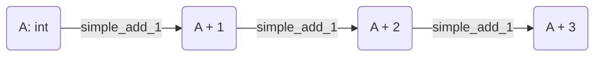
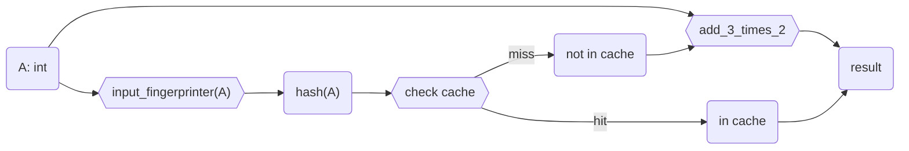

---
jupyter:
  jupytext:
    formats: ipynb,md
    text_representation:
      extension: .md
      format_name: markdown
      format_version: '1.3'
      jupytext_version: 1.16.2
  kernelspec:
    display_name: Python 3 (ipykernel)
    language: python
    name: python3
---

```python editable=true slideshow={"slide_type": ""}
import dataclasses

import factory

import gt4py.next as gtx
```

<!-- #region editable=true slideshow={"slide_type": ""} -->

# How to read (toolchain) pipelines

<!-- #endregion -->

<!-- #region editable=true slideshow={"slide_type": ""} -->

## Basic step


```mermaid
graph LR

StageA -->|step| StageB
```

Where "Stage" describes any data structure, and where `StageA` contains all the input data and `StageB` contains all the output data.

<!-- #endregion -->

<!-- #region editable=true slideshow={"slide_type": ""} -->

### Simplest possible

<!-- #endregion -->

```python editable=true slideshow={"slide_type": ""}
def simple_add_1(inp: int) -> int:
    return inp + 1


simple_add_1(1)
```

<!-- #region editable=true slideshow={"slide_type": ""} -->

This is already a step: the type `gtx.otf.workflow.Step[S, T]` is nothing but an alias of `Callable[[S], T]`, so every single-argument callable is a step and there is no base class, decorator or wrapper to apply.

Composing steps is therefore plain Python:


```mermaid
graph LR

inp(A: int) -->|simple_add_1| b(A + 1) -->|simple_add_1| c(A + 2) -->|simple_add_1| out(A + 3)
```

<!-- #endregion -->

```python editable=true slideshow={"slide_type": ""}
add_3: gtx.otf.workflow.Step[int, int] = lambda inp: simple_add_1(simple_add_1(simple_add_1(inp)))

add_3(1)
```

### Example in the Wild

```python
gtx.ffront.func_to_past.func_to_past??
```

<!-- #region editable=true slideshow={"slide_type": ""} -->

### Step with Parameters

Sometimes we want to allow for different configurations of a step. A frozen dataclass with a `__call__` gives us a configurable, immutable step.

<!-- #endregion -->

```python editable=true slideshow={"slide_type": ""}
@dataclasses.dataclass(frozen=True)
class MathOp:
    op: str
    rhs: int = 0

    def __call__(self, inp: int) -> int:
        return getattr(self, self.op)(inp, self.rhs)

    def add(self, lhs: int, rhs: int) -> int:
        return lhs + rhs

    def mul(self, lhs: int, rhs: int) -> int:
        return lhs * rhs


add_3_step = MathOp("add", 3)
times_2_step = MathOp("mul", 2)


def add_3_times_2(inp: int) -> int:
    return times_2_step(add_3_step(inp))


add_3_times_2(1)
```

### Example in the Wild

```python
gtx.program_processors.runners.roundtrip.Roundtrip??
```

<!-- #region editable=true slideshow={"slide_type": ""} -->

### Wrapper Steps

Sometimes we want to make a step behave slightly differently without modifying the step itself. In this case we can wrap it into a wrapper step. These behave a little bit like (limited) decorators.

#### Caching / memoizing

For example we might want to cache the output (memoize) for which we need to add a way of hashing the input:


```mermaid
graph LR


inp --> calc
inp(A: int) --> ha{{"input_fingerprinter(A)"}} --> h("hash(A)") --> ck{{"check cache"}} -->|miss| miss("not in cache") --> calc{{add_3_times_2}} --> out(result)
ck -->|hit| hit("in cache") --> out
```

For this we can use the `CachedStep`, the one wrapper step the toolchain still has. You will see something like below

<!-- #endregion -->

```python editable=true slideshow={"slide_type": ""}
def debug_print_and_calc(inp: int) -> int:
    print("cache miss!")
    return add_3_times_2(inp)


# NOTE: `CachedStep` keys the cache on a fingerprint of the step itself plus the
# `input_fingerprinter` of the input. `.in_memory` pairs a `dict` cache with the
# lenient fingerprinter, which hashes the step structurally -- so non-importable
# callables (lambdas, closures) are fine for this single-process cache.
cached_calc = gtx.otf.workflow.CachedStep.in_memory(
    step=debug_print_and_calc,
    input_fingerprinter=lambda i: str(i),  # using ints as their own hash
)

cached_calc(1)
cached_calc(1)
cached_calc(1)
```

### Example in the Wild

```python
gtx.backend.DEFAULT_TRANSFORMS.past_lint??
```

<!-- #region editable=true slideshow={"slide_type": ""} -->

Though we execute the step three times we only get the debug print once, it worked! Btw, hashing is rarely that easy in the wild...

Let's say we want to make our calculation compatible with string input. We can add a conversion step (which only works with strings).

<!-- #endregion -->

```python editable=true slideshow={"slide_type": ""}
# A plain conversion step turning a string into an int, composed into the
# pipeline below and reused by `StrToIntFactory(cached=True)`.
def to_int(inp: str) -> int:
    assert isinstance(inp, str), "Can not work with 'int'!"  # yes, this is horribly contrived
    return int(inp)


def str_calc(inp: str) -> int:
    return add_3_times_2(to_int(inp))


str_calc("1")
```

<!-- #region editable=true slideshow={"slide_type": ""} -->

### Step with factory (builder)

If a step can be useful with different combinations of parameters and wrappers, it should have a factory. In this case we will add a neutral wrapper around it, so we can put any combination of wrappers into that:

<!-- #endregion -->

```python editable=true slideshow={"slide_type": ""}
@dataclasses.dataclass(frozen=True)
class AnyStrToInt:
    inner_step: gtx.otf.workflow.Step[str, int] = to_int

    def __call__(self, inp: str | int) -> int:
        return self.inner_step(inp)


class StrToIntFactory(factory.Factory):
    class Meta:
        model = AnyStrToInt

    class Params:
        default_step = to_int
        cached = factory.Trait(
            inner_step=factory.LazyAttribute(
                lambda o: gtx.otf.workflow.CachedStep.in_memory(
                    step=o.default_step, input_fingerprinter=str
                )
            )
        )

    inner_step = factory.LazyAttribute(lambda o: o.default_step)


cached = StrToIntFactory(cached=True)
uncached = StrToIntFactory()
uncached.inner_step
```

### Example in the Wild

```python
gtx.ffront.past_passes.linters.linter_factory??
```

<!-- #region editable=true slideshow={"slide_type": ""} -->

## Named pipelines

Real toolchain pipelines are frozen dataclasses whose fields are the named steps and whose `__call__` spells the composition out explicitly. There is no combinator machinery left: reading `__call__` tells you exactly which steps run and in which order, and the whole composition is statically typed.

There are two of them:

- `gtx.backend.Transforms` — the frontend pipeline, from a program definition in any stage to a `CompilableProgram`. Which of its steps run depends on the type of the input definition (a DSL program definition starts one step earlier than a PAST one), which is why its `__call__` is a `match` rather than a straight line.
- `gtx.backend.CompilePipeline` — the compiled backends' `translation` / `bindings` / `compilation` pipeline.

Naming the steps buys two things: they can be run in isolation for debugging, and a variant pipeline is one `dataclasses.replace` away, without touching the code that uses it.

<!-- #endregion -->

```python editable=true slideshow={"slide_type": ""}
## The steps are plain attributes, so they can be run on their own ...
transforms = gtx.backend.DEFAULT_TRANSFORMS
transforms.past_lint
```

```python editable=true slideshow={"slide_type": ""}
## ... and a variant is built at composition time, never with per-call flags.
dataclasses.replace(
    transforms, past_to_itir=gtx.ffront.past_to_itir.past_to_gtir_factory(cached=False)
)
```

<!-- #region editable=true slideshow={"slide_type": ""} -->

Both pipelines announce every step they run on the `gtx.otf.workflow.stage_hook` event hook, as `(name, artifact)` where `name` is the field name of the step. That is the sanctioned way to observe intermediate stages; setting `GT4PY_DUMP_STAGES=<dir>` registers a subscriber that writes each stage artifact to disk.

<!-- #endregion -->

### Example in the Wild

```python editable=true slideshow={"slide_type": ""}
gtx.backend.DEFAULT_TRANSFORMS??
```

```python
gtx.program_processors.runners.gtfn.run_gtfn_gpu.backend??
```

```python
gtx.program_processors.runners.gtfn.GTFNBackendFactory??
```
