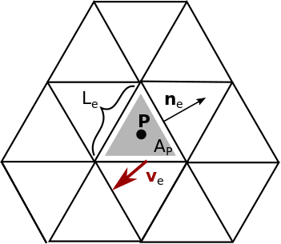

---
jupyter:
  jupytext:
    text_representation:
      extension: .md
      format_name: markdown
      format_version: '1.3'
      jupytext_version: 1.15.2
  kernelspec:
    display_name: Python 3 (ipykernel)
    language: python
    name: python3
---

```python
from helpers import *
```

# 3. Divergence


Next we will translate a divergence stencil. We approximate the divergence of a vector field $\mathbf{v}$ at the middle point of a cell $\mathbf{P}$ in the following way: We take the dot product of the normal velocity $\mathbf{n}_e$ of each direct neighbor edge of $\mathbf{P}$  with $\mathbf{v}_e$ which is multipled with the edge length $L_e$. The contributions from all three edges of a cell are summed up and then divided by the area of the cell $A_P$. In the next pictures we can see a graphical representation of all of the quantities involved:



And the equation:


The orientation of the edge has to factor in, since we do not know, in general, if the normal of an edge is pointed inwards or outwards of any cell we are looking at. We cannot have only outwards pointing edge normals, because if we look at two neighboring cells, the normal of their shared edge has to point outwards for one of the cells, but inwards for the other.


```python
C2EDim = Dimension("C2E", kind=DimensionKind.LOCAL)
C2E = FieldOffset("C2E", source=E, target=(C, C2EDim))
```

```python
def divergence_numpy(
    c2e: np.array,
    u: np.array,
    v: np.array,
    nx: np.array,
    ny: np.array,
    L: np.array,
    A: np.array,
    edge_orientation: np.array,
) -> np.array:
    uv_div = np.sum((u[c2e]*nx[c2e] + v[c2e]*ny[c2e]) * L[c2e] * edge_orientation, axis=1) / A
    return uv_div
```

```python
@gtx.field_operator(backend=roundtrip.executor)
def divergence(
    u: gtx.Field[[E], float],
    v: gtx.Field[[E], float],
    nx: gtx.Field[[E], float],
    ny: gtx.Field[[E], float],
    L: gtx.Field[[E], float],
    A: gtx.Field[[C], float],
    edge_orientation: gtx.Field[[C, C2EDim], float],
) -> gtx.Field[[C], float]:
    #uv_div = neighbor_sum(???, axis=C2EDim) / A
    #return uv_div
    return A
```

```python
def test_divergence():
    u = random_field((n_edges), E)
    v = random_field((n_edges), E)
    nx = random_field((n_edges), E)
    ny = random_field((n_edges), E)
    L = random_field((n_edges), E)
    A = random_field((n_cells), C)
    edge_orientation = random_field((n_cells, 3), C, C2EDim)

    divergence_ref = divergence_numpy(
        c2e_table,
        np.asarray(u),
        np.asarray(v),
        np.asarray(nx),
        np.asarray(ny),
        np.asarray(L),
        np.asarray(A),
        np.asarray(edge_orientation),
    )

    c2e_connectivity = gtx.NeighborTableOffsetProvider(c2e_table, C, E, 3)

    divergence_gt4py = zero_field((n_cells), C)

    divergence(
        u, v, nx, ny, L, A, edge_orientation, out = divergence_gt4py, offset_provider = {C2E.value: c2e_connectivity}
    )
    
    assert np.allclose(divergence_gt4py, divergence_ref)
```

```python
test_divergence()
print("Test successful")
```

## 3. Divergence in ICON


In ICON we can find a divergence in diffusion which looks somewhat like this, but also quite a bit different:

```fortran
      DO jb = i_startblk,i_endblk

        CALL get_indices_c(p_patch, jb, i_startblk, i_endblk, &
                           i_startidx, i_endidx, rl_start, rl_end)
        DO jk = 1, nlev
          DO jc = i_startidx, i_endidx

            div(jc,jk) = p_nh_prog%vn(ieidx(jc,jb,1),jk,ieblk(jc,jb,1))*p_int%geofac_div(jc,1,jb) + &
                         p_nh_prog%vn(ieidx(jc,jb,2),jk,ieblk(jc,jb,2))*p_int%geofac_div(jc,2,jb) + &
                         p_nh_prog%vn(ieidx(jc,jb,3),jk,ieblk(jc,jb,3))*p_int%geofac_div(jc,3,jb)
          ENDDO
        ENDDO
      ENDDO
```

Two assumptions are necessary to derive the ICON version of the divergence starting from our version above:
* Assume that the velocity components $u$ is always orthogonal and the velocity component $v$ is always parallel to the edge, in ICON these are called $vn$ and $vt$ where the n stands for normal and the t for tangential.
* At ICON startup time merge all constants (such as cell area $A_P$ and edge length $L_e$) into one array of geometrical factors `p_int%geofac_div`, which are constant during time stepping:

```fortran
    DO jb = i_startblk, i_endblk

      CALL get_indices_c(ptr_patch, jb, i_startblk, i_endblk, &
        & i_startidx, i_endidx, rl_start, rl_end)

      DO je = 1, ptr_patch%geometry_info%cell_type
        DO jc = i_startidx, i_endidx

          ile = ptr_patch%cells%edge_idx(jc,jb,je)
          ibe = ptr_patch%cells%edge_blk(jc,jb,je)

          ptr_int%geofac_div(jc,je,jb) = &
            & ptr_patch%edges%primal_edge_length(ile,ibe) * &
            & ptr_patch%cells%edge_orientation(jc,jb,je)  / &
            & ptr_patch%cells%area(jc,jb)

        ENDDO !cell loop
      ENDDO

    END DO !block loop

```
