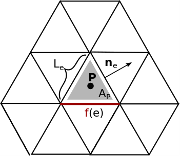

---
jupytext:
  formats: ipynb,md:myst
  text_representation:
    extension: .md
    format_name: myst
    format_version: 0.13
    jupytext_version: 1.15.2
kernelspec:
  display_name: Python 3 (ipykernel)
  language: python
  name: python3
---

# 4. Gradient

+++

Another example is the gradient defined at the center of a Cell $\mathbf{P}$ of a scalar function $f$. We approximate this by taking the sum over the three edges and multiplying $f(e)$ with the edge normal $\mathbf{n}_e$ and the edge length $L_e$ and dividing the resulting sum with the cell area $A_P$.
The result will be the two components of the gradient vector.




```{code-cell} ipython3
from helpers import *


import gt4py.next as gtx
```

```{code-cell} ipython3
def gradient_numpy(
    c2e: np.array,
    f: np.array,
    nx: np.array,
    ny: np.array,
    L: np.array,
    A: np.array,
    edge_orientation: np.array,
) -> gtx.tuple[np.array, np.array]:
    # edge_orientation = np.expand_dims(edge_orientation, axis=-1)
    f_x = np.sum(f[c2e] * nx[c2e] * L[c2e] * edge_orientation, axis=1) / A
    f_y = np.sum(f[c2e] * ny[c2e] * L[c2e] * edge_orientation, axis=1) / A
    return f_x, f_y
```

```{code-cell} ipython3
@gtx.field_operator
def gradient(
    f: gtx.Field[[E], float],
    nx: gtx.Field[[E], float],
    ny: gtx.Field[[E], float],
    L: gtx.Field[[E], float],
    A: gtx.Field[[C], float],
    edge_orientation: gtx.Field[[C, C2EDim], float],
) -> gtx.tuple[gtx.Field[[C], float], gtx.Field[[C], float]]:
    f_x = neighbor_sum(f(C2E) * nx(C2E) * L(C2E) * edge_orientation, axis=C2EDim) / A
    f_y = neighbor_sum(f(C2E) * ny(C2E) * L(C2E) * edge_orientation, axis=C2EDim) / A
    return f_x, f_y
```

```{code-cell} ipython3
def test_gradient():
    backend = None
    # backend = gtfn_cpu
    # backend = gtfn_gpu

    cell_domain = gtx.domain({C: n_cells})
    edge_domain = gtx.domain({E: n_edges})
    
    f = random_field_new(edge_domain, allocator=backend)
    nx = random_field_new(edge_domain, allocator=backend)
    ny = random_field_new(edge_domain, allocator=backend)
    L = random_field_new(edge_domain, allocator=backend)
    A = random_field_new(cell_domain, allocator=backend)
    edge_orientation = random_sign(
        gtx.domain({C: n_cells, C2EDim: 3}), allocator=backend
    )

    gradient_numpy_x, gradient_numpy_y = gradient_numpy(
        c2e_table,
        f.asnumpy(),
        nx.asnumpy(),
        ny.asnumpy(),
        L.asnumpy(),
        A.asnumpy(),
        edge_orientation.asnumpy(),
    )

    c2e_connectivity = gtx.NeighborTableOffsetProvider(c2e_table, C, E, 3, has_skip_values=False)

    gradient_gt4py_x = gtx.zeros(cell_domain, allocator=backend) 
    gradient_gt4py_y = gtx.zeros(cell_domain, allocator=backend) 

    gradient(
        f,
        nx,
        ny,
        L,
        A,
        edge_orientation,
        out=(gradient_gt4py_x, gradient_gt4py_y),
        offset_provider={C2E.value: c2e_connectivity},
    )

    assert np.allclose(gradient_gt4py_x.asnumpy(), gradient_numpy_x)
    assert np.allclose(gradient_gt4py_y.asnumpy(), gradient_numpy_y)
```

```{code-cell} ipython3
test_gradient()
print("Test successful")
```
