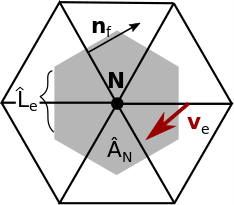

---
jupytext:
  formats: ipynb,md:myst
  text_representation:
    extension: .md
    format_name: myst
    format_version: 0.13
    jupytext_version: 1.15.2
kernelspec:
  display_name: Python 3 (ipykernel)
  language: python
  name: python3
---

# 5. Curl

+++

As the last example of the easier operations, we take a look at the curl of a vector field $\mathbf{v}$ defined at a vertex $\mathbf{N}$.
To approximate this, we once again iterate over all of the direct neighboring edges of the vertex in the center and for each edge take the dot product of the vector field $\mathbf{v}_e$ with the edge normals $\mathbf{n}_f$ and multiply that by the dual edge length $\hat{L}_e$. The resulting neighbor sum is then divided by the dual area $\hat{A}_N$, which is the area of the Voronoi cell around the Vertex $\mathbf{N}$.





```{code-cell} ipython3
from helpers import *
```

```{code-cell} ipython3
C2EDim = Dimension("C2E", kind=DimensionKind.LOCAL)
C2E = FieldOffset("C2E", source=E, target=(C, C2EDim))
V2EDim = Dimension("V2E", kind=DimensionKind.LOCAL)
V2E = FieldOffset("V2E", source=E, target=(V, V2EDim))
```

```{code-cell} ipython3
def curl_numpy(
    v2e: np.array,
    u: np.array,
    v: np.array,
    nx: np.array,
    ny: np.array,
    dualL: np.array,
    dualA: np.array,
    edge_orientation: np.array,
) -> np.array:
    uv_curl = np.sum((u[v2e]*nx[v2e] + v[v2e]*ny[v2e]) * dualL[v2e] * edge_orientation, axis=1) / dualA

    return uv_curl
```

```{code-cell} ipython3
@gtx.field_operator(backend=roundtrip.executor)
def curl(
    u: gtx.Field[[E], float],
    v: gtx.Field[[E], float],
    nx: gtx.Field[[E], float],
    ny: gtx.Field[[E], float],
    dualL: gtx.Field[[E], float],
    dualA: gtx.Field[[V], float],
    edge_orientation: gtx.Field[[V, V2EDim], float],
) -> gtx.Field[[V], float]:
    uv_curl = neighbor_sum((u(V2E)*nx(V2E) + v(V2E)*ny(V2E)) * dualL(V2E) * edge_orientation, axis=V2EDim) / dualA
    
    return uv_curl
```

```{code-cell} ipython3
def test_curl():
    u = random_field((n_edges), E)
    v = random_field((n_edges), E)
    nx = random_field((n_edges), E)
    ny = random_field((n_edges), E)
    dualL = random_field((n_edges), E)
    dualA = random_field((n_vertices), V)
    edge_orientation = random_field((n_vertices, 6), V, V2EDim)

    divergence_ref = curl_numpy(
        v2e_table,
        np.asarray(u),
        np.asarray(v),
        np.asarray(nx),
        np.asarray(ny),
        np.asarray(dualL),
        np.asarray(dualA),
        np.asarray(edge_orientation),
    )

    v2e_connectivity = gtx.NeighborTableOffsetProvider(v2e_table, V, E, 6)

    curl_gt4py = zero_field((n_vertices), V)

    curl(
        u, v, nx, ny, dualL, dualA, edge_orientation, out = curl_gt4py, offset_provider = {V2E.value: v2e_connectivity}
    )
    
    assert np.allclose(curl_gt4py, divergence_ref)
```

```{code-cell} ipython3
test_curl()
print("Test successful")
```
