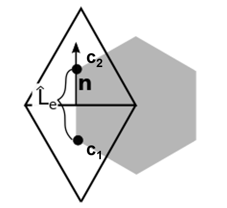
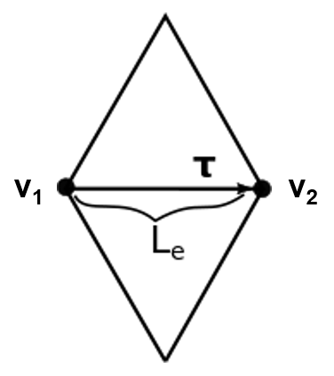

---
jupytext:
  formats: ipynb,md:myst
  text_representation:
    extension: .md
    format_name: myst
    format_version: 0.13
    jupytext_version: 1.16.1
kernelspec:
  display_name: Python 3 (ipykernel)
  language: python
  name: python3
---

# 5. Vector Laplacian

+++

Starting off from laplacian formula by taking a scalar function (scalar field) and returning a scalar **p** that measures by how much the average value of f over a surface centered at p deviates from f(p).


Look at vector Laplacian formula (relevant for Navier stokes viscous stress term) by taking a vector function (vector field) and returning a vector.


Compute normal component of vector laplacian on finite volume meshes.


Can reuse divergence and curl as defined in previous exercises, however need two more directional gradients:







```{code-cell} ipython3
from helpers import *

import gt4py.next as gtx
```

```{code-cell} ipython3
def divergence_numpy(
    c2e: np.array,
    u: np.array,
    v: np.array,
    nx: np.array,
    ny: np.array,
    L: np.array,
    A: np.array,
    edge_orientation: np.array,
) -> np.array:
    uv_div = (
        np.sum(
            (u[c2e] * nx[c2e] + v[c2e] * ny[c2e]) * L[c2e] * edge_orientation, axis=1
        )
        / A
    )
    return uv_div
```

```{code-cell} ipython3
def curl_numpy(
    v2e: np.array,
    u: np.array,
    v: np.array,
    nx: np.array,
    ny: np.array,
    dualL: np.array,
    dualA: np.array,
    edge_orientation: np.array,
) -> np.array:
    uv_curl = (
        np.sum(
            (u[v2e] * nx[v2e] + v[v2e] * ny[v2e]) * dualL[v2e] * edge_orientation,
            axis=1,
        )
        / dualA
    )

    return uv_curl
```

```{code-cell} ipython3
def laplacian_numpy(
    c2e: np.array,
    v2e: np.array,
    e2v: np.array,
    e2c: np.array,
    u: np.array,
    v: np.array,
    nx: np.array,
    ny: np.array,
    L: np.array,
    dualL: np.array,
    tangent_orientation: np.array,
    A: np.array,
    dualA: np.array,
    edge_orientation_vertex: np.array,
    edge_orientation_cell: np.array,
) -> np.array:
        # compute curl (on vertices)
        uv_curl = curl_numpy(v2e, u, v, nx, ny, dualL, dualA, edge_orientation_vertex)

        # compute divergence (on cells)
        uv_div = divergence_numpy(c2e, u, v, nx, ny, L, A, edge_orientation_cell)
        
        # first term of of nabla2 (gradient of curl)
        grad_of_curl = (uv_curl[e2v[:, 1]] - uv_curl[e2v[:, 0]])*tangent_orientation/L

        # second term of of nabla2 (gradient of divergence)
        grad_of_div = (uv_div[e2c[:, 1]] - uv_div[e2c[:, 0]])/dualL        

        # finalize nabla2 (difference between the two gradients)
        uv_nabla2 = grad_of_div - grad_of_curl

        return uv_nabla2
```

```{code-cell} ipython3
@gtx.field_operator
def divergence(
    u: gtx.Field[Dims[E], float],
    v: gtx.Field[Dims[E], float],
    nx: gtx.Field[Dims[E], float],
    ny: gtx.Field[Dims[E], float],
    L: gtx.Field[Dims[E], float],
    A: gtx.Field[Dims[C], float],
    edge_orientation: gtx.Field[Dims[C, C2EDim], float],
) -> gtx.Field[Dims[C], float]:
    # compute divergence
    uv_div = A
    
    return uv_div
```

```{code-cell} ipython3
@gtx.field_operator
def curl(
    u: gtx.Field[Dims[E], float],
    v: gtx.Field[Dims[E], float],
    nx: gtx.Field[Dims[E], float],
    ny: gtx.Field[Dims[E], float],
    dualL: gtx.Field[Dims[E], float],
    dualA: gtx.Field[Dims[V], float],
    edge_orientation: gtx.Field[Dims[V, V2EDim], float],
) -> gtx.Field[Dims[V], float]:
    # compute curl
    uv_curl = dualA

    return uv_curl
```

```{code-cell} ipython3
@gtx.field_operator
def laplacian_fvm(
    u: gtx.Field[Dims[E], float],
    v: gtx.Field[Dims[E], float],
    nx: gtx.Field[Dims[E], float],
    ny: gtx.Field[Dims[E], float],
    L: gtx.Field[Dims[E], float],
    dualL: gtx.Field[Dims[E], float],
    tangent_orientation: gtx.Field[Dims[E], float],
    A: gtx.Field[Dims[C], float],
    dualA: gtx.Field[Dims[V], float],
    edge_orientation_vertex: gtx.Field[Dims[V, V2EDim], float],
    edge_orientation_cell: gtx.Field[Dims[C, C2EDim], float],
) -> gtx.Field[Dims[E], float]:
    # compute laplacian_fvm
    uv_nabla2 = L

    return uv_nabla2
```

```{code-cell} ipython3
def test_laplacian():

    backend = None
    # backend = gtfn_cpu
    # backend = gtfn_gpu

    edge_domain = gtx.domain({E: n_edges})
    vertex_domain = gtx.domain({V: n_vertices})
    cell_domain = gtx.domain({C: n_cells})


    u = random_field(edge_domain, allocator=backend)
    v = random_field(edge_domain, allocator=backend)
    nx = random_field(edge_domain, allocator=backend)
    ny = random_field(edge_domain, allocator=backend)
    L = random_field(edge_domain, allocator=backend)
    dualL = random_field(edge_domain, allocator=backend)
    tangent_orientation = random_field(edge_domain, allocator=backend)
    A = random_field(cell_domain, allocator=backend)
    dualA = random_field(vertex_domain, allocator=backend)
    edge_orientation_vertex = random_sign(
        gtx.domain({V: n_vertices, V2EDim: 6}), allocator=backend
    )
    edge_orientation_cell = random_sign(
        gtx.domain({C: n_cells, C2EDim: 3}), allocator=backend
    )

    laplacian_ref = laplacian_numpy(
        c2e_table,
        v2e_table,
        e2v_table,
        e2c_table,
        u.asnumpy(),
        v.asnumpy(),
        nx.asnumpy(),
        ny.asnumpy(),
        L.asnumpy(),
        dualL.asnumpy(),
        tangent_orientation.asnumpy(),
        A.asnumpy(),
        dualA.asnumpy(),
        edge_orientation_vertex.asnumpy(),
        edge_orientation_cell.asnumpy(),
    )

    c2e_connectivity = gtx.NeighborTableOffsetProvider(c2e_table, C, E, 3, has_skip_values=False)
    v2e_connectivity = gtx.NeighborTableOffsetProvider(v2e_table, V, E, 6, has_skip_values=False)
    e2v_connectivity = gtx.NeighborTableOffsetProvider(e2v_table, E, V, 2, has_skip_values=False)
    e2c_connectivity = gtx.NeighborTableOffsetProvider(e2c_table, E, C, 2, has_skip_values=False)


    laplacian_gt4py = gtx.zeros(edge_domain, allocator=backend)

    laplacian_fvm(
        u,
        v,
        nx,
        ny,
        L,
        dualL,
        tangent_orientation,
        A,
        dualA,
        edge_orientation_vertex,
        edge_orientation_cell,
        out = laplacian_gt4py,
        offset_provider = {C2E.value: c2e_connectivity,
                           V2E.value: v2e_connectivity,
                           E2V.value: e2v_connectivity,
                           E2C.value: e2c_connectivity,
                          },
    )
    
    assert np.allclose(laplacian_gt4py.asnumpy(), laplacian_ref)
```

```{code-cell} ipython3
test_laplacian()
print("Test successful")
```

```{code-cell} ipython3

```
