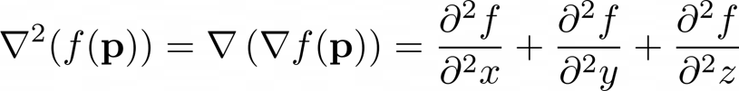
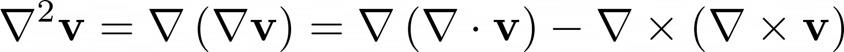
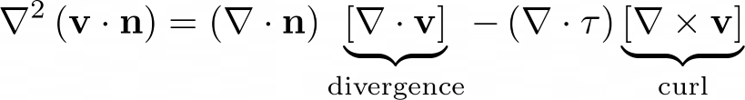
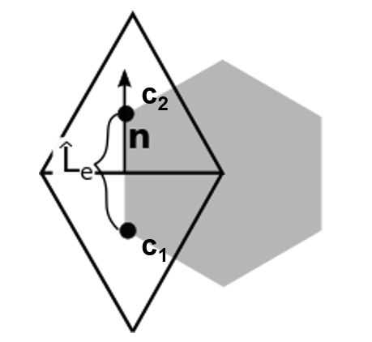
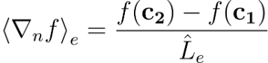
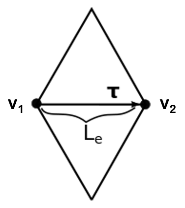

---
jupytext:
  formats: ipynb,md:myst
  text_representation:
    extension: .md
    format_name: myst
    format_version: 0.13
    jupytext_version: 1.16.1
kernelspec:
  display_name: Python 3 (ipykernel)
  language: python
  name: python3
---

# 5. Vector Laplacian

+++

Starting off from laplacian formula



Look at vector Laplacian formula (relevant for Navier stokes viscous stress term)



Compute normal component of vector laplacian on finite volume meshes



Can reuse divergence and curl as defined in previous exercises, however need two more directional gradients:








```{code-cell} ipython3
from helpers import *

import gt4py.next as gtx
```

```{code-cell} ipython3
def divergence_numpy(
    c2e: np.array,
    u: np.array,
    v: np.array,
    nx: np.array,
    ny: np.array,
    L: np.array,
    A: np.array,
    edge_orientation: np.array,
) -> np.array:
    uv_div = (
        np.sum(
            (u[c2e] * nx[c2e] + v[c2e] * ny[c2e]) * L[c2e] * edge_orientation, axis=1
        )
        / A
    )
    return uv_div
```

```{code-cell} ipython3
def curl_numpy(
    v2e: np.array,
    u: np.array,
    v: np.array,
    nx: np.array,
    ny: np.array,
    dualL: np.array,
    dualA: np.array,
    edge_orientation: np.array,
) -> np.array:
    uv_curl = (
        np.sum(
            (u[v2e] * nx[v2e] + v[v2e] * ny[v2e]) * dualL[v2e] * edge_orientation,
            axis=1,
        )
        / dualA
    )

    return uv_curl
```

```{code-cell} ipython3
def laplacian_numpy(
    c2e: np.array,
    v2e: np.array,
    e2v: np.array,
    e2c: np.array,
    u: np.array,
    v: np.array,
    nx: np.array,
    ny: np.array,
    L: np.array,
    dualL: np.array,
    tangent_orientation: np.array,
    A: np.array,
    dualA: np.array,
    edge_orientation_vertex: np.array,
    edge_orientation_cell: np.array,
) -> np.array:
        # compute curl (on vertices)
        uv_curl = curl_numpy(v2e, u, v, nx, ny, dualL, dualA, edge_orientation_vertex)

        # compute divergence (on cells)
        uv_div = divergence_numpy(c2e, u, v, nx, ny, L, A, edge_orientation_cell)
        
        # first term of of nabla2 (gradient of curl)
        grad_of_curl = (uv_curl[e2v[:, 1]] - uv_curl[e2v[:, 0]])*tangent_orientation/L

        # second term of of nabla2 (gradient of divergence)
        grad_of_div = (uv_div[e2c[:, 1]] - uv_div[e2c[:, 0]])/dualL        

        # finalize nabla2 (difference between the two gradients)
        uv_nabla2 = grad_of_div - grad_of_curl

        return uv_nabla2
```

```{code-cell} ipython3
@gtx.field_operator
def divergence(
    u: gtx.Field[Dims[E], float],
    v: gtx.Field[Dims[E], float],
    nx: gtx.Field[Dims[E], float],
    ny: gtx.Field[Dims[E], float],
    L: gtx.Field[Dims[E], float],
    A: gtx.Field[Dims[C], float],
    edge_orientation: gtx.Field[Dims[C, C2EDim], float],
) -> gtx.Field[Dims[C], float]:
    uv_div = (
        neighbor_sum(
            (u(C2E) * nx(C2E) + v(C2E) * ny(C2E)) * L(C2E) * edge_orientation,
            axis=C2EDim,
        )
        / A
    )
    return uv_div
```

```{code-cell} ipython3
@gtx.field_operator
def curl(
    u: gtx.Field[Dims[E], float],
    v: gtx.Field[Dims[E], float],
    nx: gtx.Field[Dims[E], float],
    ny: gtx.Field[Dims[E], float],
    dualL: gtx.Field[Dims[E], float],
    dualA: gtx.Field[Dims[V], float],
    edge_orientation: gtx.Field[Dims[V, V2EDim], float],
) -> gtx.Field[Dims[V], float]:
    uv_curl = (
        neighbor_sum(
            (u(V2E) * nx(V2E) + v(V2E) * ny(V2E)) * dualL(V2E) * edge_orientation,
            axis=V2EDim,
        )
        / dualA
    )

    return uv_curl
```

```{code-cell} ipython3
@gtx.field_operator
def laplacian_fvm(
    u: gtx.Field[Dims[E], float],
    v: gtx.Field[Dims[E], float],
    nx: gtx.Field[Dims[E], float],
    ny: gtx.Field[Dims[E], float],
    L: gtx.Field[Dims[E], float],
    dualL: gtx.Field[Dims[E], float],
    tangent_orientation: gtx.Field[Dims[E], float],
    A: gtx.Field[Dims[C], float],
    dualA: gtx.Field[Dims[V], float],
    edge_orientation_vertex: gtx.Field[Dims[V, V2EDim], float],
    edge_orientation_cell: gtx.Field[Dims[C, C2EDim], float],
) -> gtx.Field[Dims[E], float]:
        
    # compute curl (on vertices)
    uv_curl = curl(u, v, nx, ny, dualL, dualA, edge_orientation_vertex)

    # compute divergence (on cells)
    uv_div = divergence(u, v, nx, ny, L, A, edge_orientation_cell)
        
    # first term of of nabla2 (gradient of curl)
    grad_of_curl = (uv_curl(E2V[1]) - uv_curl(E2V[0]))*tangent_orientation/L

    # second term of of nabla2 (gradient of divergence)
    grad_of_div = (uv_div(E2C[1]) - uv_div(E2C[0]))/dualL        

    # finalize nabla2 (difference between the two gradients)
    uv_nabla2 = grad_of_div - grad_of_curl

    return uv_nabla2
```

```{code-cell} ipython3
def test_laplacian():

    backend = None
    # backend = gtfn_cpu
    # backend = gtfn_gpu

    edge_domain = gtx.domain({E: n_edges})
    vertex_domain = gtx.domain({V: n_vertices})
    cell_domain = gtx.domain({C: n_cells})


    u = random_field(edge_domain, allocator=backend)
    v = random_field(edge_domain, allocator=backend)
    nx = random_field(edge_domain, allocator=backend)
    ny = random_field(edge_domain, allocator=backend)
    L = random_field(edge_domain, allocator=backend)
    dualL = random_field(edge_domain, allocator=backend)
    tangent_orientation = random_field(edge_domain, allocator=backend)
    A = random_field(cell_domain, allocator=backend)
    dualA = random_field(vertex_domain, allocator=backend)
    edge_orientation_vertex = random_sign(
        gtx.domain({V: n_vertices, V2EDim: 6}), allocator=backend
    )
    edge_orientation_cell = random_sign(
        gtx.domain({C: n_cells, C2EDim: 3}), allocator=backend
    )

    laplacian_ref = laplacian_numpy(
        c2e_table,
        v2e_table,
        e2v_table,
        e2c_table,
        u.asnumpy(),
        v.asnumpy(),
        nx.asnumpy(),
        ny.asnumpy(),
        L.asnumpy(),
        dualL.asnumpy(),
        tangent_orientation.asnumpy(),
        A.asnumpy(),
        dualA.asnumpy(),
        edge_orientation_vertex.asnumpy(),
        edge_orientation_cell.asnumpy(),
    )

    c2e_connectivity = gtx.NeighborTableOffsetProvider(c2e_table, C, E, 3, has_skip_values=False)
    v2e_connectivity = gtx.NeighborTableOffsetProvider(v2e_table, V, E, 6, has_skip_values=False)
    e2v_connectivity = gtx.NeighborTableOffsetProvider(e2v_table, E, V, 2, has_skip_values=False)
    e2c_connectivity = gtx.NeighborTableOffsetProvider(e2c_table, E, C, 2, has_skip_values=False)


    laplacian_gt4py = gtx.zeros(edge_domain, allocator=backend)

    laplacian_fvm(
        u,
        v,
        nx,
        ny,
        L,
        dualL,
        tangent_orientation,
        A,
        dualA,
        edge_orientation_vertex,
        edge_orientation_cell,
        out = laplacian_gt4py,
        offset_provider = {C2E.value: c2e_connectivity,
                           V2E.value: v2e_connectivity,
                           E2V.value: e2v_connectivity,
                           E2C.value: e2c_connectivity,
                          },
    )
    
    assert np.allclose(laplacian_gt4py.asnumpy(), laplacian_ref)
```

```{code-cell} ipython3
test_laplacian()
print("Test successful")
```

```{code-cell} ipython3

```
