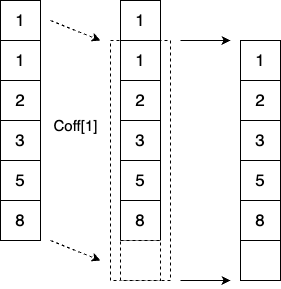

---
jupytext:
  formats: ipynb,md:myst
  text_representation:
    extension: .md
    format_name: myst
    format_version: 0.13
    jupytext_version: 1.15.2
kernelspec:
  display_name: Python 3 (ipykernel)
  language: python
  name: python3
---

# GT4Py workshop

+++

## GT4Py: GridTools for Python

GT4Py is a Python library for generating high performance implementations of stencil kernels from a high-level definition using regular Python functions.

GT4Py is part of the GridTools framework: a set of libraries and utilities to develop performance portable applications in the area of weather and climate modeling.

**NOTE:** The `gt4py.next` subpackage contains a new and currently experimental version of GT4Py.

## Description

GT4Py is a Python library for expressing computational motifs as found in weather and climate applications. 

These computations are expressed in a domain specific language (GTScript) which is translated to high-performance implementations for CPUs and GPUs.

The DSL expresses computations on a 3-dimensional Cartesian grid. The horizontal axes are always computed in parallel, while the vertical can be iterated in sequential, forward or backward, order. 

In addition, GT4Py provides functions to allocate arrays with memory layout suited for a particular backend.

The following backends are supported:

- `numpy`: Pure-Python backend
- `gt:cpu_ifirst`: GridTools C++ CPU backend using `I`-first data ordering
- `gt:cpu_kfirst`: GridTools C++ CPU backend using `K`-first data ordering
- `gt:gpu`: GridTools backend for CUDA
- `cuda`: CUDA backend minimally using utilities from GridTools
- `dace:cpu`: Dace code-generated CPU backend
- `dace:gpu`: Dace code-generated GPU backend

+++

## Installation

You can install the library directly from GitHub using pip:

```{raw-cell}
pip install --upgrade git+https://github.com/gridtools/gt4py.git
```

```{code-cell} ipython3
import warnings
warnings.filterwarnings('ignore')
```

```{code-cell} ipython3
import numpy as np
import gt4py.next as gtx
from gt4py.next import float64, neighbor_sum, where
from gt4py.next.common import DimensionKind
```

## Key concepts and application structure

- [Fields](#Fields),
- [Field operators](#Field-operators), and
- [Programs](#Programs).

+++

### Fields
Fields are **multi-dimensional array** defined over a set of dimensions and a dtype: `gtx.Field[[dimensions], dtype]`

The `as_field` builtin is used to define fields

```{code-cell} ipython3
CellDim = gtx.Dimension("Cell")
KDim = gtx.Dimension("K", kind=DimensionKind.VERTICAL)
grid_shape = (5, 6)
a = gtx.as_field([CellDim, KDim], np.full(shape=grid_shape, fill_value=2.0, dtype=np.float64))
b = gtx.as_field([CellDim, KDim], np.full(shape=grid_shape, fill_value=3.0, dtype=np.float64))

print("a definition: \n {}".format(a))
print("a array: \n {}".format(np.asarray(a)))
print("b array: \n {}".format(np.asarray(b)))
```

### Field operators

Field operators perform operations on a set of fields, i.e. elementwise addition or reduction along a dimension. 

They are written as Python functions by using the `@field_operator` decorator.

```{code-cell} ipython3
@gtx.field_operator
def add(a: gtx.Field[[CellDim, KDim], float64],
        b: gtx.Field[[CellDim, KDim], float64]) -> gtx.Field[[CellDim, KDim], float64]:
    return a + b
```

Direct calls to field operators require two additional arguments: 
- `out`: a field to write the return value to
- `offset_provider`: empty dict for now, explanation will follow

```{code-cell} ipython3
result = gtx.as_field([CellDim, KDim], np.zeros(shape=grid_shape))
add(a, b, out=result, offset_provider={})

print("result array \n {}".format(np.asarray(result)))
```

### Programs

+++

Programs are used to call field operators to mutate their arguments.

They are written as Python functions by using the `@program` decorator. 

This example below calls the `add` field operator twice:

```{code-cell} ipython3
# @gtx.field_operator
# def add(a, b):
#    return a + b

@gtx.program
def run_add(a : gtx.Field[[CellDim, KDim], float64],
            b : gtx.Field[[CellDim, KDim], float64],
            result : gtx.Field[[CellDim, KDim], float64]):
    add(a, b, out=result) # 2.0 + 3.0 = 5.0
    add(b, result, out=result) # 5.0 + 3.0 = 8.0
```

```{code-cell} ipython3
result = gtx.as_field([CellDim, KDim], np.zeros(shape=grid_shape))
run_add(a, b, result, offset_provider={})

print("result array: \n {}".format(np.asarray(result)))
```

### Offsets
Fields can be offset by a predefined number of indices.

Take an array with values ranging from 0 to 5:

```{code-cell} ipython3
a_off = gtx.as_field([CellDim], np.array([1.0, 1.0, 2.0, 3.0, 5.0, 8.0]))

print("a_off array: \n {}".format(np.asarray(a_off)))
```

Visually, offsetting this field by 1 would result in the following:

|  |
| :------------------------: |
|  _CellDim Offset (Coff)_   |

+++

Fields can be offeset by a predefined number of indices.

Take an array with values ranging from 0 to 5:

```{code-cell} ipython3
Coff = gtx.FieldOffset("Coff", source=CellDim, target=(CellDim,))

@gtx.field_operator
def a_offset(a_off: gtx.Field[[CellDim], float64]) -> gtx.Field[[CellDim], float64]:
    return a_off(Coff[1])
    
a_offset(a_off, out=a_off, offset_provider={"Coff": CellDim})
print("result array: \n {}".format(np.asarray(a_off)))
```

## Defining the mesh and its connectivities
Take an unstructured mesh with numbered cells (in red) and edges (in blue).

|  |
| :------------------------------------------: |
|         _The mesh with the indices_          |

```{code-cell} ipython3
CellDim = gtx.Dimension("Cell")
EdgeDim = gtx.Dimension("Edge")
```

Connectivityy among mesh elements is expressed through connectivity tables.

For example, `e2c_table` lists for each edge its adjacent rows. 

Similarly, `c2e_table` lists the edges that are neighbors to a particular cell.

Note that if an edge is lying at the border, one entry will be filled with -1.

```{code-cell} ipython3
e2c_table = np.array([
    [0, -1], # edge 0 (neighbours: cell 0)
    [2, -1], # edge 1
    [2, -1], # edge 2
    [3, -1], # edge 3
    [4, -1], # edge 4
    [5, -1], # edge 5
    [0, 5],  # edge 6 (neighbours: cell 0, cell 5)
    [0, 1],  # edge 7
    [1, 2],  # edge 8
    [1, 3],  # edge 9
    [3, 4],  # edge 10
    [4, 5]   # edge 11
])

c2e_table = np.array([
    [0, 6, 7],   # cell 0 (neighbors: edge 0, edge 6, edge 7)
    [7, 8, 9],   # cell 1
    [1, 2, 8],   # cell 2
    [3, 9, 10],  # cell 3
    [4, 10, 11], # cell 4
    [5, 6, 11],  # cell 5
])
```

#### Using connectivities in field operators

Let's start by defining two fields: one over the cells and another one over the edges. The field over cells serves input for subsequent calculations and is therefore filled up with values, whereas the field over the edges stores the output of the calculations and is therefore left blank.

```{code-cell} ipython3
cell_field = gtx.as_field([CellDim], np.array([1.0, 1.0, 2.0, 3.0, 5.0, 8.0]))
edge_field = gtx.as_field([EdgeDim], np.zeros((12,)))
```

|  |
| :-----------------------------------------: |
|                _Cell values_                |

+++

`field_offset` is used as an argument to transform fields over one domain to another domain.

For example, `E2C` can be used to shift a field over cells to edges with the following dimension transformation: 

[CellDim] -> CellDim(E2C) -> [EdgeDim, E2CDim]

A field with an offset dimension is called a sparse field

```{code-cell} ipython3
E2CDim = gtx.Dimension("E2C", kind=gtx.DimensionKind.LOCAL)
E2C = gtx.FieldOffset("E2C", source=CellDim, target=(EdgeDim, E2CDim))
```

```{code-cell} ipython3
E2C_offset_provider = gtx.NeighborTableOffsetProvider(e2c_table, EdgeDim, CellDim, 2)
```

```{code-cell} ipython3
@gtx.field_operator
def nearest_cell_to_edge(cell_field: gtx.Field[[CellDim], float64]) -> gtx.Field[[EdgeDim], float64]:
    return cell_field(E2C[0]) # 0th index to isolate edge dimension

@gtx.program
def run_nearest_cell_to_edge(cell_field: gtx.Field[[CellDim], float64], edge_field: gtx.Field[[EdgeDim], float64]):
    nearest_cell_to_edge(cell_field, out=edge_field)

run_nearest_cell_to_edge(cell_field, edge_field, offset_provider={"E2C": E2C_offset_provider})

print("0th adjacent cell's value: {}".format(np.asarray(edge_field)))
```

Running the above snippet results in the following edge field:

|  | $\mapsto$ |  |
| :----------------------------------------------------: | :-------: | :------------------------------------------: |
|                    _Domain (edges)_                    |           |                _Edge values_                 |

+++

### Using reductions on connected mesh elements

To sum up all the cells adjacent to an edge the `neighbor_sum` builtin function can be called to operate along the `E2CDim` dimension.

```{code-cell} ipython3
@gtx.field_operator
def sum_adjacent_cells(cell_field : gtx.Field[[CellDim], float64]) -> gtx.Field[[EdgeDim], float64]:
    return neighbor_sum(cell_field(E2C), axis=E2CDim)

@gtx.program
def run_sum_adjacent_cells(cell_field : gtx.Field[[CellDim], float64], edge_field: gtx.Field[[EdgeDim], float64]):
    sum_adjacent_cells(cell_field, out=edge_field)

run_sum_adjacent_cells(cell_field, edge_field, offset_provider={"E2C": E2C_offset_provider})

print("sum of adjacent cells: {}".format(np.asarray(edge_field)))
```

For the border edges, the results are unchanged compared to the previous example, but the inner edges now contain the sum of the two adjacent cells:

|  | $\mapsto$ |  |
| :----------------------------------------------------: | :-------: | :--------------------------------------------: |
|                    _Domain (edges)_                    |           |                 _Edge values_                  |

+++

#### Using conditionals on fields

To filter operations such that they are performed on only certain cells instead of the whole field, the `where` builtin was developed. 

This function takes 3 input arguments:
- mask: a field of booleans or an expression evaluating to this type
- true branch: a tuple, a field, or a scalar
- false branch: a tuple, a field, of a scalar

```{code-cell} ipython3
mask = gtx.as_field([CellDim], np.zeros(shape=grid_shape[0], dtype=bool))
result = gtx.as_field([CellDim], np.zeros(shape=grid_shape[0]))
b = 6.0

@gtx.field_operator
def conditional(mask: gtx.Field[[CellDim], bool], cell_field: gtx.Field[[CellDim], float64], b: float
) -> gtx.Field[[CellDim], float64]:
    return where(mask, cell_field, b)

conditional(mask, cell_field, b, out=result, offset_provider={})
print("where return: {}".format(np.asarray(result)))
```

#### Using domain on fields

Another way to filter parts of a field where to perform operations, is to use the `domain` keyword argument when calling the field operator.

Note: domain needs both dimensions to be included with integer tuple values.

```{code-cell} ipython3
# @gtx.field_operator
# def add(a, b):
#    return a + b   # 2.0 + 3.0

@gtx.program
def run_add_domain(a : gtx.Field[[CellDim, KDim], float64],
            b : gtx.Field[[CellDim, KDim], float64],
            result : gtx.Field[[CellDim, KDim], float64]):
    add(a, b, out=result, domain={CellDim: (1, 3), KDim: (1, 4)}) 
```

```{code-cell} ipython3
a = gtx.as_field([CellDim, KDim], np.full(shape=grid_shape, fill_value=2.0, dtype=np.float64))
b = gtx.as_field([CellDim, KDim], np.full(shape=grid_shape, fill_value=3.0, dtype=np.float64))
result = gtx.as_field([CellDim, KDim], np.zeros(shape=grid_shape))
run_add_domain(a, b, result, offset_provider={})

print("result array: \n {}".format(np.asarray(result)))
```

#### Scan operators

Scan operators work in a similar fashion to iterations in Python.

```{code-cell} ipython3
x = np.asarray([1.0, 2.0, 4.0, 6.0, 0.0, 2.0, 5.0])
def x_iteration(x):
    for i in range(len(x)):
        if i > 0:
            x[i] = x[i-1] + x[i]
    return x
    
print("result array: \n {}".format(x_iteration(x)))
```

Visually, this is what `x_iteration` is doing: 

|  |
| :---------------------------------: |
|         _Iterative sum over K_      |

+++

`scan_operators` allow for the same computations and only require a return statement for the operation, for loops and indexing are handled in the background. The return state of the previous iteration is provided as its first argument.

This decorator takes 3 input arguments:
- `axis`: vertical axis over which operations have to be performed
- `forward`: True if order of operations is from bottom to top, False if from top to bottom
- `init`: initialized decorator value with type float or tuple thereof

```{code-cell} ipython3
@gtx.scan_operator(axis=KDim, forward=True, init=0.0)
def add_scan(state: float, k: float) -> float:
    return state + k
```

```{code-cell} ipython3
k_field = gtx.as_field([KDim], np.asarray([1.0, 2.0, 4.0, 6.0, 0.0, 2.0, 5.0]))
result = gtx.as_field([KDim], np.zeros(shape=(7,)))

add_scan(k_field, out=result, offset_provider={}) # Note: `state` is not an input here

print("result array: \n {}".format(np.asarray(result)))
```

Note: `scan_operators` can be called from `field_operators` and `programs`. Likewise, `field_operators` can be called from `scan_operators`

```{code-cell} ipython3

```
