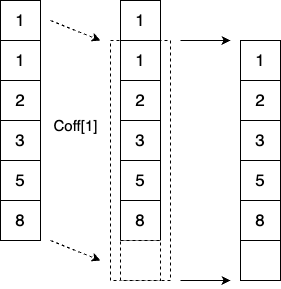
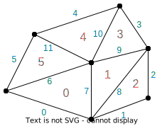
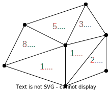
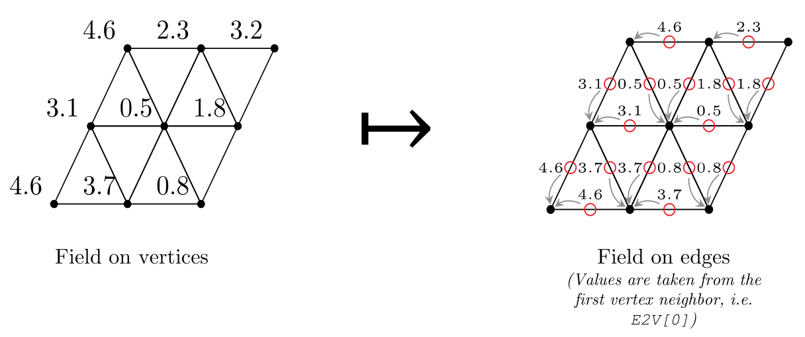
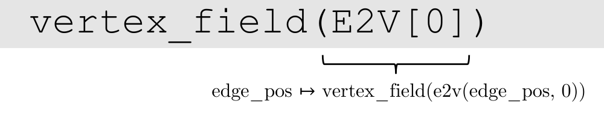
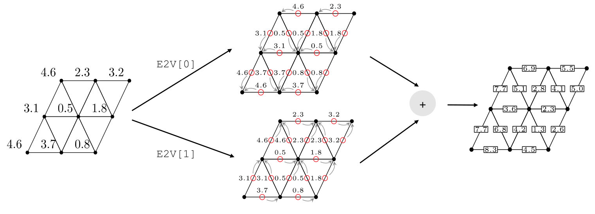
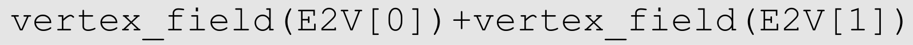

---
jupytext:
  formats: ipynb,md:myst
  text_representation:
    extension: .md
    format_name: myst
    format_version: 0.13
    jupytext_version: 1.16.1
kernelspec:
  display_name: Python 3 (ipykernel)
  language: python
  name: python3
---

 
 

```{code-cell} ipython3
import warnings
warnings.filterwarnings('ignore')
```

```{code-cell} ipython3
import numpy as np
import gt4py.next as gtx
from gt4py.next import float64, neighbor_sum, Dims
```

```{code-cell} ipython3
Cell = gtx.Dimension("Cell")
K = gtx.Dimension("K", kind=gtx.DimensionKind.VERTICAL)
```

## Offsets
Fields can be shifted with a (Cartesian) offset.

Take the following array:

```{code-cell} ipython3
a_off = gtx.as_field([K], np.array([1.0, 1.0, 2.0, 3.0, 5.0, 8.0]))

print("a_off array: \n {}".format(a_off.asnumpy()))
```

Visually, offsetting this field by 1 would result in the following:

|  |
| :------------------------: |
|  _CellDim Offset (Coff)_   |

In GT4Py we express this by

```{code-cell} ipython3
Koff = gtx.FieldOffset("Koff", source=K, target=(K,))

@gtx.field_operator
def a_offset(a_off: gtx.Field[Dims[K], float64]) -> gtx.Field[Dims[K], float64]:
    return a_off(Koff[1])

result = gtx.zeros(gtx.domain({K: 6}))

a_offset(a_off, out=result[:-1], offset_provider={"Koff": K})
print(f"result field: \n {result} \n {result.asnumpy()}")
```

## Defining the mesh and its connectivities
Take an unstructured mesh with numbered cells (in red) and edges (in blue).

|  |
| :------------------------------------------: |
|         _The mesh with the indices_          |

```{code-cell} ipython3
Cell = gtx.Dimension("Cell")
Edge = gtx.Dimension("Edge")
```

Connectivity among mesh elements is expressed through connectivity tables.

For example, `e2c_table` lists for each edge its adjacent cells. 

Similarly, `c2e_table` lists the edges that are neighbors to a particular cell.

Note that if an edge is lying at the border, one entry will be filled with -1.

```{code-cell} ipython3
e2c_table = np.array([
    [0, -1], # edge 0 (neighbours: cell 0)
    [2, -1], # edge 1
    [2, -1], # edge 2
    [3, -1], # edge 3
    [4, -1], # edge 4
    [5, -1], # edge 5
    [0, 5],  # edge 6 (neighbours: cell 0, cell 5)
    [0, 1],  # edge 7
    [1, 2],  # edge 8
    [1, 3],  # edge 9
    [3, 4],  # edge 10
    [4, 5]   # edge 11
])

c2e_table = np.array([
    [0, 6, 7],   # cell 0 (neighbors: edge 0, edge 6, edge 7)
    [7, 8, 9],   # cell 1
    [1, 2, 8],   # cell 2
    [3, 9, 10],  # cell 3
    [4, 10, 11], # cell 4
    [5, 6, 11],  # cell 5
])
```

#### Using connectivities in field operators

Let's start by defining two fields: one over the cells and another one over the edges. The field over cells serves input as for subsequent calculations and is therefore filled up with values, whereas the field over the edges stores the output of the calculations and is therefore left blank.

```{code-cell} ipython3
cell_field = gtx.as_field([Cell], np.array([1.0, 1.0, 2.0, 3.0, 5.0, 8.0]))
edge_field = gtx.as_field([Edge], np.zeros((12,)))
```

|  |
| :-----------------------------------------: |
|                _Cell values_                |

+++

`field_offset` is used to remap fields over one domain to another domain, e.g. cells -> edges.

+++

Field remappings are just composition of mappings
- Field defined on cells: $f_C: C \to \mathbb{R}$
- Connectivity from _edges to cells_: $c_{E \to C_0}$
- We define a new field on edges composing both mappings
$$ f_E: E \to \mathbb{R}, e \mapsto (f_C \circ c_{E \to C_0})(e) := f_c(c_{E \to C_0}(e)) $$
- In point-free notation: $f_E = f_C(c_{E \to C_0}) \Rightarrow$ `f_c(E2C[0])`


We extend the connectivities to refer to more than just one neighbor
- `E2CDim` is the local dimension of all cell neighbors of an edge

$$ c_{E \to C}: E \times E2CDim \to C $$
$$ f_E(e, l) := f_C(c_{E \to C}(e, l)), e \in E, l \in \{0,1\} $$

```{code-cell} ipython3
E2CDim = gtx.Dimension("E2C", kind=gtx.DimensionKind.LOCAL)
E2C = gtx.FieldOffset("E2C", source=Cell, target=(Edge, E2CDim))
```

```{code-cell} ipython3
E2C_offset_provider = gtx.NeighborTableOffsetProvider(e2c_table, Edge, Cell, 2)
```

```{code-cell} ipython3
@gtx.field_operator
def nearest_cell_to_edge(cell_field: gtx.Field[Dims[Cell], float64]) -> gtx.Field[Dims[Edge], float64]:
    return cell_field(E2C[0]) # 0th index to isolate edge dimension

@gtx.program(backend=gtx.gtfn_cpu) # uses skip_values, therefore we cannot use embedded
def run_nearest_cell_to_edge(cell_field: gtx.Field[Dims[Cell], float64], edge_field: gtx.Field[Dims[Edge], float64]):
    nearest_cell_to_edge(cell_field, out=edge_field)

run_nearest_cell_to_edge(cell_field, edge_field, offset_provider={"E2C": E2C_offset_provider})

print("0th adjacent cell's value: {}".format(edge_field.asnumpy()))
```

Running the above snippet results in the following edge field:

|  | $\mapsto$ |  |
| :----------------------------------------------------: | :-------: | :------------------------------------------: |
|                    _Domain (edges)_                    |           |                _Edge values_                 |

+++

### Another example: E2V

Creating fields on edges from fields on vertices using an **E2V** connectivity:

| <div></div> |
| :-----------------------------------------: |
| <div></div> |

We can create two edge fields from the same vertex field, by taking the values from the start or from the end vertex, and then you can operate wi to the 
| <div></div> |
| :-----------------------------------------: |
| <div></div> |

+++

### Using reductions on connected mesh elements

To sum up all the cells adjacent to an edge the `neighbor_sum` builtin function can be called to operate along the `E2CDim` dimension.

```{code-cell} ipython3
@gtx.field_operator
def sum_adjacent_cells(cell_field : gtx.Field[Dims[Cell], float64]) -> gtx.Field[Dims[Edge], float64]:
    return neighbor_sum(cell_field(E2C), axis=E2CDim)

@gtx.program(backend=gtx.gtfn_cpu) # uses skip_values, therefore we cannot use embedded
def run_sum_adjacent_cells(cell_field : gtx.Field[Dims[Cell], float64], edge_field: gtx.Field[Dims[Edge], float64]):
    sum_adjacent_cells(cell_field, out=edge_field)

run_sum_adjacent_cells(cell_field, edge_field, offset_provider={"E2C": E2C_offset_provider})

print("sum of adjacent cells: {}".format(edge_field.asnumpy()))
```

For the border edges, the results are unchanged compared to the previous example, but the inner edges now contain the sum of the two adjacent cells:

|  | $\mapsto$ |  |
| :----------------------------------------------------: | :-------: | :--------------------------------------------: |
|                    _Domain (edges)_                    |           |                 _Edge values_                  |

```{code-cell} ipython3

```

```{code-cell} ipython3

```
