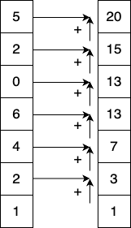

---
jupytext:
  formats: ipynb,md:myst
  text_representation:
    extension: .md
    format_name: myst
    format_version: 0.13
    jupytext_version: 1.16.1
kernelspec:
  display_name: Python 3 (ipykernel)
  language: python
  name: python3
---

 
 

```{code-cell} ipython3
import warnings
warnings.filterwarnings('ignore')
```

```{code-cell} ipython3
import numpy as np
import gt4py.next as gtx
from gt4py.next import float64, Dims
```

```{code-cell} ipython3
K = gtx.Dimension("K", kind=gtx.DimensionKind.VERTICAL)
```

## Scan algorithm

All operations so far where map operations over the output domain. The only other algorithm that we currently support is _scanning_ of an axis, one example of a scan is the partial sum as illustrated in the following code snippet.

```{code-cell} ipython3
x = np.asarray([1.0, 2.0, 4.0, 6.0, 0.0, 2.0, 5.0])
def partial_sum(x):
    for i in range(len(x)):
        if i > 0:
            x[i] = x[i-1] + x[i]
    return x
print(f"input:\n {x}") 
print(f"partial sum:\n {partial_sum(x)}")
```

Visually, this is what `partial_sum` is doing: 

|  |
| :---------------------------------: |
|         _Iterative sum over K_      |

+++

In GT4Py the a scan pattern is implemented with the so-called `scan_operator` where the return statement expresses the computation at the current position in the scan direction. This value is additionally injected as the first argument to the next position, usually called `state` or `carry`.

The `scan_operator` decorator takes 3 arguments:
- `axis`: a `Dimension` that specifies the scan axis; note: the `Dimension` has to be of kind `VERTICAL`
- `forward`: True if order of operations is from bottom to top, False if from top to bottom
- `init`: value that is injected as the `state` at the start

Note: Unlike a `field_operator`, the `scan_operator` is actually a local, scalar operation. It is applied to all points in the dimensions orthogonal to the scan axis (a form of single-column-abstraction). That might change in the future or be extended with a field version.

```{code-cell} ipython3
@gtx.scan_operator(axis=K, forward=True, init=0.0)
def add_scan(state: float, k_field: float) -> float:
    return state + k_field
```

```{code-cell} ipython3
k_field = gtx.as_field([K], np.asarray([1.0, 2.0, 4.0, 6.0, 0.0, 2.0, 5.0]))
result = gtx.zeros(domain=gtx.domain({K: 7}))

add_scan(k_field, out=result, offset_provider={})

print("result array: \n {}".format(result.asnumpy()))
```

Note: `scan_operators` can be called from `field_operators` and `programs`. Likewise, `field_operators` can be called from `scan_operators`

```{code-cell} ipython3

```
