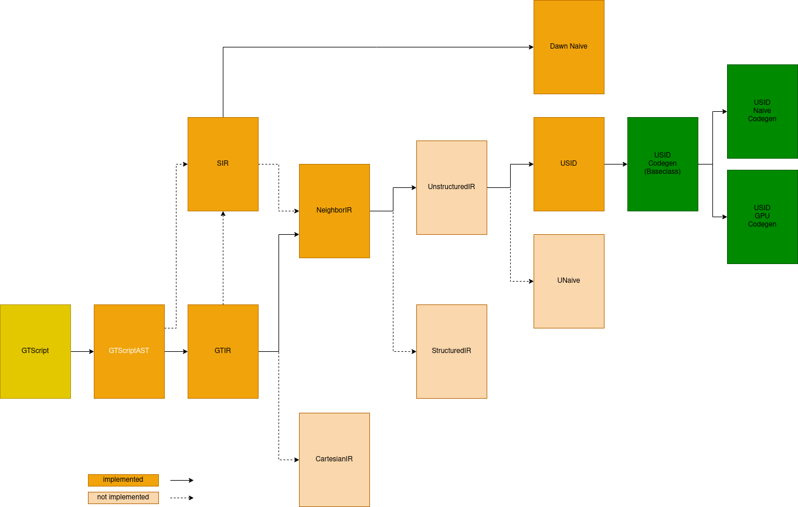

GridTools Compiler (gtc)
========================

GridTools Compiler is an experimental toolchain for *unstructured grids* in GT4Py.

The current state is sketched in the following diagram (probably outdated by the time you see it).

